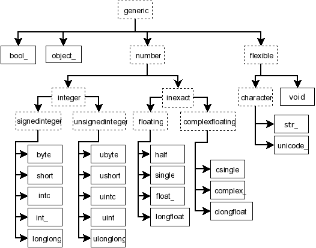

.. _NEP40:

================================================
NEP 40 — Legacy Datatype Implementation in NumPy
================================================

:title: Legacy Datatype Implementation in NumPy
:Author: Sebastian Berg
:Status: Final
:Type: Informational
:Created: 2019-07-17

.. note::

    This NEP is first in a series:

    - NEP 40 (this document) explains the shortcomings of NumPy's dtype implementation.

    - :ref:`NEP 41 <NEP41>` gives an overview of our proposed replacement.

    - :ref:`NEP 42 <NEP42>` describes the new design's datatype-related APIs.

    - NEP 43 describes the new design's API for universal functions.

Abstract
--------

As a preparation to further NumPy enhancement proposals 41, 42, and 43. This
NEP details the current status of NumPy datatypes as of NumPy 1.18.
It describes some of the technical aspects and concepts that
motivated the other proposals.
For more general information most readers should begin by reading :ref:`NEP 41 <NEP41>`
and use this document only as a reference or for additional details.

Detailed Description
--------------------

This section describes some central concepts and provides a brief overview
of the current implementation of dtypes as well as a discussion.
In many cases subsections will be split roughly to first describe the
current implementation and then follow with an "Issues and Discussion" section.

.. _parametric-datatype-discussion:

Parametric Datatypes
^^^^^^^^^^^^^^^^^^^^

Some datatypes are inherently *parametric*. All ``np.flexible`` scalar
types are attached to parametric datatypes (string, bytes, and void).
The class ``np.flexible`` for scalars is a superclass for the data types of
variable length (string, bytes, and void).
This distinction is similarly exposed by the C-Macros
``PyDataType_ISFLEXIBLE`` and ``PyTypeNum_ISFLEXIBLE``.
This flexibility generalizes to the set of values which can be represented
inside the array.
For instance, ``"S8"`` can represent longer strings than ``"S4"``.
The parametric string datatype thus also limits the values inside the array
to a subset (or subtype) of all values which can be represented by string
scalars.

The basic numerical datatypes are not flexible (do not inherit from
``np.flexible``). ``float64``, ``float32``, etc. do have a byte order, but the described
values are unaffected by it, and it is always possible to cast them to the
native, canonical representation without any loss of information.

The concept of flexibility can be generalized to parametric datatypes.
For example the private ``PyArray_AdaptFlexibleDType`` function also accepts the
naive datetime dtype as input to find the correct time unit.
The datetime dtype is thus parametric not in the size of its storage,
but instead in what the stored value represents.
Currently ``np.can_cast("datetime64[s]", "datetime64[ms]", casting="safe")``
returns true, although it is unclear that this is desired or generalizes
to possible future data types such as physical units.

Thus we have data types (mainly strings) with the properties that:

1. Casting is not always safe (``np.can_cast("S8", "S4")``)
2. Array coercion should be able to discover the exact dtype, such as for
   ``np.array(["str1", 12.34], dtype="S")`` where NumPy discovers the
   resulting dtype as ``"S5"``.
   (If the dtype argument is ommitted the behaviour is currently ill defined [gh-15327]_.)
   A form similar to ``dtype="S"`` is ``dtype="datetime64"`` which can
   discover the unit: ``np.array(["2017-02"], dtype="datetime64")``.

This notion highlights that some datatypes are more complex than the basic
numerical ones, which is evident in the complicated output type discovery
of universal functions.

Value Based Casting
^^^^^^^^^^^^^^^^^^^

Casting is typically defined between two types:
A type is considered to cast safely to a second type when the second type
can represent all values of the first without loss of information.
NumPy may inspect the actual value to decide
whether casting is safe or not.

This is useful for example in expressions such as::

    arr = np.array([1, 2, 3], dtype="int8")
    result = arr + 5
    assert result.dtype == np.dtype("int8")
    # If the value is larger, the result will change however:
    result = arr + 500
    assert result.dtype == np.dtype("int16")

In this expression, the python value (which originally has no datatype) is
represented as an ``int8`` or ``int16`` (the smallest possible data type).

NumPy currently does this even for NumPy scalars and zero-dimensional arrays,
so that replacing ``5`` with ``np.int64(5)`` or ``np.array(5, dtype="int64")``
in the above expression will lead to the same results, and thus ignores the
existing datatype. The same logic also applies to floating-point scalars,
which are allowed to lose precision.
The behavior is not used when both inputs are scalars, so that
``5 + np.int8(5)`` returns the default integer size (32 or 64-bit) and not
an ``np.int8``.

While the behaviour is defined in terms of casting and exposed by
``np.result_type`` it is mainly important for universal functions
(such as ``np.add`` in the above examples).
Universal functions currently rely on safe casting semantics to decide which
loop should be used, and thus what the output datatype will be.

Issues and Discussion
"""""""""""""""""""""

There appears to be some agreement that the current method is
not desirable for values that have a datatype,
but may be useful for pure python integers or floats as in the first
example.
However, any change of the datatype system and universal function dispatching
must initially fully support the current behavior.
A main difficulty is that for example the value ``156`` can be represented
by ``np.uint8`` and ``np.int16``.
The result depends on the "minimal" representation in the context of the
conversion (for ufuncs the context may depend on the loop order).

The Object Datatype
^^^^^^^^^^^^^^^^^^^

The object datatype currently serves as a generic fallback for any value
which is not otherwise representable.
However, due to not having a well-defined type, it has some issues,
for example when an array is filled with Python sequences::

    >>> l = [1, [2]]
    >>> np.array(l, dtype=np.object_)
    array([1, list([2])], dtype=object)  # a 1d array

    >>> a = np.empty((), dtype=np.object_)
    >>> a[...] = l
    ValueError: assignment to 0-d array  # ???
    >>> a[()] = l
    >>> a
    array(list([1, [2]]), dtype=object)

Without a well-defined type, functions such as ``isnan()`` or ``conjugate()``
do not necessarily work, but can work for a :class:`decimal.Decimal`.
To improve this situation it seems desirable to make it easy to create
``object`` dtypes that represent a specific Python datatype and stores its object
inside the array in the form of pointer to python ``PyObject``.
Unlike most datatypes, Python objects require garbage collection.
This means that additional methods to handle references and
visit all objects must be defined.
In practice, for most use-cases it is sufficient to limit the creation of such
datatypes so that all functionality related to Python C-level references is
private to NumPy.

Creating NumPy datatypes that match builtin Python objects also creates a few problems
that require more thoughts and discussion.
These issues do not need to solved right away:

* NumPy currently returns *scalars* even for array input in some cases, in most
  cases this works seamlessly. However, this is only true because the NumPy
  scalars behave much like NumPy arrays, a feature that general Python objects
  do not have.
* Seamless integration probably requires that ``np.array(scalar)`` finds the
  correct DType automatically since some operations (such as indexing) return
  the scalar instead of a 0D array.
  This is problematic if multiple users independently decide to implement
  for example a DType for ``decimal.Decimal``.

Current ``dtype`` Implementation
^^^^^^^^^^^^^^^^^^^^^^^^^^^^^^^^

Currently ``np.dtype`` is a Python class with its instances being the
``np.dtype(">float64")``, etc. instances.
To set the actual behaviour of these instances, a prototype instance is stored
globally and looked up based on the ``dtype.typenum``. The singleton is used
where possible. Where required it is copied and modified, for instance to change
endianess.

Parametric datatypes (strings, void, datetime, and timedelta) must store
additional information such as string lengths, fields, or datetime units --
new instances of these types are created instead of relying on a singleton.
All current datatypes within NumPy further support setting a metadata field
during creation which can be set to an arbitrary dictionary value, but seems
rarely used in practice (one recent and prominent user is h5py).

Many datatype-specific functions are defined within a C structure called
:c:type:`PyArray_ArrFuncs`, which is part of each ``dtype`` instance and
has a similarity to Python's ``PyNumberMethods``.
For user-defined datatypes this structure is exposed to the user, making
ABI-compatible changes impossible.
This structure holds important information such as how to copy or cast,
and provides space for pointers to functions, such as comparing elements,
converting to bool, or sorting.
Since some of these functions are vectorized operations, operating on more than
one element, they fit the model of ufuncs and do not need to be defined on the
datatype in the future.
For example the ``np.clip`` function was previously implemented using
``PyArray_ArrFuncs`` and is now implemented as a ufunc.

Discussion and Issues
"""""""""""""""""""""

A further issue with the current implementation of the functions on the dtype
is that, unlike methods,
they are not passed an instance of the dtype when called.
Instead, in many cases, the array which is being operated on is passed in
and typically only used to extract the datatype again.
A future API should likely stop passing in the full array object.
Since it will be necessary to fall back to the old definitions for
backward compatibility, the array object may not be available.
However, passing a "fake" array in which mainly the datatype is defined
is probably a sufficient workaround
(see backward compatibility; alignment information may sometimes also be desired).

Although not extensively used outside of NumPy itself, the currently
``PyArray_Descr`` is a public structure.
This is especially also true for the ``PyArray_ArrFuncs`` structure stored in
the ``f`` field.
Due to compatibility they may need to remain supported for a very long time,
with the possibility of replacing them by functions that dispatch to a newer API.

However, in the long run access to these structures will probably have to
be deprecated.

NumPy Scalars and Type Hierarchy
^^^^^^^^^^^^^^^^^^^^^^^^^^^^^^^^

As a side note to the above datatype implementation: unlike the datatypes,
the NumPy scalars currently **do** provide a type hierarchy, consisting of abstract
types such as ``np.inexact`` (see figure below).
In fact, some control flow within NumPy currently uses
``issubclass(a.dtype.type, np.inexact)``.

.. _nep-0040_dtype-hierarchy:

   **Figure:** Hierarchy of NumPy scalar types reproduced from the reference
   documentation. Some aliases such as ``np.intp`` are excluded. Datetime
   and timedelta are not shown.

NumPy scalars try to mimic zero-dimensional arrays with a fixed datatype.
For the numerical (and unicode) datatypes, they are further limited to
native byte order.

Current Implementation of Casting
^^^^^^^^^^^^^^^^^^^^^^^^^^^^^^^^^

One of the main features which datatypes need to support is casting between one
another using ``arr.astype(new_dtype, casting="unsafe")``, or during execution
of ufuncs with different types (such as adding integer and floating point numbers).

Casting tables determine whether it is possible to cast from one specific type to another.
However, generic casting rules cannot handle the parametric dtypes such as strings.
The logic for parametric datatypes is defined mainly in ``PyArray_CanCastTo``
and currently cannot be customized for user defined datatypes.

The actual casting has two distinct parts:

1. ``copyswap``/``copyswapn`` are defined for each dtype and can handle
   byte-swapping for non-native byte orders as well as unaligned memory.
2. The generic casting code is provided by C functions which know how to
   cast aligned and contiguous memory from one dtype to another
   (both in native byte order).
   These C-level functions can be registered to cast aligned and contiguous memory
   from one dtype to another.
   The function may be provided with both arrays (although the parameter
   is sometimes ``NULL`` for scalars).
   NumPy will ensure that these functions receive native byte order input.
   The current implementation stores the functions either in a C-array
   on the datatype which is cast, or in a dictionary when casting to a user
   defined datatype.

Generally NumPy will thus perform casting as chain of the three functions
``in_copyswapn -> castfunc -> out_copyswapn`` using (small) buffers between
these steps.

The above multiple functions are wrapped into a single function (with metadata)
that handles the cast and is used for example during the buffered iteration used
by ufuncs.
This is the mechanism that is always used for user defined datatypes.
For most dtypes defined within NumPy itself, more specialized code is used to
find a function to do the actual cast
(defined by the private ``PyArray_GetDTypeTransferFunction``).
This mechanism replaces most of the above mechanism and provides much faster
casts for example when the inputs are not contiguous in memory.
However, it cannot be extended by user defined datatypes.

Related to casting, we currently have a ``PyArray_EquivTypes`` function which
indicate that a *view* is sufficient (and thus no cast is necessary).
This function is used multiple places and should probably be part of
a redesigned casting API.

DType handling in Universal functions
^^^^^^^^^^^^^^^^^^^^^^^^^^^^^^^^^^^^^

Universal functions are implemented as instances of the ``numpy.UFunc`` class
with an ordered-list of datatype-specific
(based on the dtype typecode character, not datatype instances) implementations,
each with a signature and a function pointer.
This list of implementations can be seen with ``ufunc.types`` where
all implementations are listed with their C-style typecode signatures.
For example::

    >>> np.add.types
    [...,
     'll->l',
     ...,
     'dd->d',
     ...]

Each of these signatures is associated with a single inner-loop function defined
in C, which does the actual calculation, and may be called multiple times.

The main step in finding the correct inner-loop function is to call a
:c:type:`PyUFunc_TypeResolutionFunc` which retrieves the input dtypes from
the provided input arrays
and will determine the full type signature (including output dtype) to be executed.

By default the ``TypeResolver`` is implemented by searching all of the implementations
listed in ``ufunc.types`` in order and stopping if all inputs can be safely
cast to fit the signature.
This means that if long (``l``) and double (``d``) arrays are added,
numpy will find that the ``'dd->d'`` definition works
(long can safely cast to double) and uses that.

In some cases this is not desirable. For example the ``np.isnat`` universal
function has a ``TypeResolver`` which rejects integer inputs instead of
allowing them to be cast to float.
In principle, downstream projects can currently use their own non-default
``TypeResolver``, since the corresponding C-structure necessary to do this
is public.
The only project known to do this is Astropy, which is willing to switch to
a new API if NumPy were to remove the possibility to replace the TypeResolver.

For user defined datatypes, the dispatching logic is similar,
although separately implemented and limited (see discussion below).

Issues and Discussion
"""""""""""""""""""""

It is currently only possible for user defined functions to be found/resolved
if any of the inputs (or the outputs) has the user datatype, since it uses the
`OO->O` signature.
For example, given that a ufunc loop to implement ``fraction_divide(int, int)
-> Fraction`` has been implemented,
the call ``fraction_divide(4, 5)`` (with no specific output dtype) will fail
because the loop that
includes the user datatype ``Fraction`` (as output) can only be found if any of
the inputs is already a ``Fraction``.
``fraction_divide(4, 5, dtype=Fraction)`` can be made to work, but is inconvenient.

Typically, dispatching is done by finding the first loop that matches. A match
is defined as: all inputs (and possibly outputs) can
be cast safely to the signature typechars (see also the current implementation
section).
However, in some cases safe casting is problematic and thus explicitly not
allowed.
For example the ``np.isnat`` function is currently only defined for
datetime and timedelta,
even though integers are defined to be safely castable to timedelta.
If this was not the case, calling
``np.isnat(np.array("NaT", "timedelta64").astype("int64"))`` would currently
return true, although the integer input array has no notion of "not a time".
If a universal function, such as most functions in ``scipy.special``, is only
defined for ``float32`` and ``float64`` it will currently automatically
cast a ``float16`` silently to ``float32`` (similarly for any integer input).
This ensures successful execution, but may lead to a change in the output dtype
when support for new data types is added to a ufunc.
When a ``float16`` loop is added, the output datatype will currently change
from ``float32`` to ``float16`` without a warning.

In general the order in which loops are registered is important.
However, this is only reliable if all loops are added when the ufunc is first defined.
Additional loops added when a new user datatypes is imported
must not be sensitive to the order in which imports occur.

There are two main approaches to better define the type resolution for user
defined types:

1. Allow for user dtypes to directly influence the loop selection.
   For example they may provide a function which return/select a loop
   when there is no exact matching loop available.
2. Define a total ordering of all implementations/loops, probably based on
   "safe casting" semantics, or semantics similar to that.

While option 2 may be less complex to reason about it remains to be seen
whether it is sufficient for all (or most) use cases.

Adjustment of Parametric output DTypes in UFuncs
^^^^^^^^^^^^^^^^^^^^^^^^^^^^^^^^^^^^^^^^^^^^^^^^

A second step necessary for parametric dtypes is currently performed within
the ``TypeResolver``:
the datetime and timedelta datatypes have to decide on the correct parameter
for the operation and output array.
This step also needs to double check that all casts can be performed safely,
which by default means that they are "same kind" casts.

Issues and Discussion
"""""""""""""""""""""

Fixing the correct output dtype is currently part of the type resolution.
However, it is a distinct step and should probably be handled as such after
the actual type/loop resolution has occurred.

As such this step may move from the dispatching step (described above) to
the implementation-specific code described below.

DType-specific Implementation of the UFunc
^^^^^^^^^^^^^^^^^^^^^^^^^^^^^^^^^^^^^^^^^^

Once the correct implementation/loop is found, UFuncs currently call
a single *inner-loop function* which is written in C.
This may be called multiple times to do the full calculation and it has
little or no information about the current context. It also has a void
return value.

Issues and Discussion
"""""""""""""""""""""

Parametric datatypes may require passing
additional information to the inner-loop function to decide how to interpret
the data.
This is the reason why currently no universal functions for ``string`` dtypes
exist (although technically possible within NumPy itself).
Note that it is currently possible to pass in the input array objects
(which in turn hold the datatypes when no casting is necessary).
However, the full array information should not be required and currently the
arrays are passed in before any casting occurs.
The feature is unused within NumPy and no known user exists.

Another issue is the error reporting from within the inner-loop function.
There exist currently two ways to do this:

1. by setting a Python exception
2. using the CPU floating point error flags.

Both of these are checked before returning to the user.
However, many integer functions currently can set neither of these errors,
so that checking the floating point error flags is unnecessary overhead.
On the other hand, there is no way to stop the iteration or pass out error
information which does not use the floating point flags or requires to hold
the Python global interpreter lock (GIL).

It seems necessary to provide more control to authors of inner loop functions.
This means allowing users to pass in and out information from the inner-loop
function more easily, while *not* providing the input array objects.
Most likely this will involve:

* Allowing the execution of additional code before the first and after
  the last inner-loop call.
* Returning an integer value from the inner-loop to allow stopping the
  iteration early and possibly propagate error information.
* Possibly, to allow specialized inner-loop selections. For example currently
  ``matmul`` and many reductions will execute optimized code for certain inputs.
  It may make sense to allow selecting such optimized loops beforehand.
  Allowing this may also help to bring casting (which uses this heavily) and
  ufunc implementations closer.

The issues surrounding the inner-loop functions have been discussed in some
detail in the github issue gh-12518_ .

Reductions use an "identity" value.
This is currently defined once per ufunc, regardless of the ufunc dtype signature.
For example  ``0`` is used for ``sum``, or ``math.inf`` for ``min``.
This works well for numerical datatypes, but is not always appropriate for other dtypes.
In general it should be possible to provide a dtype-specific identity to the
ufunc reduction.

Datatype Discovery during Array Coercion
^^^^^^^^^^^^^^^^^^^^^^^^^^^^^^^^^^^^^^^^

When calling ``np.array(...)`` to coerce a general Python object to a NumPy array,
all objects need to be inspected to find the correct dtype.
The input to ``np.array()`` are potentially nested Python sequences which hold
the final elements as generic Python objects.
NumPy has to unpack all the nested sequences and then inspect the elements.
The final datatype is found by iterating over all elements which will end up
in the array and:

1. discovering the dtype of the single element:

   * from array (or array like) or NumPy scalar using ``element.dtype``
   * using ``isinstance(..., float)`` for known Python types
     (note that these rules mean that subclasses are *currently* valid).
   * special rule for void datatypes to coerce tuples.

2. Promoting the current dtype with the next elements dtype using
   ``np.promote_types``.
3. If strings are found, the whole process is restarted (see also [gh-15327]_),
   in a similar manner as if ``dtype="S"`` was given (see below).

If ``dtype=...`` is given, this dtype is used unmodified, unless
it is an unspecific *parametric dtype instance* which means "S0", "V0", "U0",
"datetime64", and "timdelta64".
These are thus flexible datatypes without length 0 – considered to be unsized –
and datetimes or timedelta without a unit attached ("generic unit").

In future DType class hierarchy, these may be represented by the class rather
than a special instance, since these special instances should not normally be
attached to an array.

If such a *parametric dtype instance* is provided for example using ``dtype="S"``
``PyArray_AdaptFlexibleDType`` is called and effectively inspects all values
using DType specific logic.
That is:

* Strings will use ``str(element)`` to find the length of most elements
* Datetime64 is capable of coercing from strings and guessing the correct unit.

Discussion and Issues
"""""""""""""""""""""

It seems probable that during normal discovery, the ``isinstance`` should rather
be strict ``type(element) is desired_type`` checks.
Further, the current ``AdaptFlexibleDType`` logic should be made available to
user DTypes and not be a secondary step, but instead replace, or be part of,
the normal discovery.

Related Issues
--------------

``np.save`` currently translates all user-defined dtypes to void dtypes.
This means they cannot be stored using the ``npy`` format.
This is not an issue for the python pickle protocol, although it may require
some thought if we wish to ensure that such files can be loaded securely
without the possibility of executing malicious code
(i.e. without the ``allow_pickle=True`` keyword argument).

The additional existence of masked arrays and especially masked datatypes
within Pandas has interesting implications for interoperability.
Since mask information is often stored separately, its handling requires
support by the container (array) object.
NumPy itself does not provide such support, and is not expected to add it
in the foreseeable future.
However, if such additions to the datatypes within NumPy would improve
interoperability they could be considered even if
they are not used by NumPy itself.

Related Work
------------

* Julia types are an interesting blueprint for a type hierarchy, and define
  abstract and concrete types [julia-types]_.

* In Julia promotion can occur based on abstract types. If a promoter is
  defined, it will cast the inputs and then Julia can then retry to find
  an implementation with the new values [julia-promotion]_.

* ``xnd-project`` (https://github.com/xnd-project) with ndtypes and gumath

  * The ``xnd-project`` is similar to NumPy and defines data types as well
    as the possibility to extend them. A major difference is that it does
    not use promotion/casting within the ufuncs, but instead requires explicit
    definition of ``int32 + float64 -> float64`` loops.

Discussion
----------

There have been many discussions about the current state and what a future
datatype system may look like.
The full list of these discussion is long and some are lost to time,
the following provides a subset for more recent ones:

* Draft NEP by Stephan Hoyer after a developer meeting (was updated on the next developer meeting) https://hackmd.io/6YmDt_PgSVORRNRxHyPaNQ

* List of related documents gathered previously here
  https://hackmd.io/UVOtgj1wRZSsoNQCjkhq1g (TODO: Reduce to the most important
  ones):

  * https://github.com/numpy/numpy/pull/12630
    Matti Picus draft NEP, discusses the technical side of subclassing  more from
    the side of ``ArrFunctions``

  * https://hackmd.io/ok21UoAQQmOtSVk6keaJhw and https://hackmd.io/s/ryTFaOPHE
    (2019-04-30) Proposals for subclassing implementation approach.

  * Discussion about the calling convention of ufuncs and need for more
    powerful UFuncs: https://github.com/numpy/numpy/issues/12518

  * 2018-11-30 developer meeting notes:
    https://github.com/BIDS-numpy/docs/blob/master/meetings/2018-11-30-dev-meeting.md
    and subsequent draft for an NEP: https://hackmd.io/6YmDt_PgSVORRNRxHyPaNQ

    BIDS Meeting on November 30, 2018 and document by Stephan Hoyer about
    what numpy should provide and thoughts of how to get there. Meeting with
    Eric Wieser, Matti Picus, Charles Harris, Tyler Reddy, Stéfan van der
    Walt, and Travis Oliphant.

  * SciPy 2018 brainstorming session with summaries of use cases:
    https://github.com/numpy/numpy/wiki/Dtype-Brainstorming

    Also lists some requirements and some ideas on implementations

References
----------

.. _gh-12518: https://github.com/numpy/numpy/issues/12518
.. [gh-15327] https://github.com/numpy/numpy/issues/12518

.. [julia-types] https://docs.julialang.org/en/v1/manual/types/index.html#Abstract-Types-1

.. [julia-promotion] https://docs.julialang.org/en/v1/manual/conversion-and-promotion/

Copyright
---------

This document has been placed in the public domain.
