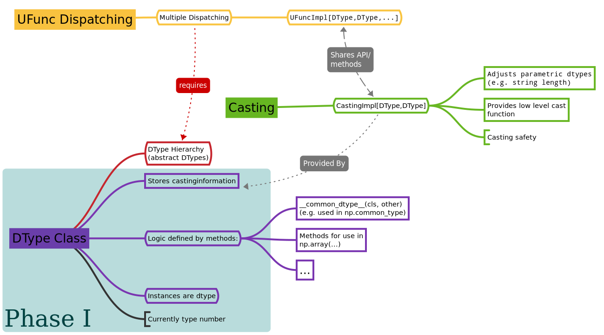
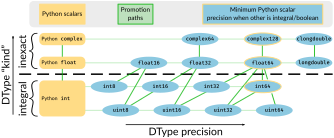

.. _NEP41:

=================================================
NEP 41 — First step towards a new datatype system
=================================================

:title: First step towards a new Datatype System
:Author: Sebastian Berg
:Author: Stéfan van der Walt
:Author: Matti Picus
:Status: Accepted
:Type: Standard Track
:Created: 2020-02-03
:Resolution: https://mail.python.org/pipermail/numpy-discussion/2020-April/080573.html and https://mail.python.org/pipermail/numpy-discussion/2020-March/080495.html

.. note::

    This NEP is second in a series:

    - :ref:`NEP 40 <NEP40>` explains the shortcomings of NumPy's dtype implementation.

    - NEP 41 (this document) gives an overview of our proposed replacement.

    - :ref:`NEP 42 <NEP42>` describes the new design's datatype-related APIs.

    - :ref:`NEP 43 <NEP43>` describes the new design's API for universal functions.

Abstract
--------

:ref:`Datatypes <arrays.dtypes>` in NumPy describe how to interpret each
element in arrays. NumPy provides ``int``, ``float``, and ``complex`` numerical
types, as well as string, datetime, and structured datatype capabilities.
The growing Python community, however, has need for more diverse datatypes.
Examples are datatypes with unit information attached (such as meters) or
categorical datatypes (fixed set of possible values).
However, the current NumPy datatype API is too limited to allow the creation
of these.

This NEP is the first step to enable such growth; it will lead to
a simpler development path for new datatypes.
In the long run the new datatype system will also support the creation
of datatypes directly from Python rather than C.
Refactoring the datatype API will improve maintainability and facilitate
development of both user-defined external datatypes,
as well as new features for existing datatypes internal to NumPy.

Motivation and Scope
--------------------

.. seealso::

    The user impact section includes examples of what kind of new datatypes
    will be enabled by the proposed changes in the long run.
    It may thus help to read these section out of order.

Motivation
^^^^^^^^^^

One of the main issues with the current API is the definition of typical
functions such as addition and multiplication for parametric datatypes
(see also :ref:`NEP 40 <NEP40>`)
which require additional steps to determine the output type.
For example when adding two strings of length 4, the result is a string
of length 8, which is different from the input.
Similarly, a datatype which embeds a physical unit must calculate the new unit
information: dividing a distance by a time results in a speed.
A related difficulty is that the :ref:`current casting rules <ufuncs.casting>`
-- the conversion between different datatypes --
cannot describe casting for such parametric datatypes implemented outside of NumPy.

This additional functionality for supporting parametric datatypes introduces
increased complexity within NumPy itself,
and furthermore is not available to external user-defined datatypes.
In general the concerns of different datatypes are not well-encapsulated.
This burden is exacerbated by the exposure of internal C structures,
limiting the addition of new fields
(for example to support new sorting methods [new_sort]_).

Currently there are many factors which limit the creation of new user-defined
datatypes:

* Creating casting rules for parametric user-defined dtypes is either impossible
  or so complex that it has never been attempted.
* Type promotion, e.g. the operation deciding that adding float and integer
  values should return a float value, is very valuable for numeric datatypes
  but is limited in scope for user-defined and especially parametric datatypes.
* Much of the logic (e.g. promotion) is written in single functions
  instead of being split as methods on the datatype itself.
* In the current design datatypes cannot have methods that do not generalize
  to other datatypes. For example a unit datatype cannot have a ``.to_si()`` method to
  easily find the datatype which would represent the same values in SI units.

The large need to solve these issues has driven the scientific community
to create work-arounds in multiple projects implementing physical units as an
array-like class instead of a datatype, which would generalize better across
multiple array-likes (Dask, pandas, etc.).
Already, Pandas has made a push into the same direction with its
extension arrays [pandas_extension_arrays]_ and undoubtedly
the community would be best served if such new features could be common
between NumPy, Pandas, and other projects.

Scope
^^^^^

The proposed refactoring of the datatype system is a large undertaking and
thus is proposed to be split into various phases, roughly:

* Phase I: Restructure and extend the datatype infrastructure (This NEP 41)
* Phase II: Incrementally define or rework API (Detailed largely in NEPs 42/43)
* Phase III: Growth of NumPy and Scientific Python Ecosystem capabilities.

For a more detailed accounting of the various phases, see
"Plan to Approach the Full Refactor" in the Implementation section below.
This NEP proposes to move ahead with the necessary creation of new dtype
subclasses (Phase I),
and start working on implementing current functionality.
Within the context of this NEP all development will be fully private API or
use preliminary underscored names which must be changed in the future.
Most of the internal and public API choices are part of a second Phase
and will be discussed in more detail in the following NEPs 42 and 43.
The initial implementation of this NEP will have little or no effect on users,
but provides the necessary ground work for incrementally addressing the
full rework.

The implementation of this NEP and the following, implied large rework of how
datatypes are defined in NumPy is expected to create small incompatibilities
(see backward compatibility section).
However, a transition requiring large code adaption is not anticipated and not
within scope.

Specifically, this NEP makes the following design choices which are discussed
in more details in the detailed description section:

1. Each datatype will be an instance of a subclass of ``np.dtype``, with most of the
   datatype-specific logic being implemented
   as special methods on the class. In the C-API, these correspond to specific
   slots. In short, for ``f = np.dtype("f8")``, ``isinstance(f, np.dtype)`` will remain true,
   but ``type(f)`` will be a subclass of ``np.dtype`` rather than just ``np.dtype`` itself.
   The ``PyArray_ArrFuncs`` which are currently stored as a pointer on the instance (as ``PyArray_Descr->f``),
   should instead be stored on the class as typically done in Python.
   In the future these may correspond to python side dunder methods.
   Storage information such as itemsize and byteorder can differ between
   different dtype instances (e.g. "S3" vs. "S8") and will remain part of the instance.
   This means that in the long run the current lowlevel access to dtype methods
   will be removed (see ``PyArray_ArrFuncs`` in
   :ref:`NEP 40 <NEP40>`).

2. The current NumPy scalars will *not* change, they will not be instances of
   datatypes. This will also be true for new datatypes, scalars will not be
   instances of a dtype (although ``isinstance(scalar, dtype)`` may be made
   to return ``True`` when appropriate).

Detailed technical decisions to follow in NEP 42.

Further, the public API will be designed in a way that is extensible in the future:

3. All new C-API functions provided to the user will hide implementation details
   as much as possible. The public API should be an identical, but limited,
   version of the C-API used for the internal NumPy datatypes.

The datatype system may be targeted to work with NumPy arrays,
for example by providing strided-loops, but should avoid direct
interactions with the array-object (typically `np.ndarray` instances).
Instead, the design principle will be that the array-object is a consumer
of the datatype.
While only a guiding principle, this may allow splitting the datatype system
or even the NumPy datatypes into their own project which NumPy depends on.

The changes to the datatype system in Phase II must include a large refactor of the
UFunc machinery, which will be further defined in NEP 43:

4. To enable all of the desired functionality for new user-defined datatypes,
   the UFunc machinery will be changed to replace the current dispatching
   and type resolution system.
   The old system should be *mostly* supported as a legacy version for some time.

Additionally, as a general design principle, the addition of new user-defined
datatypes will *not* change the behaviour of programs.
For example ``common_dtype(a, b)`` must not be ``c`` unless ``a`` or ``b`` know
that ``c`` exists.

User Impact
-----------

The current ecosystem has very few user-defined datatypes using NumPy, the
two most prominent being: ``rational`` and ``quaternion``.
These represent fairly simple datatypes which are not strongly impacted
by the current limitations.
However, we have identified a need for datatypes such as:

* bfloat16, used in deep learning
* categorical types
* physical units (such as meters)
* datatypes for tracing/automatic differentiation
* high, fixed precision math
* specialized integer types such as int2, int24
* new, better datetime representations
* extending e.g. integer dtypes to have a sentinel NA value
* geometrical objects [pygeos]_

Some of these are partially solved; for example unit capability is provided
in ``astropy.units``, ``unyt``, or ``pint``, as `numpy.ndarray` subclasses.
Most of these datatypes, however, simply cannot be reasonably defined
right now.
An advantage of having such datatypes in NumPy is that they should integrate
seamlessly with other array or array-like packages such as Pandas,
``xarray`` [xarray_dtype_issue]_, or ``Dask``.

The long term user impact of implementing this NEP will be to allow both
the growth of the whole ecosystem by having such new datatypes, as well as
consolidating implementation of such datatypes within NumPy to achieve
better interoperability.

Examples
^^^^^^^^

The following examples represent future user-defined datatypes we wish to enable.
These datatypes are not part the NEP and choices (e.g. choice of casting rules)
are possibilities we wish to enable and do not represent recommendations.

Simple Numerical Types
""""""""""""""""""""""

Mainly used where memory is a consideration, lower-precision numeric types
such as `bfloat16 <https://en.wikipedia.org/wiki/Bfloat16_floating-point_format>`_
are common in other computational frameworks.
For these types the definitions of things such as ``np.common_type`` and
``np.can_cast`` are some of the most important interfaces. Once they
support ``np.common_type``, it is (for the most part) possible to find
the correct ufunc loop to call, since most ufuncs -- such as add -- effectively
only require ``np.result_type``::

    >>> np.add(arr1, arr2).dtype == np.result_type(arr1, arr2)

and `~numpy.result_type` is largely identical to `~numpy.common_type`.

Fixed, high precision math
""""""""""""""""""""""""""

Allowing arbitrary precision or higher precision math is important in
simulations. For instance ``mpmath`` defines a precision::

    >>> import mpmath as mp
    >>> print(mp.dps)  # the current (default) precision
    15

NumPy should be able to construct a native, memory-efficient array from
a list of ``mpmath.mpf`` floating point objects::

    >>> arr_15_dps = np.array(mp.arange(3))  # (mp.arange returns a list)
    >>> print(arr_15_dps)  # Must find the correct precision from the objects:
    array(['0.0', '1.0', '2.0'], dtype=mpf[dps=15])

We should also be able to specify the desired precision when
creating the datatype for an array. Here, we use ``np.dtype[mp.mpf]``
to find the DType class (the notation is not part of this NEP),
which is then instantiated with the desired parameter.
This could also be written as ``MpfDType`` class::

    >>> arr_100_dps = np.array([1, 2, 3], dtype=np.dtype[mp.mpf](dps=100))
    >>> print(arr_15_dps + arr_100_dps)
    array(['0.0', '2.0', '4.0'], dtype=mpf[dps=100])

The ``mpf`` datatype can decide that the result of the operation should be the
higher precision one of the two, so uses a precision of 100.
Furthermore, we should be able to define casting, for example as in::

    >>> np.can_cast(arr_15_dps.dtype, arr_100_dps.dtype, casting="safe")
    True
    >>> np.can_cast(arr_100_dps.dtype, arr_15_dps.dtype, casting="safe")
    False  # loses precision
    >>> np.can_cast(arr_100_dps.dtype, arr_100_dps.dtype, casting="same_kind")
    True

Casting from float is a probably always at least a ``same_kind`` cast, but
in general, it is not safe::

    >>> np.can_cast(np.float64, np.dtype[mp.mpf](dps=4), casting="safe")
    False

since a float64 has a higher precision than the ``mpf`` datatype with
``dps=4``.

Alternatively, we can say that::

    >>> np.common_type(np.dtype[mp.mpf](dps=5), np.dtype[mp.mpf](dps=10))
    np.dtype[mp.mpf](dps=10)

And possibly even::

    >>> np.common_type(np.dtype[mp.mpf](dps=5), np.float64)
    np.dtype[mp.mpf](dps=16)  # equivalent precision to float64 (I believe)

since ``np.float64`` can be cast to a ``np.dtype[mp.mpf](dps=16)`` safely.

Categoricals
""""""""""""

Categoricals are interesting in that they can have fixed, predefined values,
or can be dynamic with the ability to modify categories when necessary.
The fixed categories (defined ahead of time) is the most straight forward
categorical definition.
Categoricals are *hard*, since there are many strategies to implement them,
suggesting NumPy should only provide the scaffolding for user-defined
categorical types. For instance::

    >>> cat = Categorical(["eggs", "spam", "toast"])
    >>> breakfast = array(["eggs", "spam", "eggs", "toast"], dtype=cat)

could store the array very efficiently, since it knows that there are only 3
categories.
Since a categorical in this sense knows almost nothing about the data stored
in it, few operations makes, sense, although equality does:

    >>> breakfast2 = array(["eggs", "eggs", "eggs", "eggs"], dtype=cat)
    >>> breakfast == breakfast2
    array[True, False, True, False])

The categorical datatype could work like a dictionary: no two
items names can be equal (checked on dtype creation), so that the equality
operation above can be performed very efficiently.
If the values define an order, the category labels (internally integers) could
be ordered the same way to allow efficient sorting and comparison.

Whether or not casting is defined from one categorical with less to one with
strictly more values defined, is something that the Categorical datatype would
need to decide. Both options should be available.

Unit on the Datatype
""""""""""""""""""""

There are different ways to define Units, depending on how the internal
machinery would be organized, one way is to have a single Unit datatype
for every existing numerical type.
This will be written as ``Unit[float64]``, the unit itself is part of the
DType instance ``Unit[float64]("m")`` is a ``float64`` with meters attached::

    >>> from astropy import units
    >>> meters = np.array([1, 2, 3], dtype=np.float64) * units.m  # meters
    >>> print(meters)
    array([1.0, 2.0, 3.0], dtype=Unit[float64]("m"))

Note that units are a bit tricky. It is debatable, whether::

    >>> np.array([1.0, 2.0, 3.0], dtype=Unit[float64]("m"))

should be valid syntax (coercing the float scalars without a unit to meters).
Once the array is created, math will work without any issue::

    >>> meters / (2 * unit.seconds)
    array([0.5, 1.0, 1.5], dtype=Unit[float64]("m/s"))

Casting is not valid from one unit to the other, but can be valid between
different scales of the same dimensionality (although this may be "unsafe")::

    >>> meters.astype(Unit[float64]("s"))
    TypeError: Cannot cast meters to seconds.
    >>> meters.astype(Unit[float64]("km"))
    >>> # Convert to centimeter-gram-second (cgs) units:
    >>> meters.astype(meters.dtype.to_cgs())

The above notation is somewhat clumsy. Functions
could be used instead to convert between units.
There may be ways to make these more convenient, but those must be left
for future discussions::

    >>> units.convert(meters, "km")
    >>> units.to_cgs(meters)

There are some open questions. For example, whether additional methods
on the array object could exist to simplify some of the notions, and how these
would percolate from the datatype to the ``ndarray``.

The interaction with other scalars would likely be defined through::

    >>> np.common_type(np.float64, Unit)
    Unit[np.float64](dimensionless)

Ufunc output datatype determination can be more involved than for simple
numerical dtypes since there is no "universal" output type::

    >>> np.multiply(meters, seconds).dtype != np.result_type(meters, seconds)

In fact ``np.result_type(meters, seconds)`` must error without context
of the operation being done.
This example highlights how the specific ufunc loop
(loop with known, specific DTypes as inputs), has to be able to make
certain decisions before the actual calculation can start.

Implementation
--------------

Plan to Approach the Full Refactor
^^^^^^^^^^^^^^^^^^^^^^^^^^^^^^^^^^

To address these issues in NumPy and enable new datatypes,
multiple development stages are required:

* Phase I: Restructure and extend the datatype infrastructure (This NEP)

  * Organize Datatypes like normal Python classes [`PR 15508`]_

* Phase II: Incrementally define or rework API

  * Incrementally define all necessary functionality through methods and
    properties on the DType (NEP 42):

    * The properties of the class hierarchy and DType class itself,
      including methods not covered by the following, most central, points.
    * The functionality that will support dtype casting using ``arr.astype()``
      and casting related operations such as ``np.common_type``.
    * The implementation of item access and storage, and the way shape and
      dtype are determined when creating an array with ``np.array()``
    * Create a public C-API to define new DTypes.

  * Restructure how universal functions work (NEP 43), to allow extending
    a `~numpy.ufunc` such as ``np.add`` for user-defined datatypes
    such as Units:

    * Refactor how the low-level C functions are organized to make it
      extensible and flexible enough for complicated DTypes such as Units.
    * Implement registration and efficient lookup for these low-level C
      functions as defined by the user.
    * Define how promotion will be used to implement behaviour when casting
      is required. For example ``np.float64(3) + np.int32(3)`` promotes the
      ``int32`` to a ``float64``.

* Phase III: Growth of NumPy and Scientific Python Ecosystem capabilities:

  * Cleanup of legacy behaviour where it is considered buggy or undesirable.
  * Provide a path to define new datatypes from Python.
  * Assist the community in creating types such as Units or Categoricals
  * Allow strings to be used in functions such as ``np.equal`` or ``np.add``.
  * Remove legacy code paths within NumPy to improve long term maintainability

This document serves as a basis for phase I and provides the vision and
motivation for the full project.
Phase I does not introduce any new user-facing features,
but is concerned with the necessary conceptual cleanup of the current datatype system.
It provides a more "pythonic" datatype Python type object, with a clear class hierarchy.

The second phase is the incremental creation of all APIs necessary to define
fully featured datatypes and reorganization of the NumPy datatype system.
This phase will thus be primarily concerned with defining an,
initially preliminary, stable public API.

Some of the benefits of a large refactor may only become evident after the full
deprecation of the current legacy implementation (i.e. larger code removals).
However, these steps are necessary for improvements to many parts of the
core NumPy API, and are expected to make the implementation generally
easier to understand.

The following figure illustrates the proposed design at a high level,
and roughly delineates the components of the overall design.
Note that this NEP only regards Phase I (shaded area),
the rest encompasses Phase II and the design choices are up for discussion,
however, it highlights that the DType datatype class is the central, necessary
concept:

First steps directly related to this NEP
^^^^^^^^^^^^^^^^^^^^^^^^^^^^^^^^^^^^^^^^

The required changes necessary to NumPy are large and touch many areas
of the code base
but many of these changes can be addressed incrementally.

To enable an incremental approach we will start by creating a C defined
``PyArray_DTypeMeta`` class with its instances being the ``DType`` classes,
subclasses of ``np.dtype``.
This is necessary to add the ability of storing custom slots on the DType in C.
This ``DTypeMeta`` will be implemented first to then enable incremental
restructuring of current code.

The addition of ``DType`` will then enable addressing other changes
incrementally, some of which may begin before the settling the full internal
API:

1. New machinery for array coercion, with the goal of enabling user DTypes
   with appropriate class methods.
2. The replacement or wrapping of the current casting machinery.
3. Incremental redefinition of the current ``PyArray_ArrFuncs`` slots into
   DType method slots.

At this point, no or only very limited new public API will be added and
the internal API is considered to be in flux.
Any new public API may be set up give warnings and will have leading underscores
to indicate that it is not finalized and can be changed without warning.

Backward compatibility
----------------------

While the actual backward compatibility impact of implementing Phase I and II
are not yet fully clear, we anticipate, and accept the following changes:

* **Python API**:

  * ``type(np.dtype("f8"))`` will be a subclass of ``np.dtype``, while right
    now ``type(np.dtype("f8")) is np.dtype``.
    Code should use ``isinstance`` checks, and in very rare cases may have to
    be adapted to use it.

* **C-API**:

  * In old versions of NumPy ``PyArray_DescrCheck`` is a macro which uses
    ``type(dtype) is np.dtype``. When compiling against an old NumPy version,
    the macro may have to be replaced with the corresponding
    ``PyObject_IsInstance`` call. (If this is a problem, we could backport
    fixing the macro)

  * The UFunc machinery changes will break *limited* parts of the current
    implementation. Replacing e.g. the default ``TypeResolver`` is expected
    to remain supported for a time, although optimized masked inner loop iteration
    (which is not even used *within* NumPy) will no longer be supported.

  * All functions currently defined on the dtypes, such as
    ``PyArray_Descr->f->nonzero``, will be defined and accessed differently.
    This means that in the long run lowlevel access code will
    have to be changed to use the new API. Such changes are expected to be
    necessary in very few project.

* **dtype implementors (C-API)**:

  * The array which is currently provided to some functions (such as cast functions),
    will no longer be provided.
    For example ``PyArray_Descr->f->nonzero`` or ``PyArray_Descr->f->copyswapn``,
    may instead receive a dummy array object with only some fields (mainly the
    dtype), being valid.
    At least in some code paths, a similar mechanism is already used.

  * The ``scalarkind`` slot and registration of scalar casting will be
    removed/ignored without replacement.
    It currently allows partial value-based casting.
    The ``PyArray_ScalarKind`` function will continue to work for builtin types,
    but will not be used internally and be deprecated.

  * Currently user dtypes are defined as instances of ``np.dtype``.
    The creation works by the user providing a prototype instance.
    NumPy will need to modify at least the type during registration.
    This has no effect for either ``rational`` or ``quaternion`` and mutation
    of the structure seems unlikely after registration.

Since there is a fairly large API surface concerning datatypes, further changes
or the limitation certain function to currently existing datatypes is
likely to occur.
For example functions which use the type number as input
should be replaced with functions taking DType classes instead.
Although public, large parts of this C-API seem to be used rarely,
possibly never, by downstream projects.

Detailed Description
--------------------

This section details the design decisions covered by this NEP.
The subsections correspond to the list of design choices presented
in the Scope section.

Datatypes as Python Classes (1)
^^^^^^^^^^^^^^^^^^^^^^^^^^^^^^^

The current NumPy datatypes are not full scale python classes.
They are instead (prototype) instances of a single ``np.dtype`` class.
Changing this means that any special handling, e.g. for ``datetime``
can be moved to the Datetime DType class instead, away from monolithic general
code (e.g. current ``PyArray_AdjustFlexibleDType``).

The main consequence of this change with respect to the API is that
special methods move from the dtype instances to methods on the new DType class.
This is the typical design pattern used in Python.
Organizing these methods and information in a more Pythonic way provides a
solid foundation for refining and extending the API in the future.
The current API cannot be extended due to how it is exposed publicly.
This means for example that the methods currently stored in ``PyArray_ArrFuncs``
on each datatype (see :ref:`NEP 40 <NEP40>`)
will be defined differently in the future and
deprecated in the long run.

The most prominent visible side effect of this will be that
``type(np.dtype(np.float64))`` will not be ``np.dtype`` anymore.
Instead it will be a subclass of ``np.dtype`` meaning that
``isinstance(np.dtype(np.float64), np.dtype)`` will remain true.
This will also add the ability to use ``isinstance(dtype, np.dtype[float64])``
thus removing the need to use ``dtype.kind``, ``dtype.char``, or ``dtype.type``
to do this check.

With the design decision of DTypes as full-scale Python classes,
the question of subclassing arises.
Inheritance, however, appears problematic and a complexity best avoided
(at least initially) for container datatypes.
Further, subclasses may be more interesting for interoperability for
example with GPU backends (CuPy) storing additional methods related to the
GPU rather than as a mechanism to define new datatypes.
A class hierarchy does provides value, and one can be achieved by
allowing the creation of *abstract* datatypes.
An example for an abstract datatype would be the datatype equivalent of
``np.floating``, representing any floating point number.
These can serve the same purpose as Python's abstract base classes.

This NEP chooses to duplicate the scalar hierarchy fully or in part.
The main reason is to uncouple the implementation of the DType and scalar.
To add a DType to NumPy, in theory the scalar will not need to be
modified or know about NumPy. Also note that the categorical DType as
currently implemented in pandas does not have a scalar correspondence
making it less straight forward to rely on scalars to implement behaviour.
While DType and Scalar describe the same concept/type (e.g. an `int64`),
it seems practical to split out the information and functionality necessary
for numpy into the DType class.

The dtype instances provide parameters and storage options
""""""""""""""""""""""""""""""""""""""""""""""""""""""""""

From a computer science point of view a type defines the *value space*
(all possible values its instances can take) and their *behaviour*.
As proposed in this NEP, the DType class defines value space and behaviour.
The ``dtype`` instance can be seen as part of the value, so that the typical
Python ``instance`` corresponds to ``dtype + element`` (where *element* is the
data stored in the array).
An alternative view would be to define value space and behaviour on the
``dtype`` instances directly.
These two options are presented in the following figure and compared to
similar Python implementation patterns:

The difference is in how parameters, such as string length or the datetime
units (``ms``, ``ns``, ...), and storage options, such as byte-order, are handled.
When implementing a Python (scalar) ``type`` parameters, for example the datetimes
unit, will be stored in the instance.
This is the design NEP 42 tries to mimic, however, the parameters are now part
of the dtype instance, meaning that part of the data stored in the instance
is shared by all array elements.
As mentioned previously, this means that the Python ``instance`` corresponds
to the ``dtype + element`` stored in a NumPy array.

An more advanced approach in Python is to use a class factory and an abstract
base class (ABC).
This allows moving the parameter into the dynamically created ``type`` and
behaviour implementation may be specific to those parameters.
An alternative approach might use this model and implemented behaviour
directly on the ``dtype`` instance.

We believe that the version as proposed here is easier to work with and understand.
Python class factories are not commonly used and NumPy does not use code
specialized for dtype parameters or byte-orders.
Making such specialization easier to implement such specialization does not
seem to be a priority.
One result of this choice is that some DTypes may only have a singleton instance
if they have no parameters or storage variation.
However, all of the NumPy dtypes require dynamically created instances due
to allowing metadata to be attached.

Scalars should not be instances of the datatypes (2)
^^^^^^^^^^^^^^^^^^^^^^^^^^^^^^^^^^^^^^^^^^^^^^^^^^^^

For simple datatypes such as ``float64`` (see also below), it seems
tempting that the instance of a ``np.dtype("float64")`` can be the scalar.
This idea may be even more appealing due to the fact that scalars,
rather than datatypes, currently define a useful type hierarchy.

However, we have specifically decided against this for a number of reasons.
First, the new datatypes described herein would be instances of DType classes.
Making these instances themselves classes, while possible, adds additional
complexity that users need to understand.
It would also mean that scalars must have storage information (such as byteorder)
which is generally unnecessary and currently is not used.
Second, while the simple NumPy scalars such as ``float64`` may be such instances,
it should be possible to create datatypes for Python objects without enforcing
NumPy as a dependency.
However, Python objects that do not depend on NumPy cannot be instances of a NumPy DType.
Third, there is a mismatch between the methods and attributes which are useful
for scalars and datatypes. For instance ``to_float()`` makes sense for a scalar
but not for a datatype and ``newbyteorder`` is not useful on a scalar (or has
a different meaning).

Overall, it seem rather than reducing the complexity, i.e. by merging
the two distinct type hierarchies, making scalars instances of DTypes would
increase the complexity of both the design and implementation.

A possible future path may be to instead simplify the current NumPy scalars to
be much simpler objects which largely derive their behaviour from the datatypes.

C-API for creating new Datatypes (3)
^^^^^^^^^^^^^^^^^^^^^^^^^^^^^^^^^^^^

The current C-API with which users can create new datatypes
is limited in scope, and requires use of "private" structures. This means
the API is not extensible: no new members can be added to the structure
without losing binary compatibility.
This has already limited the inclusion of new sorting methods into
NumPy [new_sort]_.

The new version shall thus replace the current ``PyArray_ArrFuncs`` structure used
to define new datatypes.
Datatypes that currently exist and are defined using these slots will be
supported during a deprecation period.

The most likely solution is to hide the implementation from the user and thus make
it extensible in the future is to model the API after Python's stable
API [PEP-384]_:

.. code-block:: C

    static struct PyArrayMethodDef slots[] = {
        {NPY_dt_method, method_implementation},
        ...,
        {0, NULL}
    }

    typedef struct{
      PyTypeObject *typeobj;  /* type of python scalar */
      ...;
      PyType_Slot *slots;
    } PyArrayDTypeMeta_Spec;

    PyObject* PyArray_InitDTypeMetaFromSpec(
            PyArray_DTypeMeta *user_dtype, PyArrayDTypeMeta_Spec *dtype_spec);

The C-side slots should be designed to mirror Python side methods
such as ``dtype.__dtype_method__``, although the exposure to Python is
a later step in the implementation to reduce the complexity of the initial
implementation.

C-API Changes to the UFunc Machinery (4)
^^^^^^^^^^^^^^^^^^^^^^^^^^^^^^^^^^^^^^^^

Proposed changes to the UFunc machinery will be part of NEP 43.
However, the following changes will be necessary
(see :ref:`NEP 40 <NEP40>`
for a detailed description of the current implementation and its issues):

* The current UFunc type resolution must be adapted to allow better control
  for user-defined dtypes as well as resolve current inconsistencies.
* The inner-loop used in UFuncs must be expanded to include a return value.
  Further, error reporting must be improved, and passing in dtype-specific
  information enabled.
  This requires the modification of the inner-loop function signature and
  addition of new hooks called before and after the inner-loop is used.

An important goal for any changes to the universal functions will be to
allow the reuse of existing loops.
It should be easy for a new units datatype to fall back to existing math
functions after handling the unit related computations.

Discussion
----------

See :ref:`NEP 40 <NEP40>`
for a list of previous meetings and discussions.

Additional discussion around this specific NEP has occurred on both
the mailing list and the pull request:

* `Mailing list discussion <https://mail.python.org/pipermail/numpy-discussion/2020-March/080481.html>`_
* `NEP 41 pull request <https://github.com/numpy/numpy/pull/15506>`_
* `Pull request thread on Dtype hierarchy and Scalars <https://github.com/numpy/numpy/pull/15506#discussion_r390016298>`_

References
----------

.. [pandas_extension_arrays] https://pandas.pydata.org/pandas-docs/stable/development/extending.html#extension-types

.. [xarray_dtype_issue] https://github.com/pydata/xarray/issues/1262

.. [pygeos] https://github.com/caspervdw/pygeos

.. [new_sort] https://github.com/numpy/numpy/pull/12945

.. [PEP-384] https://www.python.org/dev/peps/pep-0384/

.. [PR 15508] https://github.com/numpy/numpy/pull/15508

Copyright
---------

This document has been placed in the public domain.

Acknowledgments
---------------

The effort to create new datatypes for NumPy has been discussed for several
years in many different contexts and settings, making it impossible to list everyone involved.
We would like to thank especially Stephan Hoyer, Nathaniel Smith, and Eric Wieser
for repeated in-depth discussion about datatype design.
We are very grateful for the community input in reviewing and revising this
NEP and would like to thank especially Ross Barnowski and Ralf Gommers.
