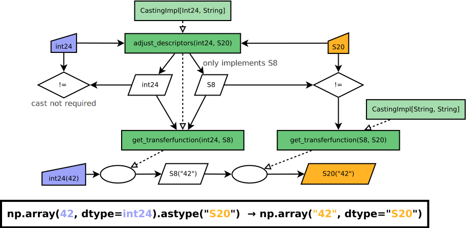

========================================
NEP 42 — Implementation of New DataTypes
========================================

:title: Extensible Datatypes for NumPy
:Author: Sebastian Berg
:Author: Marten van Kerkwijk
:Status: Draft
:Type: Standard
:Created: 2019-07-17

.. note::

    This NEP is part of a series of NEPs encompassing first information
    about the previous dtype implementation and issues with it in
    :ref:`NEP 40 <NEP40>`.
    :ref:`NEP 41 <NEP41>` then provides an overview and generic design
    choices for the refactor. NEPs 42 (this document)
    and 43 go into the technical details of the internal and external
    API changes related to datatypes and universal functions, respectively.
    In some cases it may be necessary to consult the other NEPs for a full
    picture of the desired changes and why these changes are necessary.

Abstract
--------

NEP 40 and 41 detailed the need for the creation of a new datatype system within
NumPy to better serve downstream use-cases and improve the maintainability
and the extensibility of NumPy.
A main issue with the current dtype API is that datatypes are written as
a single Python class with special instances for each of the actual datatypes.
While this certainly has been a practical approach in implementing numerical
datatypes, it does not allow to naturally split up logic. For example,
functions such as ``can_cast`` have explicit logic for each datatype.
Because of this monolithic code structure user-defined datatypes do not have
the same capabilities as NumPy datatypes have.
The current structure also makes understanding and modifying datatypes harder.
The current datatypes are not well encapsulated, so modifications targeting
a single datatype inevitably touch code involving others.
As detailed in NEP 41, the desired general design is to create classes for
each of the NumPy-provided datatypes, meaning that ``np.dtype("float64")``
returns an instance of a ``Float64`` class which is a subclass of ``np.dtype``.
``np.dtype[float64]`` will also be used to denote this class.
This will allow moving all logic into special methods on the ``np.dtype``
subclasses.  This ``DType`` class would then serve as the central
extension point  for adding new dtypes to NumPy.

This document proposes the new API for the datatypes itself.
A second proposal NEP 43 details proposed changes to the universal
functions.
Note that only the implementation of both NEPs will provide the desired full
functionality.

.. note::

    At this time this NEP is in a preliminary state. Both internal and
    external API may be adapted based on user input or implementation needs.
    The general design principles and choices, while provisional, should not
    be expected to change dramatically.

Detailed Description
--------------------

NEP 41 layed out the creation of a class hierarchy for datatypes using the
new DType classes to provide all necessary implementations.
This NEP defines the specific choice of API necessary to define new DTypes.
Here, these are suggested as C-API slots; however, conceptually these
translate identically to Python methods.

Additionally, the NEP proposes to implement the notion of *abstract* DTypes.
Further, we detail – in part – how the proposed methods (C-API slots)
enable all necessary use cases.

Each section will begin with a short motivation of the issue or what
problem is addressed. This is followed by a description of the proposed
design choice, and then may list alternatives.

Nomenclature
""""""""""""

As a brief note on nomenclature, it should be noted that ``dtype`` normally
denotes the dtype *instance*, which is the object attached to a numpy array.
On the other hand the ``DType`` class is the subclass of ``np.dtype``.
On the C-level we currently use the name ``descriptor`` or ``descr``
interchangeably with *dtype instance*. ``descriptor`` or ``descr`` will be
used in proposed C-API names to differentiate dtype instances from DType
classes more clearly.
Note that the notion of dtype class is currently represented mainly as
the ``dtype.num`` and ``dtype.char``.
Please see the :ref:`dtype hierarchy figure <hierarchy_figure>` for an
illustration of this distinction.

There are currently classes in NumPy for numeric types e.g. 
``np.float64``; however,
these are not DTypes but the corresponding scalar classes
(see also NEP 40 and 41 for discussion on why these are largely unrelated to
the proposed changes).

Proposed access to DType class
""""""""""""""""""""""""""""""

**Motivation:**

Currently we often call ``np.dtype`` to create the dtype instance
corresponding to a given scalar type (e.g.  ``np.dtype(np.int64)``).
Adding the DType classes may require a way to access the classes conveniently.

**Description:**

To avoid duplication, but also to expose the classes conveniently to users
we propose the addition of::

    np.dtype[np.int64]

as a class getter. This can work both for user and NumPy DTypes,
although, in many cases a library may choose to provide a more direct
way to access the specific DType class.
This method may initially be limited to concrete DTypes. 
The main reason for this choice is to provide a single
clear and future-proof way to find the DType class given the
Python (scalar) class.

This should not be a common operation, so providing this class getter reduces
the pressure of adding the new DType classes into the namespace.

*Note: This is currently a possible extension and not yet decided.*

Hierarchy of DTypes and Abstract DTypes
"""""""""""""""""""""""""""""""""""""""

**Motivation:**
The creation of DType classes has already been decided in NEP 41.
Here we discuss the notion of **abstract** DTypes.
There are multiple reasons for this:

1. It allows the definition of a class hierarchy, in principle allowing checks like
   ``isinstance(np.dtype("float64"), np.inexact)``.
   **This hierarchy may be a prerequisite to implementing dispatching
   for universal functions (NEP 43)**
2. Abstract DTypes can enable code such as
   ``arr.astype(Complex)`` to express the desire to cast to a
   complex data type of unspecified precision.
3. It anticipates the creation of families of DTypes by users.
   For example allowing the creation of an abstract ``Unit`` class with a concrete
   ``Float64Unit``. In which case ``Unit(np.float64, "m")`` could be
   identical to ``Float64Unit("m")``.

A very concrete example is the current Pandas ``Categorical`` DType,
which may benefit from abstraction to allow the differentiation of
a categorical of integer values and one of general object values.
The reason for this is that we may want to reject
``common_dtype(CategoricalInt64, String)``, but accept
``common_dtype(CategoricalObject, String)`` to be the ``object`` DType.
The current Pandas ``Categorical`` DType combines both and must remain
representable.  The solution is thus to make ``Categorical`` abstract with
the two subclasses ``CategoricalInt64`` and ``CategoricalObject``
distinguishing the two.

**Description:**

The figure below shows the proposed datatype hierarchy.
It should be noted that abstract DTypes are distinct in two ways:

1. They do not have instances. Instantiating an abstract DType has to return
   a concrete subclass or raise an error (default, and possibly enforced
   initially).
2. Unlike concrete DTypes, abstract DTypes can be superclasses, they may also
   serve like Python's abstract base classes (ABC).
   (It may be possible to simply use/inherit from Python ABCs.)

These two rules are identical to the type choices made for example in the
`Julia language <https://docs.julialang.org/en/v1/manual/types/#man-abstract-types-1>`_.
It allows for the creation of a datatype hierarchy, but avoids issues with
subclassing concrete DTypes directly.
For example, logic such as ``can_cast`` does not cleanly inherit from a
``Int64`` to a ``Datetime64`` even though the ``Datetime64`` could be seen
as an integer with only a unit attached (and thus implemented as a subclass).

The main consequence for the DType implementer is that concrete DTypes can
never be subclasses of existing concrete DTypes.
End-users would not notice or need to know about this distinction.
However, subclassing may be a possible mechanism to extend the datatypes
in the future to allow specialized implementations for existing dtypes
such as a GPU float64 subclassing a NumPy float64.

The combination of (initially) rejecting subclassing of concrete DTypes
while allowing it for abstract ones allows the transparent definition of
a class hierarchy, while avoiding potential issues with subclassing and
especially inheritance.

As a technical implementation detail: the DType class will require C-side
storage of methods and additional information.
This requires the creation of a ``DTypeMeta`` class.
Each ``DType`` class is thus an instance of ``DTypeMeta`` with a well-defined
and extensible interface.
The end-user will not need to be aware of this.

.. _hierarchy_figure:
.. figure:: _static/dtype_hierarchy.svg
    :figclass: align-center
    

Methods/Slots defined for each DType
""""""""""""""""""""""""""""""""""""

NEP 41 detailed that all logic should be defined through special methods
on the DTypes.
This section will list a specific set of such methods (in the form of 
Python methods).
The C-side equivalent slot signature will be summarized below after proposing
the general C-API for defining new Datatypes.
Note that while the slots are defined as special Python methods here, this is
for the readers convenience and *not* meant to imply the identical exposure
as a Python API.
This will need to be proposed in a separate, later, NEP.

Some of the methods may be similar or even reuse existing Python slots.
User-defined DType classes are discouraged from defining or using Python's
special slots without consulting the NumPy developers, in order to allow
defining them later.
For example ``dtype1 & dtype2`` could be a shorthand for
``np.common_dtype(dtype1, dtype2)``, and comparisons should be defined mainly
through casting logic.

Additional Information
^^^^^^^^^^^^^^^^^^^^^^

In addition to the more detailed methods below, the following general
information is currently provided and will be defined on the class:

* ``cls.parametric`` (see also `NEP 40 <NEP40>`_):

  * Parametric will be a flag in the (private) C-API. However, the
    Python API will instead use a ``ParametricDType`` class from
    which to inherit.  (This is similar to Python's type flags, which include
    flags for some basic subclasses such as subclasses of ``float`` or ``tuple``)
  * This flag is mainly to simplify DType creation and casting and
    allow for performance tweaks.
  * DTypes which are not parametric must define a canonical dtype instance
    which should be a singleton.
  * Parametric dtypes require some additional methods (below).

* ``self.canonical`` method (Alternative: new instance attribute)

  * Instead of byteorder, we may want a ``canonical`` flag (reusing the
    ISNBO flag – "is native byte order" seems possible here).
    This flag signals that the data are stored in the default/canonical way.
    In practice this is always an NBO check, but generalization should be possible.
    A potential use-case is a complex-conjugated instance of Complex which
    stores ``real - imag`` instead of ``real + imag`` and is thus not
    the canonical storage.

* ``ensure_canonical(self) -> dtype`` return a new dtype (or ``self``).
   The returned dtype must have the ``canonical`` flag set.

* ``DType.type`` is the associated scalar type.  ``dtype.type`` will be a
  class attribute and the current ``dtype.type`` field will be considered
  deprecated. This may be relaxed if a use-case arises.

Additionally, existing methods (and C-side fields) will be provided.
However, the fields ``kind`` and ``char`` will be set to ``\0``
(NULL character) on the C-side.
While discouraged, except for NumPy builtin types, ``kind`` both will return
the ``__qualname__`` of the object to ensure uniqueness for all DTypes.
(the replacement for ``kind`` will be to use ``isinstance`` checks).

Another example of methods that should be moved to the DType class are the
various sorting functions, which shall be implemented by defining a method:

* ``dtype_get_sort_function(self, sortkind="stable") -> sortfunction``

which must return ``NotImplemented`` if the given ``sortkind`` is not known.
Similarly, any function implemented previously which cannot be removed will
be implemented as a special method.
Since these methods can be deprecated and new (renamed) replacements added,
the API is not defined here and it is acceptable if it changes over time.

For some of the current "methods" defined on the dtype, including sorting,
a long term solution may be to instead create generalized ufuncs to provide
the functionality.

**Alternatives:**

Some of these flags could be implemented by inheriting
for example from a ``ParametricDType`` class. However, on the C-side as
an implementation detail it seems simpler to provide a flag.
This does not preclude the possibility of creating a ``ParametricDType``
to Python to represent the same thing.

**Example:**

The ``datetime64`` DType is considered parametric, due to its unit, and
unlike a float64 has no canonical representation. The associated ``type``
is the ``np.datetime64`` scalar.

**Issues and Details:**

A potential DType such as ``Categorical`` will not be required to have a clear type
associated with it. Instead, the ``type`` may be ``object`` and the
categorical's values are arbitrary objects.
Unlike with well-defined scalars, this ``type`` cannot
not be used for the dtype discovery necessary for coercion
(compare section `DType Discovery during Array Coercion`_).

Coercion to and from Python Objects
^^^^^^^^^^^^^^^^^^^^^^^^^^^^^^^^^^^

**Motivation:**

When storing a single value in an array or taking it out of the array,
it is necessary to coerce (convert) it to and from the low-level
representation inside the array.

**Description:**

Coercing to and from Python scalars requires two to three methods:

1. ``__dtype_setitem__(self, item_pointer, value)``
2. ``__dtype_getitem__(self, item_pointer, base_obj) -> object``
   The ``base_obj`` should be ignored normally, it is provided *only* for
   memory management purposes, pointing to an object owning the data.
   It exists only to allow support of structured datatypes with subarrays
   within NumPy, which (currently) return views into the array.
   The function returns an equivalent Python scalar (i.e. typically a NumPy
   scalar).
3. ``__dtype_get_pyitem__(self, item_pointer, base_obj) -> object``
   (initially hidden for new-style user-defined datatypes, may be exposed
   on user request). This corresponds to the ``arr.item()`` method which
   is also used by ``arr.tolist()`` and returns e.g. Python floats instead of
   NumPy floats.

(The above is meant for C-API. A Python-side API would have to use byte
buffers or similar to implement this, which may be useful for prototyping.)

These largely correspond to the current definitions.  When a certain scalar
has a known (different) dtype, NumPy may in the future use casting instead
of ``__dtype_setitem__``.
A user datatype is (initially) expected to implement ``__dtype_setitem__``
for its own ``DType.type`` and all basic Python scalars it wishes to support
(e.g. integers, floats, datetime).
In the future a function "``known_scalartype``" may be added to allow a user
dtype to signal which Python scalars it can store directly.

**Implementation:**

The pseudo-code implementation for setting a single item in an array
from an arbitrary Python object ``value`` is (note that some of the
functions are only defined below)::

    def PyArray_Pack(dtype, item_pointer, value):
        DType = type(dtype)
        if DType.type is type(value) or DType.known_scalartype(type(value)):
            return dtype.__dtype_setitem__(item_pointer, value)

        # The dtype cannot handle the value, so try casting:
        arr = np.array(value)
        if arr.dtype is object or arr.ndim != 0:
            # not a numpy or user scalar; try using the dtype after all:
            return dtype.__dtype_setitem__(item_pointer, value)

         arr.astype(dtype)
         item_pointer.write(arr[()])

where the call to ``np.array()`` represents the dtype discovery and is
not actually performed.

**Example:**

Current ``datetime64`` returns ``np.datetime64`` scalars and can be assigned
from ``np.datetime64``.
However, the datetime ``__dtype_setitem__`` also allows assignment from
date strings ("2016-05-01") or Python integers.
Additionally the datetime ``__dtype_get_pyitem__`` function actually returns
Python ``datetime.datetime`` object (most of the time).

**Alternatives:**

This may be seen as simply a cast to and from the ``object`` dtype.
However, it seems slightly more complicated. This is because
in general a Python object could itself be a zero-dimensional array or
scalar with an associated DType.
Thus, representing it as a normal cast would either require that:

* The implementor handles all Python classes, even those for which
  ``np.array(scalar).astype(UserDType)`` already works because
  ``np.array(scalar)`` returns, say, a datetime64 array.
* The cast is actually added between a typed-object to dtype. And even
  in this case a generic fallback (for example ``float64`` can use
  ``float(scalar)`` to do the cast) is also necessary.

It is certainly possible to describe the coercion to and from Python objects
using the general casting machinery. However, it seems special enough to
handle specifically.

**Further Issues and Discussion:**

The setitem function currently duplicates some code, such as coercion
from a string. ``datetime64`` allows assignment from string, but the same
conversion also occurs for casts from the string dtype to ``datetime64``.
In the future, we may expose a way to signal whether a conversion is known,
and otherwise a normal cast is made so that the item is effectively set to ``np.array(scalar).astype(requested_dtype)``.

There is a general issue about the handling of subclasses. We anticipate to not
automatically detect the dtype for ``np.array(float64_subclass)`` to be
float64.  The user can still provide ``dtype=np.float64``. However, the above
"assign by casting" using ``np.array(scalar_subclass).astype(requested_dtype)``
will fail.

.. note::

    This means that ``np.complex256`` should not use ``__float__`` in its
    ``__dtype_setitem__`` method in the future unless it is a known floating
    point type.  If the scalar is a subclass of a different high precision
    floating point type (e.g. ``np.float128``) then this will lose precision. 

DType Discovery during Array Coercion
^^^^^^^^^^^^^^^^^^^^^^^^^^^^^^^^^^^^^

An important step in the usage of NumPy arrays is the creation of the array
itself from collections of generic Python objects.

**Motivation:**

Although the distinction is not clear currently, there are two main needs::

    np.array([1, 2, 3, 4.])

needs to guess the correct dtype based on the Python objects inside.
Such an array may include a mix of datatypes, as long as they can be clearly
promoted.
Currently not clearly distinct (but partially existing for strings) is the
use case of::

    # np.dtype[np.str_] can also be spelled np.str_ or "S" (which works today)
    np.array([object(), None], dtype=np.dtype[np.str_])

which forces each object to be interpreted as string. This is anticipated
to be useful for example for categorical datatypes::

    np.array([1, 2, 1, 1, 2], dtype=Categorical)

to allow the discovery the of all unique values.
(For NumPy ``datetime64`` this is also currently used to allow string input.)

There are three further issues to consider:

1. It may be desirable that datatypes can be created which are associated
   to normal Python scalars (such as ``datetime.datetime``), which do not
   have a ``dtype`` attribute already.
2. In general, a datatype could represent a sequence, however, NumPy currently
   assumes that sequences are always collections of elements (the sequence cannot be an
   element itself). An example for this is would be a ``vector`` DType.
3. An array may itself contain arrays with a specific dtype (even 
   general Python objects).  For example:
   ``np.array([np.array(None, dtype=object)], dtype=np.String)``
   poses the issue of how to handle the included array.

Some of these difficulties arise due to the fact that finding the correct shape
of the output array and finding the correct datatype are closely related.

**Implementation:**

There are two distinct cases given above: First, when the user has provided no
dtype information, and second when the user provided a DType class – 
a notion that is currently represented e.g. by the parametric instance ``"S"``
representing a string of any length.

In the first case, it is necessary to establish a mapping from the Python type(s)
of the constituent elements to the DType class.
When the DType class is known, the correct dtype instance still needs to be found.
This shall be implemented by leveraging two pieces of information:

1. ``DType.type``: The current type attribute to indicate which Python scalar
   type is associated with the DType class (this is a *class* attribute that always
   exists for any datatype and is not limited to array coercion).
2. The reverse lookup will remain hardcoded for the basic Python types initially.
   Otherwise the ``type`` attribute will be used, and at least initially may
   enforce deriving the scalar from a NumPy-provided scalar base class.
   This method may be expanded later (see alternatives).
3. ``__discover_descr_from_pyobject__(cls, obj) -> dtype``: A classmethod that
   returns the correct descriptor given the input object.
   *Note that only parametric DTypes have to implement this*, most datatypes
   can simply use a default (singleton) dtype instance which is found only
   based on the ``type(obj)`` of the Python object.

The Python type which is already associated with a DType through the
``DType.type`` attribute maps from the DType to the Python type.
A DType may choose to automatically discover from this Python type.
This will be achieved using a global a mapping (dictionary-like) of::

   known_python_types[type] = DType

To anticipate the possibility of creating both a Python type (``pytype``)
and ``DType`` dynamically, and thus the potential desire to delete them again,
this mapping should generally be weak.
This requires that the ``pytype`` holds on to the ``DType`` explicitly.
Thus, in addition to building the global mapping, NumPy will store
the ``DType`` as ``pytype.__associated_array_dtype__`` in the Python type.
This does *not* define the mapping and should *not* be accessed directly.
In particular potential inheritance of the attribute does not mean that
NumPy will use the superclasses ``DType`` automatically.
A new ``DType`` must be created for the subclass.

.. note::

    Python integers do not have a clear/concrete NumPy type associated with
    them right now. This is because during array coercion NumPy currently
    finds the first type capable of representing their value in the list
    of `long`, `unsigned long`, `int64`, `unsigned int64`, and `object`
    (on many machines `long` is 64 bit).

    Instead they will need to be implemented using an
    ``AbstractPyInt``. This DType class can then provide
    ``__discover_descr_from_pyobject__`` and return the actual dtype which
    is e.g. ``np.dtype("int64")``.
    For dispatching/promotion in ufuncs, it will also be necessary
    to dynamically create ``AbstractPyInt[value]`` classes (creation can be
    cached), so that they can provide the current value based promotion
    functionality provided by ``np.result_type(python_integer, array)`` [1]_.

To allow for a DType to accept specific inputs as known scalars, we will
initially use a ``known_scalar_type`` method.
This allows discovery of a ``vector`` as a scalar (element) instead of
a sequence (for the command ``np.array(vector, dtype=VectorDType)``)
even when ``vector`` is itself a sequence or even an array subclass.
This will *not* be public API initially, but may be made public at a later
time.

This will work similar to the following pseudo-code::

    def find_dtype(array_like):
        common_dtype = None
        for element in array_like:
            # default to object dtype, if unknown
            DType = known_python_types.get(type(element), np.dtype[object])
            dtype = DType.__discover_descr_from_pyobject__(element)

            if common_dtype is None:
                common_dtype = dtype
            else:
                common_dtype = np.promote_types(common_dtype, dtype)

In practice, we have to find out whether an element is actually a sequence.
This means that instead of using the ``object`` dtype directly, we have to
check whether or not it is a sequence.

The full algorithm (without user provided dtype) thus looks more like::

    def find_dtype_recursive(array_like, dtype=None):
        """
        Recursively find the dtype for a nested sequences (arrays are not
        supported here).
        """
        DType = known_python_types.get(type(element), None)

        if DType is None and is_array_like(array_like):
            # Code for a sequence, an array_like may have a DType we
            # can use directly:
            for element in array_like:
                dtype = find_dtype_recursive(element, dtype=dtype)
            return dtype

        elif DType is None:
            DType = np.dtype[object]

        # Same as above

If the user provides ``DType``, then this DType will be tried first, and the
``dtype`` may need to be cast before the promotion is performed.

**Limitations:**

The above issue 3. is currently (sometimes) supported by NumPy so that
the values of an included array are inspected.
Support in those cases may be kept for compatibility, however,
it will not be exposed to user datatypes.
This means that if e.g. an array with a parametric string dtype is coerced above
(or cast) to an array of a fixed length string dtype (with unknown length),
this will result in an error.
Such a conversion will require passing the correct DType (fixed length of the
string) or providing a utility function to the user.

The use of a global type map means that an error or warning has to be given
if two DTypes wish to map to the same Python type. In most cases user
DTypes should only be implemented for types defined within the same library to
avoid the potential for conflicts.
It will be the DType implementor's responsibility to be careful about this and use
the flag to disable registration when in doubt.

**Alternatives:**

The above proposes to add a global mapping, however, initially limiting it
to types deriving from a NumPy subclass (and a fixed set of Python types).
This could be relaxed in the future.
Alternatively, we could rely on the scalar belonging to the user dtype to
implement ``scalar.__associated_array_dtype__`` or similar.

Initially, the exact implementation shall be *undefined*, if
scalars will have to derive from a NumPy scalar, they will also have
a ``.__associated_array_dtype__`` attribute.
At this time, a future update may to use this instead of a global mapping,
however, it makes NumPy a hard dependency for the scalar class.

An initial alternative suggestion was to use a two-pass approach instead.
The first pass would only find the correct DType class, and the second pass
would then find correct dtype instance (the second pass is often not necessary).
The advantage of this is that the DType class information is vital for universal
functions to decide which loop to execute.
The first pass would provide the full information necessary for value-based
casting currently implemented for scalars, giving even the possibility of
expanding it to e.g. list inputs ``np.add(np.array([8], dtype="uint8"), [4])``
giving a ``uint8`` result.
This is mainly related to the question to how the common dtype is found above.
It seems unlikely that this is useful, and similar to a global, could be
added later if deemed necessary.

**Further Issues and Discussion:**

While it is possible to create e.g. a DType such as Categorical, array,
or vector which can only be used if `dtype=DType` is provided, if this
is necessary these will not roundtrip correctly when converted back
and forth::

    np.array(np.array(1, dtype=Categorical)[()])

requires to pass the original ``dtype=Categorical`` or returns an array
with dtype ``object``.
While a general limitation, the round-tripping shall always be possible if
``dtype=old_dtype`` is provided.

**Example:**

The current datetime DType requires a ``__discover_descr_from_pyobject__``
which returns the correct unit for string inputs.  This allows it to support
the current::

    np.array(["2020-01-02", "2020-01-02 11:24"], dtype="M8")

By inspecting the date strings. Together with the below common dtype
operation, this allows it to automatically find that the datetime64 unit
should be "minutes".

Common DType Operations
^^^^^^^^^^^^^^^^^^^^^^^

NumPy currently provides functions like ``np.result_type`` and
``np.promote_types`` for determining common types.
These differ in that ``np.result_type`` can take arrays and scalars as input
and implements value based promotion [1]_.

To distinguish between the promotion occurring during universal function application,
we will call it "common type" operation here.

**Motivation:**
Common type operations are vital for array coercion when different
input types are mixed.
They also provide the logic currently used to decide the output dtype of
``np.concatenate()`` and on their own are quite useful.

Furthermore, common type operations may be used to find the correct dtype
to use for functions with different inputs (including universal functions).
This includes an interesting distinction:

1. Universal functions use the DType classes for dispatching, they thus
   require the common DType class (as a first step).
   While this can help with finding the correct loop to execute, the loop
   may not need the actual common dtype instance.
   (Hypothetical example:
   ``float_arr + string_arr -> string``, but the output string length is
   not the same as ``np.concatenate(float_arr, string_arr)).dtype``.)
2. Array coercion and concatenation require the common dtype *instance*.   

**Implementation:**
The implementation of the common dtype (instance) determination 
has some overlap with casting.
Casting from a specific dtype (Float64) to a String needs to find
the correct string length (a step that is mainly necessary for parametric dtypes).

We propose the following implementation:

1. ``__common_dtype__(cls, other : DTypeMeta) -> DTypeMeta`` answers what the common
   DType class is given two DType class objects.
   It may return ``NotImplemented`` to defer to ``other``.
   (For abstract DTypes, subclasses get precedence, concrete types are always
   leaves, so always get preference or are tried from left to right). 
2. ``__common_instance__(self: SelfT, other : SelfT) -> SelfT`` is used when
   two instances of the same DType are given.
   For builtin dtypes (that are not parametric), this
   currently always returns ``self`` (but ensures native byte order).
   This is to preserve metadata. We can thus provide a default implementation
   for non-parametric user dtypes.

These two cases do *not* cover the case where two different dtype instances
need to be promoted. For example `">float64"` and `"S8"`.
The solution is partially "outsourced" to the casting machinery by
splitting the operation up into three steps:

1. ``Float64.__common_dtype__(type(>float64), type(S8))``
   returns `String` (or defers to ``String.__common_dtype__``).
2. The casting machinery provides the information that `">float64"` casts
   to `"S32"` (see below for how casting will be defined).
3. ``String.__common_instance__("S8", "S32")`` returns the final `"S32"`.

The main reason for this is to avoid the need to implement
identical functionality multiple times.
The design (together with casting) naturally separates the concerns of
different Datatypes.
In the above example, Float64 does not need to know about the cast.
While the casting machinery (``CastingImpl[Float64, String]``)
could include the third step, it is not required to do so and the string
can always be extended (e.g. with new encodings) without extending the
``CastingImpl[Float64, String]``.

This means the implementation will work like this::

    def common_dtype(DType1, DType2):
        common_dtype = type(dtype1).__common_dtype__(type(dtype2))
        if common_dtype is NotImplemented:
            common_dtype = type(dtype2).__common_dtype__(type(dtype1))
            if common_dtype is NotImplemented:
                raise TypeError("no common dtype")
        return common_dtype

    def promote_types(dtype1, dtyp2):
        common = common_dtype(type(dtype1), type(dtype2))

        if type(dtype1) is not common:
            # Find what dtype1 is cast to when cast to the common DType
            # by using the CastingImpl as described below:
            castingimpl = get_castingimpl(type(dtype1), common)
            safety, (_, dtype1) = castingimpl.adjust_descriptors((dtype1, None))
            assert safety == "safe"  # promotion should normally be a safe cast

        if type(dtype2) is not common:
            # Same as above branch for dtype1.

        if dtype1 is not dtype2:
            return common.__common_instance__(dtype1, dtype2)

Some of these steps may be optimized for non-parametric DTypes.

**Note:**

A currently implemented fallback for the ``__common_dtype__`` operation
is to use the "safe" casting logic.
Since ``int16`` can safely cast to ``int64``, it is clear that
``np.promote_types(int16, int64)`` should be ``int64``.

However, this cannot define all such operations, and will fail for example for::

    np.promote_types("int64", "float32") -> np.dtype("float64")

In this design, it is the responsibility of the DType author to ensure that
in most cases a safe-cast implies that this will be the result of the
``__common_dtype__`` method.

Note that some exceptions may apply. For example casting ``int32`` to
a (long enough) string is – at least at this time – considered "safe".
However ``np.promote_types(int32, String)`` will *not* be defined.

**Alternatives:**

The use of casting for common dtype (instance) determination neatly separates
the concerns and allows for a minimal set of duplicate functionality
being implemented.
In cases of mixed DType (classes), it also adds an additional step
to finding the common dtype.
The common dtype (of two instances) could thus be implemented explicitly to avoid
this indirection, potentially only as a fast-path.
The above suggestion assumes that this is, however, not a speed relevant path,
since in most cases, e.g. in array coercion, only a single Python type (and thus
dtype) is involved.
The proposed design hinges in the implementation of casting to be
separated into its own ufunc-like object as described below.

In principle common DType could be defined only based on "safe casting" rules,
if we order all DTypes and find the first one both can cast to safely.
However, the issue with this approach is that a newly added DType can change
the behaviour of an existing program.  For example, a new ``int24`` would be
the first valid common type for ``int16`` and ``uint16``, demoting the currently
defined behaviour of ``int32``.
This API extension could be allowed in the future, while adding it may be
more involved, the current proposal for defining casts is fully opaque in
this regard and thus extensible.

**Example:**

``object`` always chooses ``object`` as the common DType.  For ``datetime64``
type promotion is defined with no other datatype, but if someone were to
implement a new higher precision datetime, then::

    HighPrecisionDatetime.__common_dtype__(np.dtype[np.datetime64])

would return ``HighPrecisionDatetime``, and the below casting may need to
decide how to handle the datetime unit.

Casting
^^^^^^^

Maybe the most complex and interesting operation which is provided
by DTypes is the ability to cast from one dtype to another.
The casting operation is much like a typical function (universal function) on
arrays converting one input to a new output.
There are mainly two distinctions:

1. Casting always requires an explicit output datatype to be given.
2. The NumPy iterator API requires access to lower-level functions than
   is currently necessary for universal functions. 

Casting from one dtype to another can be complex, and generally a casting
function may not implement all details of each input datatype (such as
non-native byte order or unaligned access).
Thus casting naturally is performed in up to three steps:

1. The input datatype is normalized and prepared for the actual cast.
2. The cast is performed.
3. The cast result, which is in a normalized form, is cast to the requested
   form (non-native byte order).

although often only step 2. is required.

Further, NumPy provides different casting kinds or safety specifiers:

* "safe"
* "same_kind"
* "unsafe"

and in some cases a cast may even be represented as a simple view.

**Motivation:**

Similar to the common dtype/DType operation above, we again have two use cases:

1. ``arr.astype(np.String)`` (current spelling ``arr.astype("S")``)
2. ``arr.astype(np.dtype("S8"))``.

Where the first case is also noted in NEP 40 and 41 as a design goal, since
``np.String`` could also be an abstract DType as mentioned above.

The implementation of casting should also come with as little duplicate
implementation as necessary, i.e. to avoid unnecessary methods on the
DTypes.
Furthermore, it is desirable that casting is implemented similar to universal
functions.

Analogous to the above, the following also need to be defined:

1. ``np.can_cast(dtype, DType, "safe")`` (instance to class)
2. ``np.can_cast(dtype, other_dtype, "safe")`` (casting an instance to another instance)

overloading the meaning of ``dtype`` to mean either class or instance
(on the Python level).
The question of ``np.can_cast(DType, OtherDType, "safe")`` is also a
possibility and may be used internally.
However, it is initially not necessary to expose to Python.

**Implementation:**

During DType creation, DTypes will have the ability to pass a list of
``CastingImpl`` objects, which can define casting to and from the DType.
One of these ``CastingImpl`` objects is special because it should define
the cast within the same DType (from one instance to another).
A DType which does not define this, must have only a single implementation
and not be parametric.

Each ``CastingImpl`` has a specific DType signature:
``CastingImpl[InputDtype, RequestedDtype]``.
And implements the following methods and attributes:

* ``adjust_descriptors(self, Tuple[DType] : input) -> casting, Tuple[DType]``.
  Here ``casting`` signals the casting safeness (safe, unsafe, or same-kind)
  and the output dtype tuple is used for more multi-step casting (see below).
* ``get_transferfunction(...) -> function handling cast`` (signature to be decided).
  This function returns a low-level implementation of a strided casting function
  ("transfer function").
* ``cast_kind`` attribute with one of safe, unsafe, or same-kind. Used to
  quickly decide casting safety when this is relevant.

``adjust_descriptors`` provides information about whether or
not a cast is safe and is of importance mainly for parametric DTypes.
``get_transferfunction`` provides NumPy with a function capable of performing
the actual cast.  Initially the implementation of ``get_transferfunction``
will be *private*, and users will only be able to provide contiguous loops
with the signature.

**Performing the Cast:**

.. _cast_figure:

`The above figure <cast_figure>`_ illustrates the multi-step logic necessary to
cast for example an ``int24`` with a value of ``42`` to a string of length 20
(``"S20"``).
In this example, the implementer only provided the functionality of casting
an ``int24`` to an ``S8`` string (which can hold all 24bit integers).
Due to this limited implementation, the full cast has to do multiple
conversions.  The full process is:

1. Call ``CastingImpl[Int24, String].adjust_descriptors((int24, "S20"))``.
   This provides the information that ``CastingImpl[Int24, String]`` only
   implements the cast of ``int24`` to ``"S8``.
2. Since ``"S8"`` does not match ``"S20"``, use
   ``CastingImpl[String, String].get_transferfunction()``
   to find the transfer (casting) function to convert an ``"S8"`` into an ``"S20"``
3. Fetch the transfer function to convert an ``int24`` to an ``"S8"`` using
   ``CastingImpl[Int24, String].get_transferfunction()``
4. Perform the actual cast using the two transfer functions:
   ``int24(42) -> S8("42") -> S20("42")``. 

Note that in this example the ``adjust_descriptors`` function plays a less
central role.  It becomes more important for ``np.can_cast``.

Further, ``adjust_descriptors`` allows the implementation for
``np.array(42, dtype=int24).astype(String)`` to call
``CastingImpl[Int24, String].adjust_descriptors((int24, None))``.
In this case the result of ``(int24, "S8")`` defines the correct cast:
``np.array(42, dtype=int24),astype(String) == np.array("42", dtype="S8")``.

**Casting Safety:**

To answer the question of casting safety
``np.can_cast(int24, "S20", casting="safe")``, only the ``adjust_descriptors``
function is required and called is in the same way as in 
`the figure describing a cast <cast_figure>`_.
In this case, the calls to ``adjust_descriptors``, will also provide the
information that ``int24 -> "S8"`` as well as ``"S8" -> "S20"`` are safe casts,
and thus also the ``int24 -> "S20"`` is a safe cast.

The casting safety can currently be "equivalent" when a cast is both safe
and can be performed using only a view.
The information that a cast is a simple "view" will instead be handled by
an additional flag.  Thus the ``casting`` can have the 6 values in total:
safe, unsafe, same-kind as well as safe+view, unsafe+view, same-kind+view.
Where the current "equivalent" is the same as safe+view.

(For more information on the ``adjust_descriptor`` signature see the
C-API section below.)

**Casting between instances of the same DType:**

In general one of the casting implementations define by the DType implementor
must be ``CastingImpl[DType, DType]`` (unless there is only a singleton
instance).
To keep the casting to as few steps as possible, this implementation must
be capable any conversions between all instances of this DType.

**General Multi-Step Casting**

In general we could implement certain casts, such as ``int8`` to ``int24``
even if the user only provides an ``int16 -> int24`` cast.
This proposal currently does not provide this functionality.  However,
it could be extended in the future to either find such casts dynamically,
or at least allow ``adjust_descriptors`` to return arbitrary ``dtypes``.
If ``CastingImpl[Int8, Int24].adjust_descriptors((int8, int24))`` returns
``(int16, int24)``, the actual casting process could be extended to include
the ``int8 -> int16`` cast.  Unlike the above example, which is limited
to at most three steps.

**Alternatives:**

The choice of using only the DType classes in the first step of finding the
correct ``CastingImpl`` means that the default implementation of
``__common_dtype__`` has a reasonable definition of "safe casting" between
DTypes classes (although e.g. the concatenate operation using it may still
fail when attempting to find the actual common instance or cast).

The split into multiple steps may seem to add complexity
rather than reduce it, however, it consolidates that we have the two distinct
signatures of ``np.can_cast(dtype, DTypeClass)`` and ``np.can_cast(dtype, other_dtype)``.
Further, the above API guarantees the separation of concerns for user DTypes.
The user ``Int24`` dtype does not have to handle all string lengths if it
does not wish to do so.  Further, if an encoding was added to the ``String``
DType, this does not affect the overall cast.
The ``adjust_descriptor`` function can keep returning the default encoding
and the ``CastingImpl[String, String]`` can take care of any necessary encoding
changes.

The main alternative to the proposed design is to move most of the information
which is here pushed into the ``CastingImpl`` directly into methods
on the DTypes. This, however, will not allow the close similarity between casting
and universal functions. On the up side, it reduces the necessary indirection
as noted below.

An initial proposal defined two methods ``__can_cast_to__(self, other)``
to dynamically return ``CastingImpl``.
The advantage of this addition is that it removes the requirement to know all
possible casts at DType creation time (of one of the involved DTypes).
Such API could be added at a later time. It should be noted, however,
that it would be mainly useful for inheritance-like logic, which can be
problematic. As an example two different ``Float64WithUnit`` implementations
both could infer that they can unsafely cast between one another when in fact
some combinations should cast safely or preserve the Unit (both of which the
"base" ``Float64`` would discard).
In the proposed implementation this is not possible, since the two implementations
are not aware of each other.

**Notes:**

The proposed ``CastingImpl`` is designed to be compatible with the
``UFuncImpl`` proposed in NEP 43.
While initially it will be a distinct object or C-struct, the aim is that
``CastingImpl`` can be a subclass or extension of ``UFuncImpl``.
Once this happens, this may naturally allow the use of a ``CastingImpl`` to
pass around a specialized casting function directly.

In the future, we may consider adding a way to spell out that specific
casts are known to be *not* possible.

In the above text ``CastingImpl`` is described as a Python object. In practice,
the current plan is to implement it as a C-side structure stored on the ``from``
datatype.
A Python side API to get an equivalent ``CastingImpl`` object will be created,
but storing it (similar to the current implementation) on the ``from`` datatype
avoids the creation of cyclic reference counts.

The way dispatching works for ``CastingImpl`` is planned to be limited initially
and fully opaque.
In the future, it may or may not be moved into a special UFunc, or behave
more like a universal function.

**Example:**

The implementation for casting integers to datetime would currently generally
say that this cast is unsafe (it is always an unsafe cast).
Its ``adjust_descriptors`` functions may look like::

    def adjust_descriptors(input):
        from_dtype, to_dtype = input

        from_dtype = from_dtype.ensure_canonical()  # ensure not byte-swapped
        if to_dtype is None:
            raise TypeError("Cannot convert to a NumPy datetime without a unit")
        to_dtype = to_dtype.ensure_canonical()  # ensure not byte-swapped

        # This is always an "unsafe" cast, but for int64, we can represent
        # it by a simple view (if the dtypes are both canonical).
        # (represented as C-side flags here).
        safety_and_view = NPY_UNSAFE_CASTING | NPY_CAST_IS_VIEW
        return safety_and_view, (from_dtype, to_dtype)

.. note::

    While NumPy currently defines some of these casts, with the possible
    exception of the unit-less ``timedelta64`` it may be better to not
    define these cast at all.  In general we expect that user defined
    DTypes will be using other methods such as ``unit.drop_unit(arr)``
    or ``arr * unit.seconds``.

C-Side API
^^^^^^^^^^

A Python side API shall not be defined here. This is a general side approach.

DType creation
""""""""""""""

As already mentioned in NEP 41, the interface to define new DTypes in C
is modeled after the limited API in Python: the above-mentioned slots
and some additional necessary information will thus be passed within a slots
struct and identified by ``ssize_t`` integers::

    static struct PyArrayMethodDef slots[] = {
        {NPY_dt_method, method_implementation},
        ...,
        {0, NULL}
    }

    typedef struct{
      PyTypeObject *typeobj;    /* type of python scalar */
      int is_parametric;        /* Is the dtype parametric? */
      int is_abstract;          /* Is the dtype abstract? */
      int flags                 /* flags (to be discussed) */
      /* NULL terminated CastingImpl; is copied and references are stolen */
      CastingImpl *castingimpls[];
      PyType_Slot *slots;
      PyTypeObject *baseclass;  /* Baseclass or NULL */
    } PyArrayDTypeMeta_Spec;

    PyObject* PyArray_InitDTypeMetaFromSpec(PyArrayDTypeMeta_Spec *dtype_spec);

all of this information will be copied during instantiation.

**TODO:** The DType author should be able to at define new methods for
their DType, up to defining a full type object and in the future possibly even
extending the ``PyArrayDTypeMeta_Type`` struct.
We have to decide on how (and what) to make available to the user initially.
A proposed initial solution may be to simply allow inheriting from an existing
class.
Further this prevents overriding some slots, such as `==` which may not be
desirable.

The proposed method slots are (prepended with ``NPY_dt_``), these are
detailed above and given here for summary:

* ``is_canonical(self) -> {0, 1}``
* ``ensure_canonical(self) -> dtype``
* ``default_descr(self) -> dtype`` (return must be native and should normally be a singleton)
* ``setitem(self, char *item_ptr, PyObject *value) -> {-1, 0}``
* ``getitem(self, char *item_ptr, PyObject (base_obj) -> object or NULL``
* ``discover_descr_from_pyobject(cls, PyObject) -> dtype or NULL``
* ``common_dtype(cls, other) -> DType, NotImplemented, or NULL``
* ``common_instance(self, other) -> dtype or NULL``

If not set, most slots are filled with slots which either error or defer automatically.
Non-parametric dtypes do not have to implement:

* ``discover_descr_from_pyobject`` (uses ``default_descr`` instead)
* ``common_instance`` (uses ``default_descr`` instead)
* ``ensure_canonical`` (uses ``default_descr`` instead)

Which will be correct for most dtypes *which do not store metadata*.

Other slots may be replaced by convenience versions, e.g. sorting methods
can be defined by providing:

* ``compare(self, char *item_ptr1, char *item_ptr2, int *res) -> {-1, 0}``
  *TODO: We would like an error return, is this reasonable? (similar to old
  python compare)*

which uses generic sorting functionality.  In general, we could add a
functions such as:

* ``get_sort_function(self, NPY_SORTKIND sort_kind) -> {out_sortfunction, NotImplemented, NULL}``.
  If the sortkind is not understood it may be allowed to return ``NotImplemented``.

in the future. However, for example sorting is likely better solved by the
implementation of multiple generalized ufuncs which are called internally.

**Limitations:**

Using the above ``PyArrayDTypeMeta_Spec`` struct, the structure itself can
only be extended clumsily (e.g. by adding a version tag to the ``slots``
to indicate a new, longer version of the struct).
We could also provide the struct using a function, which however will require
memory management but would allow ABI-compatible extension
(the struct is freed again when the DType is created).

CastingImpl
"""""""""""

The external API for ``CastingImpl`` will be limited initially to defining:

* ``cast_kind`` attribute, which can be one of the supported casting kinds.
  This is the safest cast possible. For example casting between two NumPy
  strings is of course "safe" in general, but may be "same kind" in a specific
  instance if the second string is shorter. If neither type is parametric the
  ``adjust_descriptors`` must use it. 
* ``adjust_descriptors(dtypes_in[2], dtypes_out[2], casting_out) -> int {0, -1}``
  The out dtypes must be set correctly to dtypes which the strided loop
  (transfer function) can handle.  Initially the result must have be instances
  of the same DType class as the ``CastingImpl`` is defined for.
  The ``casting_out`` will be set to ``NPY_SAFE_CASTING``, ``NPY_UNSAFE_CASTING``,
  or ``NPY_SAME_KIND_CASTING``.  With a new, additional, flag ``NPY_CAST_IS_VIEW``
  which can be set to indicate that no cast is necessary, but a simple view
  is sufficient to perform the cast.
  The cast should return ``-1`` when a custom error message is set and
  ``NPY_NO_CASTING`` to indicate that a generic casting error should be
  set (this is in most cases preferable).
* ``strided_loop(char **args, npy_intp *dimensions, npy_intp *strides, dtypes[2]) -> int {0, nonzero}`` (must currently succeed)

This is identical to the proposed API for ufuncs. By default the two dtypes
are passed in as the last argument. On error return (if no error is set) a
generic error will be given.
More optimized loops are in use internally, and will be made available to users
in the future (see notes)
The iterator API does not currently support casting errors: this is
a bug that needs to be fixed. Until it is fixed the loop should always
succeed (return 0).

Although verbose, the API shall mimic the one for creating a new DType.
The ``PyArrayCastingImpl_Spec`` will include a field for ``dtypes`` and
identical to a ``PyArrayUFuncImpl_Spec``::

    typedef struct{
      int needs_api;                 /* whether the cast requires the API */
      PyArray_DTypeMeta *in_dtype;   /* input DType class */
      PyArray_DTypeMeta *out_dtype;  /* output DType class */
      /* NULL terminated slots defining the methods */
      PyType_Slot *slots;
    } PyArrayUFuncImpl_Spec;

The actual creation function ``PyArrayCastingImpl_FromSpec()`` will additionally
require a ``casting`` parameter to define the default (maximum) casting safety.
The internal representation of ufuncs and casting implementations may differ
initially if it makes implementation simpler, but should be kept opaque to
allow future merging.

**TODO:** It may be possible to make this more close to the ufuncs or even
use a single FromSpec.  This API shall only be finalized after/when NEP 43
is finalized.

**Notes:**

We may initially allow users to define only a single loop.
However, internally NumPy optimizes far more, and this should be made
public incrementally, by either allowing to provide multiple versions, such
as:

* contiguous inner loop
* strided inner loop
* scalar inner loop

or more likely through an additional ``get_inner_loop`` function which has
additional information, such as the fixed strides (similar to our internal API).

The above example does not yet include the definition of setup/teardown
functionality, which may overlap with ``get_inner_loop``.
Since these are similar to the UFunc machinery, this should be defined in
detail in NEP 43 and then incorporated identically into casting.

Also the ``needs_api`` decision may actually be moved into a setup function,
and removed or mainly provided as a convenience flag.

The slots/methods used will be prefixed ``NPY_uf_`` for similarity to the ufunc
machinery.

Alternatives
""""""""""""

Aside from name changes, and possible signature tweaks, there seem to
be few alternatives to the above structure.
Keeping the creation process close the Python limited API has some advantage.
Convenience functions could still be provided to allow creation with less
code.
The central point in the above design is that the enumerated slots design
is extensible and can be changed without breaking binary compatibility.
A downside is the possible need to pass in e.g. integer flags using a void
pointer inside this structure.

A downside of this is that compilers cannot warn about function
pointer incompatibilities. There is currently no proposed solution to this.

Issues
^^^^^^

Any possible design decision will have issues.

The above split into Python objects has the disadvantage that reference cycles
naturally occur.  For example a potential ``CastingImpl`` object needs to
hold on to both ``DTypes``.  Further, a scalar type may want to own a
strong reference to the corresponding ``DType`` while the ``DType`` *must*
hold a strong reference to the scalar.
We do not believe that these reference cycles are an issue. The may
require implementation of of cyclic reference counting at some point, but
cyclic reference resolution is very common in Python and dtypes (especially
classes) are only a small number of objects.

In some cases, the new split will add additional indirections to the code,
since methods on the DType have to be looked up and called.
This should not have serious performance impact and seems necessary to
achieve the desired flexibility.

From a user-perspective, a more serious downside is that handling certain
functionality in the ``DType`` rather than directly can mean that error
messages need to be raised from places where less context is available.
This may mean that error messages can be less specific.
This will be alleviated by exception chaining.  Also decisions such as
returning the casting safety (even when it is impossible to cast) allow
most exceptions to be set at a point where more context is available
and ensures uniform errors messages.

Implementation
--------------

Internally a few implementation details have to be decided. These will be
fully opaque to the user and can be changed at a later time.

This includes:

* How ``CastingImpl`` lookup, and thus the decision whether a cast is possible,
  is defined. (This is speed relevant, although mainly during a transition
  phase where UFuncs where NEP 43 is not yet implemented).
  Thus, it is not very relevant to the NEP. It is only necessary to ensure fast
  lookup during the transition phase for the current builtin Numerical types.

* How the mapping from a python scalar (e.g. ``3.``) to the DType is
  implemented.

The main steps for implementation are outlined in :ref:`NEP 41 <NEP41>`.
This includes the internal restructure for how casting and array-coercion
works.
After this the new public API will be added incrementally.
This includes replacements for certain slots which are occasionally
directly used on the dtype (e.g. ``dtype->f->setitem``).

Discussion
----------

There is a large space of possible implementations with many discussions
in various places, as well as initial thoughts and design documents.
These are listed in the discussion of NEP 40 and not repeated here for
brevity.

References
----------

.. [1] NumPy currently inspects the value to allow the operations::

     np.array([1], dtype=np.uint8) + 1
     np.array([1.2], dtype=np.float32) + 1.

   to return a ``uint8`` or ``float32`` array respectively.  This is
   further described in the documentation of `numpy.result_type`.

Copyright
---------

This document has been placed in the public domain.
