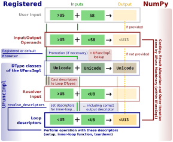

.. _NEP43:

==============================================================================
NEP 43 — Enhancing the Extensibility of UFuncs
==============================================================================

:title: Enhancing the Extensibility of UFuncs
:Author: Sebastian Berg
:Status: Draft
:Type: Standard
:Created: 2020-06-20

.. note::

    This NEP is fourth in a series:

    - :ref:`NEP 40 <NEP40>` explains the shortcomings of NumPy's dtype implementation.

    - :ref:`NEP 41 <NEP41>` gives an overview of our proposed replacement.

    - :ref:`NEP 42 <NEP42>`  describes the new design's datatype-related APIs.

    - NEP 43 (this document) describes the new design's API for universal functions.

******************************************************************************
Abstract
******************************************************************************

The previous NEP 42 proposes the creation of new DTypes which can
be defined by users outside of NumPy itself.
The implementation of NEP 42 will enable users to create arrays with a custom dtype
and stored values.
This NEP outlines how NumPy will operate on arrays with custom dtypes in the future.
The most important functions operating on NumPy arrays are the so called
"universal functions" (ufunc) which include all math functions, such as
``np.add``, ``np.multiply``, and even ``np.matmul``.
These ufuncs must operate efficiently on multiple arrays with
different datatypes.

This NEP proposes to expand the design of ufuncs.
It makes a new distinction between the ufunc which can operate
on many different dtypes such as floats or integers,
and a new ``ArrayMethod`` which defines the efficient operation for
specific dtypes.

.. note::

    Details of the private and external APIs may change to reflect user
    comments and implementation constraints. The underlying principles and
    choices should not change significantly.

******************************************************************************
Motivation and scope
******************************************************************************

The goal of this NEP is to extend universal
functions support the new DType system detailed in NEPs 41 and 42.
While the main motivation is enabling new user-defined DTypes, this will
also significantly simplify defining universal functions for NumPy strings or
structured DTypes.
Until now, these DTypes are not supported by any of NumPy's functions
(such as ``np.add`` or ``np.equal``), due to difficulties arising from
their parametric nature (compare NEP 41 and 42), e.g. the string length.

Functions on arrays must handle a number of distinct steps which are
described in more detail in section "`Steps involved in a UFunc call`_".
The most important ones are:

- Organizing all functionality required to define a ufunc call for specific
  DTypes.  This is often called the "inner-loop".
- Deal with input for which no exact matching implementation is found.
  For example when ``int32`` and ``float64`` are added, the ``int32``
  is cast to ``float64``.  This requires a distinct "promotion" step.

After organizing and defining these, we need to:

- Define the user API for customizing both of the above points.
- Allow convenient reuse of existing functionality.
  For example a DType representing physical units, such as meters,
  should be able to fall back to NumPy's existing math implementations.

This NEP details how these requirements will be achieved in NumPy:

- All DTyper-specific functionality currently part of the ufunc
  definition will be defined as part of a new `ArrayMethod`_ object.
  This ``ArrayMethod`` object will be the new, preferred, way to describe any
  function operating on arrays.

- Ufuncs will dispatch to the ``ArrayMethod`` and potentially use promotion
  to find the correct ``ArrayMethod`` to use.
  This will be described in the `Promotion and dispatching`_ section.

A new C-API will be outlined in each section. A future Python API is
expected to be very similar and the C-API is presented in terms of Python
code for readability.

The NEP proposes a large, but necessary, refactor of the NumPy ufunc internals.
This modernization will not affect end users directly and is not only a necessary
step for new DTypes, but in itself a maintenance effort which is expected to
help with future improvements to the ufunc machinery.

While the most important restructure proposed is the new ``ArrayMethod``
object, the largest long-term consideration is the API choice for
promotion and dispatching.

***********************
Backwards Compatibility
***********************

The general backwards compatibility issues have also been listed
previously in NEP 41.

The vast majority of users should not see any changes beyond those typical
for NumPy releases.
There are three main users or use-cases impacted by the proposed changes:

1. The Numba package uses direct access to the NumPy C-loops and modifies
   the NumPy ufunc struct directly for its own purposes.
2. Astropy uses its own "type resolver", meaning that a default switch over
   from the existing type resolution to a new default Promoter requires care.
3. It is currently possible to register loops for dtype *instances*.
   This is theoretically useful for structured dtypes and is a resolution
   step happening *after* the DType resolution step proposed here.

This NEP will try hard to maintain backward compatibility as much as
possible. However, both of these projects have signaled willingness to adapt
to breaking changes.

The main reason why NumPy will be able to provide backward compatibility
is that:

* Existing inner-loops can be wrapped, adding an indirection to the call but
  maintaining full backwards compatibility.
  The ``get_loop`` function can, in this case, search the existing
  inner-loop functions (which are stored on the ufunc directly) in order
  to maintain full compatibility even with potential direct structure access.
* Legacy type resolvers can be called as a fallback (potentially caching
  the result). The resolver may need to be called twice (once for the DType
  resolution and once for the ``resolve_descriptor`` implementation).
* The fallback to the legacy type resolver should in most cases handle loops
  defined for such structured dtype instances.  This is because if there is no
  other ``np.Void`` implementation, the legacy fallback will retain the old
  behaviour at least initially.

The masked type resolvers specifically will *not* remain supported, but
has no known users (including NumPy itself, which only uses the default
version).

While the above changes potentially break some workflows,
we believe that the long-term improvements vastly outweigh this.
Further, packages such as astropy and Numba are capable of adapting so that
end-users may need to update their libraries but not their code.

******************************************************************************
Usage and impact
******************************************************************************

This NEP restructures how operations on NumPy arrays are defined both
within NumPy and for external implementers.
The NEP mainly concerns those who either extend ufuncs for custom DTypes
or create custom ufuncs.  It does not aim to finalize all
potential use-cases, but rather restructure NumPy to be extensible and allow
addressing new issues or feature requests as they arise.

Overview and end user API 
=========================

To give an overview of how this NEP proposes to structure ufuncs,
the following describes the potential exposure of the proposed restructure
to the end user.

Universal functions are much like a Python method defined on the DType of
the array when considering a ufunc with only a single input::

    res = np.positive(arr)

could be implemented (conceptually) as::

    positive_impl = arr.dtype.positive
    res = positive_impl(arr)

However, unlike methods, ``positive_impl`` is not stored on the dtype itself.
It is rather the implementation of ``np.positive`` for a specific DType.
Current NumPy partially exposes this "choice of implementation" using
the ``dtype`` (or more exact ``signature``) attribute in universal functions,
although these are rarely used::

    np.positive(arr, dtype=np.float64)

forces NumPy to use the ``positive_impl`` written specifically for the Float64
DType.

This NEP makes the distinction more explicit, by creating a new object to
represent ``positive_impl``::

    positive_impl = np.positive.resolve_impl((type(arr.dtype), None))
    # The `None` represents the output DType which is automatically chosen.

While the creation of a ``positive_impl`` object and the ``resolve_impl``
method is part of this NEP, the following code::

    res = positive_impl(arr)

may not be implemented initially and is not central to the redesign.

In general NumPy universal functions can take many inputs.
This requires looking up the implementation by considering all of them
and makes ufuncs "multi-methods" with respect to the input DTypes::

    add_impl = np.add.resolve_impl((type(arr1.dtype), type(arr2.dtype), None))

This NEP defines how ``positive_impl`` and ``add_impl`` will be represented
as a new ``ArrayMethod`` which can be implemented outside of NumPy.
Further, it defines how ``resolve_impl`` will implement and solve dispatching
and promotion.

The reasons for this split may be more clear after reviewing the
`Steps involved in a UFunc call`_ section.

Defining a new ufunc implementation
===================================

The following is a mock-up of how a new implementation, in this case
to define string equality, will be added to a ufunc.

.. code-block:: python

    class StringEquality(BoundArrayMethod):
        nin = 1
        nout = 1
        # DTypes are stored on the BoundArrayMethod and not on the internal
        # ArrayMethod, to reference cyles.
        DTypes = (String, String, Bool)

        def resolve_descriptors(self: ArrayMethod, DTypes, given_descrs):
            """The strided loop supports all input string dtype instances
            and always returns a boolean. (String is always native byte order.)

            Defining this function is not necessary, since NumPy can provide
            it by default.

            The `self` argument here refers to the unbound array method, so
            that DTypes are passed in explicitly.
            """
            assert isinstance(given_descrs[0], DTypes[0])
            assert isinstance(given_descrs[1], DTypes[1])
            assert given_descrs[2] is None or isinstance(given_descrs[2], DTypes[2])
            
            out_descr = given_descrs[2]  # preserve input (e.g. metadata)
            if given_descrs[2] is None:
                out_descr = DTypes[2]()

            # The operation is always "safe" casting (most ufuncs are)
            return (given_descrs[0], given_descrs[1], out_descr), "safe"

        def strided_loop(context, dimensions, data, strides, innerloop_data):
            """The 1-D strided loop, similar to those used in current ufuncs"""
            # dimensions: Number of loop items and core dimensions
            # data: Pointers to the array data.
            # strides: strides to iterate all elements
            n = dimensions[0]  # number of items to loop over
            num_chars1 = context.descriptors[0].itemsize
            num_chars2 = context.descriptors[1].itemsize

            # C code using the above information to compare the strings in
            # both arrays.  In particular, this loop requires the `num_chars1`
            # and `num_chars2`.  Information which is currently not easily
            # available.

    np.equal.register_impl(StringEquality)
    del StringEquality  # may be deleted.

This definition will be sufficient to create a new loop, and the
structure allows for expansion in the future; something that is already
required to implement casting within NumPy itself.
We use ``BoundArrayMethod`` and a ``context`` structure here.  These
are described and motivated in details later. Briefly:

* ``context`` is a generalization of the ``self`` that Python passes to its
  methods.
* ``BoundArrayMethod`` is equivalent to the Python distinction that
  ``class.method`` is a method, while ``class().method`` returns a "bound" method.

Customizing Dispatching and Promotion
=====================================

Finding the correct implementation when ``np.positive.resolve_impl()`` is
called is largely an implementation detail.
But, in some cases it may be necessary to influence this process when no
implementation matches the requested DTypes exactly:

.. code-block:: python

    np.multiple.resolve_impl((Timedelta64, Int8, None))

will not have an exact match, because NumPy only has an implementation for
multiplying ``Timedelta64`` with ``Int64``.
In simple cases, NumPy will use a default promotion step to attempt to find
the correct implementation, but to implement the above step, we will allow
the following:

.. code-block:: python

    def promote_timedelta_integer(ufunc, dtypes):
        new_dtypes = (Timdelta64, Int64, dtypes[-1])
        # Resolve again, using Int64:
        return ufunc.resolve_impl(new_dtypes)

    np.multiple.register_promoter(
        (Timedelta64, Integer, None), promote_timedelta_integer)

Where ``Integer`` is an abstract DType (compare NEP 42).

.. _steps_of_a_ufunc_call:

****************************************************************************
Steps involved in a UFunc call
****************************************************************************

Before going into more detailed API choices, it is helpful to review the
steps involved in a call to a universal function in NumPy.

A UFunc call is split into the following steps:

1. *Handle ``__array_ufunc__`` protocol:*

   * For array-likes such as a Dask arrays, NumPy can defer the operation.
     This step is performed first, and unaffected by this NEP (compare :ref:`NEP18`).

2. *Promotion and dispatching*

   * Given the DTypes of all inputs, find the correct implementation.
     E.g. an implementation for ``float64``, ``int64`` or a user-defined DType.

   * When no exact implementation exists, *promotion* has to be performed.
     For example, adding a ``float32`` and a ``float64`` is implemented by
     first casting the ``float32`` to ``float64``.

3. *Parametric ``dtype`` resolution:*

   * In general, whenever an output DType is parametric the parameters have
     to be found (resolved).
   * For example, if a loop adds two strings, it is necessary to define the
     correct output (and possibly input) dtypes.  ``S5 + S4 -> S9``, while
     an ``upper`` function has the signature ``S5 -> S5``.
   * When they are not parametric, a default implementation is provided
     which fills in the default dtype instances (ensuring for example native
     byte order).

4. *Preparing the iteration:*

   * This step is largely handled by ``NpyIter`` internally (the iterator).
   * Allocate all outputs and temporary buffers necessary to perform casts.
   * Find the best iteration order, which includes information to efficiently
     implement broadcasting. For example, adding a single value to an array
     repeats the same value.

5. *Setup and fetch the C-level function:*

   * If necessary, allocate temporary working space.
   * Find the C-implemented, light weight, inner-loop function.
     Finding the inner-loop function can allow specialized implementations
     in the future.
     For example casting currently optimizes contiguous casts and
     reductions have optimizations that are currently handled
     inside the inner-loop function itself.
   * Signal whether the inner-loop requires the Python API or whether
     the GIL may be released (to allow threading).
   * Clear floating point exception flags.

6. *Perform the actual calculation:*

   * Run the DType specific inner-loop function.
   * The inner-loop may require access to additional data, such as dtypes or
     additional data set in the previous step.
   * The inner-loop function may be called an undefined number of times.

7. *Finalize:*

   * Free any temporary working space allocated in 5.
   * Check for floating point exception flags.
   * Return the result.

The ``ArrayMethod`` provides a concept to group steps 3 to 6 and partially 7.
However, implementers of a new ufunc or ``ArrayMethod`` do not need to
customize the behaviour in steps 4 or 6, aside from the inner-loop function.
For the ``ArrayMethod`` implementer, the central steps to have control over
are step 3 and step 5 to provide the custom inner-loop function.
Further customization is a potential future extension.

Step 2. is promotion and dispatching which will also be restructured
with new API which allows influencing the process where necessary.

Step 1 is listed for completeness and is unaffected by this NEP.

The following sketch provides an overview of step 2 to 6 with an emphasize
of how dtypes are handled:

*****************************************************************************
ArrayMethod
*****************************************************************************

A central proposal of this NEP is the creation of the ``ArrayMethod`` as an object
describing each implementation specific to a given set of DTypes.
We use the ``class`` syntax to describe the information required to create
a new ``ArrayMethod`` object:

.. code-block:: python
    :dedent: 0

    class ArrayMethod:
        name: str  # Name, mainly useful for debugging

        # Casting safety information (almost always "safe", necessary to
        # unify casting and universal functions)
        casting: Casting = "safe"

        # More general flags:
        flags: int

        def resolve_descriptors(self,
                Tuple[DTypeMeta], Tuple[DType|None]: given_descrs) -> Casting, Tuple[DType]:
            """Returns the safety of the operation (casting safety) and the
            """
            # A default implementation can be provided for non-parametric
            # output dtypes.
            raise NotImplementedError

        @staticmethod
        def get_loop(Context : context, strides, ...) -> strided_loop_function, flags:
            """Returns the low-level C (strided inner-loop) function which
            performs the actual operation.
            
            This method may initially private, users will be able to provide
            a set of optimized inner-loop functions instead:
            
            * `strided_inner_loop`
            * `contiguous_inner_loop`
            * `unaligned_strided_loop`
            * ...
            """
            raise NotImplementedError

        @staticmethod
        def strided_inner_loop(
                Context : context, data, dimensions, strides, innerloop_data):
            """The inner-loop (equivalent to the current ufunc loop)
            which is returned by the default `get_loop()` implementation."""
            raise NotImplementedError

With ``Context`` providing mostly static information about the function call:

.. code-block:: python
    :dedent: 0

    class Context:
        # The ArrayMethod object itself:
        ArrayMethod : method

        # Information about the caller, e.g. the ufunc, such as `np.add`:
        callable : caller = None
        # The number of input arguments:
        int : nin = 1
        # The number of output arguments:
        int : nout = 1
        # The actual dtypes instances the inner-loop operates on:
        Tuple[DType] : descriptors

        # Any additional information required. In the future, this will
        # generalize or duplicate things currently stored on the ufunc:
        #  - The ufunc signature of generalized ufuncs
        #  - The identity used for reductions

And ``flags`` stored properties, for whether:

* the ``ArrayMethod`` supports unaligned input and output arrays
* the inner-loop function requires the Python API (GIL)
* NumPy has to check the floating point error CPU flags.

*Note: More information is expected to be added as necessary.*

The call ``Context``
====================

The "context" object is analogous to Python's ``self`` that is
passed to all methods.
To understand why the "context" object is necessary and its
internal structure, it is helpful to remember
that a Python method can be written in the following way
(see also the `documentation of __get__
<https://docs.python.org/3.8/reference/datamodel.html#object.__get__>`_):

.. code-block:: python

    class BoundMethod:
        def __init__(self, instance, method):
            self.instance = instance
            self.method = method

        def __call__(self, *args, **kwargs):
            return self.method.function(self.instance, *args, **kwargs)

    class Method:
        def __init__(self, function):
            self.function = function

        def __get__(self, instance, owner=None):
            assert instance is not None  # unsupported here
            return BoundMethod(instance, self)            

With which the following ``method1`` and ``method2`` below, behave identically:

.. code-block:: python

    def function(self):
        print(self)

    class MyClass:
        def method1(self):
            print(self)

        method2 = Method(function)

And both will print the same result:

.. code-block:: python

    >>> myinstance = MyClass()
    >>> myinstance.method1()
    <__main__.MyClass object at 0x7eff65436d00>
    >>> myinstance.method2()
    <__main__.MyClass object at 0x7eff65436d00>

Here ``self.instance`` would be all information passed on by ``Context``.
The ``Context`` is a generalization and has to pass additional information:

* Unlike a method which operates on a single class instance, the ``ArrayMethod``
  operates on many input arrays and thus multiple dtypes.
* The ``__call__`` of the ``BoundMethod`` above contains only a single call
  to a function. But an ``ArrayMethod`` has to call ``resolve_descriptors``
  and later pass on that information to the inner-loop function.
* A Python function has no state except that defined by its outer scope.
  Within C, ``Context`` is able to provide additional state if necessary.

Just as Python requires the distinction of a method and a bound method,
NumPy will have a ``BoundArrayMethod``.
This stores all of the constant information that is part of the ``Context``,
such as:

* the ``DTypes``
* the number of input and ouput arguments
* the ufunc signature (specific to generalized ufuncs, compare :ref:`NEP20`).

Fortunately, most users and even ufunc implementers will not have to worry
about these internal details; just like few Python users need to know
about the ``__get__`` dunder method.
The ``Context`` object or C-structure provides all necessary data to the
fast C-functions and NumPy API creates the new ``ArrayMethod`` or
``BoundArrayMethod`` as required.

.. _ArrayMethod_specs:

ArrayMethod Specifications
==========================

.. highlight:: c

These specifications provide a minimal initial C-API, which shall be expanded
in the future, for example to allow specialized inner-loops.

Briefly, NumPy currently relies on strided inner-loops and this
will be the only allowed method of defining a ufunc initially.
We expect the addition of a ``setup`` function or exposure of ``get_loop``
in the future.

UFuncs require the same information as casting, giving the following
definitions (see also :ref:`NEP 42 <NEP42>` ``CastingImpl``):

* A new structure to be passed to the resolve function and inner-loop::
  
        typedef struct {
            PyObject *caller;  /* The ufunc object */
            PyArrayMethodObject *method;

            int nin, nout;

            PyArray_DTypeMeta **dtypes;
            /* Operand descriptors, filled in by resolve_desciptors */
            PyArray_Descr **descriptors;

            void *reserved;  // For Potential in threading (Interpreter state)
        } PyArrayMethod_Context
  
  This structure may be appended to include additional information in future
  versions of NumPy and includes all constant loop metadata.

  We could version this structure, although it may be simpler to version
  the ``ArrayMethod`` itself.

* Similar to casting, ufuncs may need to find the correct loop dtype
  or indicate that a loop is only capable of handling certain instances of
  the involved DTypes (e.g. only native byteorder).  This is handled by
  a ``resolve_descriptors`` function (identical to the ``resolve_descriptors``
  of ``CastingImpl``)::

      NPY_CASTING
      resolve_descriptors(
              PyArrayMethodObject *self,
              PyArray_DTypeMeta *dtypes,
              PyArray_Descr *given_dtypes[nin+nout],
              PyArray_Descr *loop_dtypes[nin+nout]);

  The function fills ``loop_dtypes`` based on the given ``given_dtypes``.
  This requires filling in the descriptor of the output(s).
  Often also the input descriptor(s) have to be found, e.g. to ensure native
  byteorder when needed by the inner-loop.

  In most cases an ``ArrayMethod`` will have non-parametric output DTypes
  so that a default implementation can be provided.

* An additional ``void *user_data`` will usually be typed to extend
  the existing ``NpyAuxData *`` struct::
  
        struct {
            NpyAuxData_FreeFunc *free;
            NpyAuxData_CloneFunc *clone;
            /* To allow for a bit of expansion without breaking the ABI */
           void *reserved[2];
        } NpyAuxData;

  This struct is currently mainly used for the NumPy internal casting
  machinery and as of now both ``free`` and ``clone`` must be provided,
  although this could be relaxed.

  Unlike NumPy casts, the vast majority of ufuncs currently do not require
  this additional scratch-space, but may need simple flagging capability
  for example for implementing warnings (see Error and Warning Handling below).
  To simplify this NumPy will pass a single zero initialized ``npy_intp *``
  when ``user_data`` is not set. 
  *NOTE that it would be possible to pass this as part of ``Context``.*

* The optional ``get_loop`` function will not be public initially, to avoid
  finalizing the API which requires design choices also with casting:

  .. code-block:: C

        innerloop *
        get_loop(
            PyArrayMethod_Context *context,
            int aligned, int move_references,
            npy_intp *strides,
            PyArray_StridedUnaryOp **out_loop,
            NpyAuxData **innerloop_data,
            NPY_ARRAYMETHOD_FLAGS *flags);
  
  ``NPY_ARRAYMETHOD_FLAGS`` can indicate whether the Python API is required
  and floating point errors must be checked. ``move_references`` is used
  internally for NumPy casting at this time.

* The inner-loop function::

    int inner_loop(PyArrayMethod_Context *context, ..., void *innerloop_data);

  Will have the identical signature to current inner-loops with the following
  changes:

  * A return value to indicate an error when returning ``-1`` instead of ``0``.
    When returning ``-1`` a Python error must be set.
  * The new first argument ``PyArrayMethod_Context *`` is used to pass in
    potentially required information about the ufunc or descriptors in a
    convenient way.
  * The ``void *innerloop_data`` will be the ``NpyAuxData **innerloop_data`` as set by
    ``get_loop``.  If ``get_loop`` does not set ``innerloop_data`` an ``npy_intp *``
    is passed instead (see `Error Handling`_ below for the motivation).

  *Note:* Since ``get_loop`` is expected to be private, the exact implementation
  of ``innerloop_data`` can be modified until final exposure.

Creation of a new ``BoundArrayMethod`` will use a ``PyArrayMethod_FromSpec()``
function.  A shorthand will allow direct registration to a ufunc using
``PyUFunc_AddImplementationFromSpec()``.  The specification is expected
to contain the following (this may extend in the future)::

    typedef struct {
        const char *name;  /* Generic name, mainly for debugging */
        int nin, nout;
        NPY_CASTING casting;
        NPY_ARRAYMETHOD_FLAGS flags;
        PyArray_DTypeMeta **dtypes;
        PyType_Slot *slots;
    } PyArrayMethod_Spec;

.. highlight:: python

Discussion and alternatives
===========================

The above split into an ``ArrayMethod`` and ``Context`` and the additional
requirement of a ``BoundArrayMethod`` is a necessary split mirroring the
implementation of methods and bound methods in Python.

One reason for this requirement is that it allows storing the ``ArrayMethod``
object in many cases without holding references to the ``DTypes`` which may
be important if DTypes are created (and deleted) dynamically.
(This is a complex topic, which does not have a complete solution in current
Python, but the approach solves the issue with respect to casting.)

There seem to be no alternatives to this structure.  Separating the
DType-specific steps from the general ufunc dispatching and promotion is
absolutely necessary to allow future extension and flexibility.
Furthermore, it allows unifying casting and ufuncs.

Since the structure of ``ArrayMethod`` and ``BoundArrayMethod`` will be
opaque and can be extended, there are few long-term design implications aside
from the choice of making them Python objects.

``resolve_descriptors``
-----------------------

The ``resolve_descriptors`` method is possibly the main innovation of this
NEP and it is central also in the implementation of casting in NEP 42.

By ensuring that every ``ArrayMethod`` provides ``resolve_descriptors`` we
define a unified, clear API for step 3 in `Steps involved in a UFunc call`_.
This step is required to allocate output arrays and has to happen before
casting can be prepared.

While the returned casting-safety (``NPY_CASTING``) will almost always be
"safe" for universal functions, including it has two big advantages:

* ``-1`` indicates that an error occurred. If a Python error is set, it will
  be raised.  If no Python error is set this will be considered an "impossible"
  cast and a custom error will be set. (This distinction is important for the
  ``np.can_cast()`` function, which should raise the first one and return
  ``False`` in the second case, it is not noteworthy for typical ufuncs).
  *This point is under consideration, we may use ``-1`` to indicate
  a general error, and use a different return value for an impossible cast.*
* Returning the casting safety is central to NEP 42 for casting and
  allows the unmodified use of ``ArrayMethod`` there.
* There may be a future desire to implement fast but unsafe implementations.
  For example for ``int64 + int64 -> int32`` which is unsafe from a casting
  perspective. Currently, this would use ``int64 + int64 -> int64`` and then
  cast to ``int32``. An implementation that skips the cast would
  have to signal that it effectively includes the "same-kind" cast and is
  thus not considered "safe".

``get_loop`` method
-------------------

Currently, NumPy ufuncs typically only provide a single strided loop, so that
the ``get_loop`` method may seem unnecessary.
For this reason we plan for ``get_loop`` to be a private function initially.

However, ``get_loop`` is required for casting where specialized loops are
used even beyond strided and contiguous loops.
Thus, the ``get_loop`` function must be a full replacement for
the internal ``PyArray_GetDTypeTransferFunction``.

In the future, ``get_loop`` may be made public or a new ``setup`` function
be exposed to allow more control, for example to allow allocating
working memory.
Further, we could expand ``get_loop`` and allow the ``ArrayMethod`` implementer
to also control the outer iteration and not only the 1-D inner-loop.

Extending the inner-loop signature
----------------------------------

Extending the inner-loop signature is another central and necessary part of
the NEP.

**Passing in the ``Context``:**

Passing in the ``Context`` potentially allows for the future extension of
the signature by adding new fields to the context struct.
Furthermore it provides direct access to the dtype instances which
the inner-loop operates on.
This is necessary information for parametric dtypes since for example comparing
two strings requires knowing the length of both strings.
The ``Context`` can also hold potentially useful information such as the
the original ``ufunc``, which can be helpful when reporting errors.

In principle passing in Context is not necessary, as all information could be
included in ``innerloop_data`` and set up in the ``get_loop`` function.
In this NEP we propose passing the struct to simplify creation of loops for
parametric DTypes.

**Passing in user data:**

The current casting implementation uses the existing ``NpyAuxData *`` to pass
in additional data as defined by ``get_loop``.
There are certainly alternatives to the use of this structure, but it
provides a simple solution, which is already used in NumPy and public API.

``NpyAyxData *`` is a light weight, allocated structure and since it already
exists in NumPy for this purpose, it seems a natural choice.
To simplify some use-cases (see "Error Handling" below), we will pass a
``npy_intp *innerloop_data = 0`` instead when ``innerloop_data`` is not provided.

*Note: Since ``get_loop`` is expected to be private initially we can gain
experience with ``innerloop_data`` before exposing it as public API.*

**Return value:**

The return value to indicate an error is an important, but currently missing
feature in NumPy. The error handling is further complicated by the way
CPUs signal floating point errors.
Both are discussed in the next section.

Error Handling
""""""""""""""

.. highlight:: c

We expect that future inner-loops will generally set Python errors as soon
as an error is found. This is complicated when the inner-loop is run without
locking the GIL.  In this case the function will have to lock the GIL,
set the Python error and return ``-1`` to indicate an error occurred:::

    int
    inner_loop(PyArrayMethod_Context *context, ..., void *innerloop_data)
    {
        NPY_ALLOW_C_API_DEF

        for (npy_intp i = 0; i < N; i++) {
            /* calculation */

            if (error_occurred) {
                NPY_ALLOW_C_API;
                PyErr_SetString(PyExc_ValueError,
                    "Error occurred inside inner_loop.");
                NPY_DISABLE_C_API
                return -1;
            }
        }
        return 0;
    }

Floating point errors are special, since they require checking the hardware
state which is too expensive if done within the inner-loop function itself.
Thus, NumPy will handle these if flagged by the ``ArrayMethod``.
An ``ArrayMethod`` should never cause floating point error flags to be set
if it flags that these should not be checked. This could interfere when
calling multiple functions; in particular when casting is necessary.

An alternative solution would be to allow setting the error only at the later
finalization step when NumPy will also check the floating point error flags.

We decided against this pattern at this time. It seems more complex and
generally unnecessary.
While safely grabbing the GIL in the loop may require passing in an additional
``PyThreadState`` or ``PyInterpreterState`` in the future (for subinterpreter
support), this is acceptable and can be anticipated.
Setting the error at a later point would add complexity: for instance
if an operation is paused (which can currently happen for casting in particular),
the error check needs to run explicitly ever time this happens.

We expect that setting errors immediately is the easiest and most convenient
solution and more complex solution may be possible future extensions.

Handling *warnings* is slightly more complex: A warning should be
given exactly once for each function call (i.e. for the whole array) even
if naively it would be given many times.
To simplify such a use case, we will pass in ``npy_intp *innerloop_data = 0``
by default which can be used to store flags (or other simple persistent data).
For instance, we could imagine an integer multiplication loop which warns
when an overflow occurred::

    int
    integer_multiply(PyArrayMethod_Context *context, ..., npy_intp *innerloop_data)
    {
        int overflow;
        NPY_ALLOW_C_API_DEF

        for (npy_intp i = 0; i < N; i++) {
            *out = multiply_integers(*in1, *in2, &overflow);

            if (overflow && !*innerloop_data) {
                NPY_ALLOW_C_API;
                if (PyErr_Warn(PyExc_UserWarning,
                        "Integer overflow detected.") < 0) {
                    NPY_DISABLE_C_API
                    return -1;
                }
                *innerloop_data = 1;
                NPY_DISABLE_C_API
        }
        return 0;
    }

*TODO:* The idea of passing an ``npy_intp`` scratch space when ``innerloop_data``
is not set seems convenient, but I am uncertain about it, since I am not
aware of any similar prior art.  This "scratch space" could also be part of
the ``context`` in principle.

.. highlight:: python

Reusing existing Loops/Implementations
======================================

For many DTypes the above definition for adding additional C-level loops will be
sufficient and require no more than a single strided loop implementation
and if the loop works with parametric DTypes, the
``resolve_descriptors`` function *must* additionally be provided.

However, in some use-cases it is desirable to call back to an existing implementation.
In Python, this could be achieved by simply calling into the original ufunc.

For better performance in C, and for large arrays, it is desirable to reuse
an existing ``ArrayMethod`` as directly as possible, so that its inner-loop function
can be used directly without additional overhead.
We will thus allow to create a new, wrapping, ``ArrayMethod`` from an existing
``ArrayMethod``.

This wrapped ``ArrayMethod`` will have two additional methods:

* ``view_inputs(Tuple[DType]: input_descr) -> Tuple[DType]`` replacing the
  user input descriptors with descriptors matching the wrapped loop.
  It must be possible to *view* the inputs as the output.
  For example for ``Unit[Float64]("m") + Unit[Float32]("km")`` this will
  return ``float64 + int32``. The original ``resolve_descriptors`` will
  convert this to ``float64 + float64``.

* ``wrap_outputs(Tuple[DType]: input_descr) -> Tuple[DType]`` replacing the
  resolved descriptors with with the desired actual loop descriptors.
  The original ``resolve_descriptors`` function will be called between these
  two calls, so that the output descriptors may not be set in the first call.
  In the above example it will use the ``float64`` as returned (which might
  have changed the byte-order), and further resolve the physical unit making
  the final signature::
  
      ``Unit[Float64]("m") + Unit[Float64]("m") -> Unit[Float64]("m")``

  the UFunc machinery will take care of casting the "km" input to "m".

The ``view_inputs`` method allows passing the correct inputs into the
original ``resolve_descriptors`` function, while ``wrap_outputs`` ensures
the correct descriptors are used for output allocation and input buffering casts.

An important use-case for this is that of an abstract Unit DType
with subclasses for each numeric dtype (which could be dynamically created)::

    Unit[Float64]("m")
    # with Unit[Float64] being the concrete DType:
    isinstance(Unit[Float64], Unit)  # is True

Such a ``Unit[Float64]("m")`` instance has a well-defined signature with
respect to type promotion.
The author of the ``Unit`` DType can implement most necessary logic by
wrapping the existing math functions and using the two additional methods
above.
Using the *promotion* step, this will allow to create a register a single
promoter for the abstract ``Unit`` DType with the ``ufunc``.
The promoter can then add the wrapped concrete ``ArrayMethod`` dynamically
at promotion time, and NumPy can cache (or store it) after the first call.

**Alternative use-case:**

A different use-case is that of a ``Unit(float64, "m")`` DType, where
the numerical type is part of the DType parameter.
This approach is possible, but will require a custom ``ArrayMethod``
which wraps existing loops.
It must also always require require two steps of dispatching
(one to the ``Unit`` DType and a second one for the numerical type).

Furthermore, the efficient implementation will require the ability to
fetch and reuse the inner-loop function from another ``ArrayMethod``.
(Which is probably necessary for users like Numba, but it is uncertain
whether it should be a common pattern and it cannot be accessible from
Python itself.)

.. _promotion_and_dispatching:

*************************
Promotion and dispatching
*************************

NumPy ufuncs are multi-methods in the sense that they operate on (or with)
multiple DTypes at once.
While the input (and output) dtypes are attached to NumPy arrays,
the ``ndarray`` type itself does not carry the information of which
function to apply to the data.

For example, given the input::

    int_arr = np.array([1, 2, 3], dtype=np.int64)
    float_arr = np.array([1, 2, 3], dtype=np.float64)
    np.add(int_arr, float_arr)

has to find the correct ``ArrayMethod`` to perform the operation.
Ideally, there is an exact match defined, e.g. for ``np.add(int_arr, int_arr)``
the ``ArrayMethod[Int64, Int64, out=Int64]`` matches exactly and can be used.
However, for ``np.add(int_arr, float_arr)`` there is no direct match,
requiring a promotion step.

Promotion and dispatching process
=================================

In general the ``ArrayMethod`` is found by searching for an exact match of
all input DTypes.
The output dtypes should *not* affect calculation, but if multiple registered
``ArrayMethod``\ s match exactly, the output DType will be used to find the
better match.
This will allow the current distinction for ``np.equal`` loops which define
both ``Object, Object -> Bool`` (default) and ``Object, Object -> Object``.

Initially, an ``ArrayMethod`` will be defined for *concrete* DTypes only
and since these cannot be subclassed an exact match is guaranteed.
In the future we expect that ``ArrayMethod``\ s can also be defined for
*abstract* DTypes. In which case the best match is found as detailed below.

**Promotion:**

If a matching ``ArrayMethod`` exists, dispatching is straight forward.
However, when it does not, require additional definitions to implement
promotion:

* By default any UFunc has a promotion which uses the common DType of all
  inputs and dispatches a second time.  This is well-defined for most
  mathematical functions, but can be disabled or customized if necessary.
  For instances ``int32 + float64`` tries again using ``float64 + float64``
  which is the common DType.

* Users can *register* new Promoters just as they can register a
  new ``ArrayMethod``.  These will use abstract DTypes to allow matching
  a large variety of signatures.
  The return value of a promotion function shall be a new ``ArrayMethod``
  or ``NotImplemented``.  It must be consistent over multiple calls with
  the same input to allow caching of the result.

The signature of a promotion function would be::

    promoter(np.ufunc: ufunc, Tuple[DTypeMeta]: DTypes): -> Union[ArrayMethod, NotImplemented]

Note that DTypes may include the output's DType, however, normally the
output DType will *not* affect which ``ArrayMethod`` is chosen.

In most cases, it should not be necessary to add a custom promotion function.
An example which requires this is multiplication with a unit:
in NumPy ``timedelta64`` can be multiplied with most integers,
but NumPy only defines a loop (``ArrayMethod``) for ``timedelta64 * int64``
so that multiplying with ``int32`` would fail.

To allow this, the following promoter can be registered for
``(Timedelta64, Integral, None)``::

    def promote(ufunc, DTypes):
        res = list(DTypes)
        try:
            res[1] = np.common_dtype(DTypes[1], Int64)
        except TypeError:
            return NotImplemented

        # Could check that res[1] is actually Int64
        return ufunc.resolve_impl(tuple(res))

In this case, just as a ``Timedelta64 * int64`` and ``int64 * timedelta64``
``ArrayMethod`` is necessary, a second promoter will have to be registered to
handle the case where the integer is passed first.

**Dispatching rules for ``ArrayMethod`` and Promoters:**

Promoter and ``ArrayMethod`` are discovered by finding the best match as
defined by the DType class hierarchy.
The best match is defined if:

* The signature matches for all input DTypes, so that
  ``issubclass(input_DType, registered_DType)``  returns true.
* No other promoter or ``ArrayMethod`` is more precise in any input:
  ``issubclass(other_DType, this_DType)`` is true (this may include if both
  are identical).
* This promoter or ``ArrayMethod`` is more precise in at least one input or
  output DType.

It will be an error if ``NotImplemented`` is returned or if two
promoters match the input equally well.
When an existing promoter is not precise enough for new functionality, a
new promoter has to be added.
To ensure that this promoter takes precedence it may be necessary to define
new abstract DTypes as more precise subclasses of existing ones.

The above rules enable specialization if an output is supplied
or the full loop is specified.  This should not typically be necessary,
but allows resolving ``np.logic_or``, etc. which have both
``Object, Object -> Bool`` and ``Object, Object -> Object`` loops (using the
first by default).

Discussion and alternatives
===========================

Instead of resolving and returning a new implementation, we could also
return a new set of DTypes to use for dispatching.  This works, however,
it has the disadvantage that it is impossible to dispatch to a loop
defined on a different ufunc or to dynamically create a new ``ArrayMethod``.

**Rejected Alternatives:**

In the above the promoters use a multiple dispatching style type resolution
while the current UFunc machinery uses the first
"safe" loop (see also :ref:`NEP 40 <NEP40>`) in an ordered hierarchy.

While the "safe" casting rule is not restrictive enough, we could imagine
using a new "promote" casting rule, or the common-DType logic to find the
best matching loop by upcasting the inputs as necessary.

One downside to this approach is that upcasting alone allows upcasting the
result beyond what is expected by users:
Currently (which will remain supported as a fallback) any ufunc which defines
only a float64 loop will also work for float16 and float32 by *upcasting*::

    >>> from scipy.special import erf
    >>> erf(np.array([4.], dtype=np.float16))  # float16
    array([1.], dtype=float32)

with a float32 result.  It is impossible to change the ``erf`` function to
return a float16 result without changing the result of following code.
In general, we argue that automatic upcasting should not occur in cases
where a less precise loop can be defined, *unless* the ufunc
author does this intentionally using a promotion.

This consideration means that upcasting has to be limited by some additional
method.

*Alternative 1:*

Assuming general upcasting is not intended, a rule must be defined to
limit upcasting the input from ``float16 -> float32`` either using generic
logic on the DTypes or the UFunc itself (or a combination of both).
The UFunc cannot do this easily on its own, since it cannot know all possible
DTypes which register loops.
Consider the two examples:

First (should be rejected):

* Input: ``float16 * float16``
* Existing loop: ``float32 * float32``

Second (should be accepted):

* Input: ``timedelta64 * int32``
* Existing loop: ``timedelta64 * int16``

This requires either:

1. The ``timedelta64`` to somehow signal that the ``int64`` upcast is
   always supported if it is involved in the operation.
2. The ``float32 * float32`` loop to reject upcasting.

Implementing the first approach requires signaling that upcasts are
acceptable in the specific context.  This would require additional hooks
and may not be simple for complex DTypes.

For the second approach in most cases a simple ``np.common_dtype`` rule will
work for initial dispatching, however, even this is only clearly the case
for homogeneous loops.
This option will require adding a function to check whether the input
is a valid upcast to each loop individually, which seems problematic.
In many cases a default could be provided (homogeneous signature).

*Alternative 2:*

An alternative "promotion" step is to ensure that the *output* DType matches
with the loop after first finding the correct output DType.
If the output DTypes are known, finding a safe loop becomes easy.
In the majority of cases this works, the correct output dtype is just::

    np.common_dtype(*input_DTypes)

or some fixed DType (e.g. Bool for logical functions).

However, it fails for example in the ``timedelta64 * int32`` case above since
there is a-priori no way to know that the "expected" result type of this
output is indeed ``timedelta64`` (``np.common_dtype(Datetime64, Int32)`` fails).
This requires some additional knowledge of the timedelta64 precision being
int64. Since a ufunc can have an arbitrary number of (relevant) inputs
it would thus at least require an additional ``__promoted_dtypes__`` method
on ``Datetime64`` (and all DTypes).

A further limitation is shown by masked DTypes.  Logical functions do not
have a boolean result when masked are involved, which would thus require the
original ufunc author to anticipate masked DTypes in this scheme.
Similarly, some functions defined for complex values will return real numbers
while others return complex numbers.  If the original author did not anticipate
complex numbers, the promotion may be incorrect for a later added complex loop.

We believe that promoters, while allowing for an huge theoretical complexity,
are the best solution:

1. Promotion allows for dynamically adding new loops. E.g. it is possible
   to define an abstract Unit DType, which dynamically creates classes to
   wrap other existing DTypes.  Using a single promoter, this DType can
   dynamically wrap existing ``ArrayMethod`` enabling it to find the correct
   loop in a single lookup instead of two.
2. The promotion logic will usually err on the safe side: A newly-added
   loop cannot be misused unless a promoter is added as well.
3. They put the burden of carefully thinking of whether the logic is correct
   on the programmer adding new loops to a UFunc.  (Compared to Alternative 2)
4. In case of incorrect existing promotion, writing a promoter to restrict
   or refine a generic rule is possible.  In general a promotion rule should
   never return an *incorrect* promotion, but if it the existing promotion
   logic fails or is incorrect for a newly-added loop, the loop can add a
   new promoter to refine the logic.

The option of having each loop verify that no upcast occured is probably
the best alternative, but does not include the ability to dynamically
adding new loops.

The main downsides of general promoters is that they allow a possible
very large complexity.
A third-party library *could* add incorrect promotions to NumPy, however,
this is already possible by adding new incorrect loops.
In general we believe we can rely on downstream projects to use this
power and complexity carefully and responsibly.

***************
User Guidelines
***************

In general adding a promoter to a UFunc must be done very carefully.
A promoter should never affect loops which can be reasonably defined
by other datatypes.  Defining a hypothetical ``erf(UnitFloat16)`` loop
must not lead to ``erf(float16)``.
In general a promoter should fulfill the following requirements:

* Be conservative when defining a new promotion rule. An incorrect result
  is a much more dangerous error than an unexpected error.
* One of the (abstract) DTypes added should typically match specifically with a
  DType (or family of DTypes) defined by your project.
  Never add promotion rules which go beyond normal common DType rules!
  It is *not* reasonable to add a loop for ``int16 + uint16 -> int24`` if
  you write an ``int24`` dtype. The result of this operation was already
  defined previously as ``int32`` and will be used with this assumption.
* A promoter (or loop) should never affect existing loop results.
  This includes adding faster but less precise loops/promoters to replace
  existing ones.
* Try to stay within a clear, linear hierarchy for all promotion (and casting)
  related logic. NumPy itself breaks this logic for integers and floats
  (they are not strictly linear, since int64 cannot promote to float32).
* Loops and promoters can be added by any project, which could be:

  * The project defining the ufunc
  * The project defining the DType
  * A third-party project

  Try to find out which is the best project to add the loop.  If neither
  the project defining the ufunc nor the project defining the DType add the
  loop, issues with multiple definitions (which are rejected) may arise
  and care should be taken that the loop behaviour is always more desirable
  than an error.

In some cases exceptions to these rules may make sense, however, in general
we ask you to use extreme caution and when in doubt create a new UFunc
instead.  This clearly notifies the users of differing rules.
When in doubt, ask on the NumPy mailing list or issue tracker!

**************
Implementation
**************

Implementation of this NEP will entail a large refactor and restructuring
of the current ufunc machinery (as well as casting).

The implementation unfortunately will require large maintenance of the
UFunc machinery, since both the actual UFunc loop calls, as well as the
the initial dispatching steps have to be modified.

In general, the correct ``ArrayMethod``, also those returned by a promoter,
will be cached (or stored) inside a hashtable for efficient lookup.

**********
Discussion
**********

There is a large space of possible implementations with many discussions
in various places, as well as initial thoughts and design documents.
These are listed in the discussion of :ref:`NEP 40 <NEP40>` and not repeated here for
brevity.

A long discussion which touches many of these points and points towards
similar solutions can be found in
`the github issue 12518 "What should be the calling convention for ufunc inner loop signatures?" <https://github.com/numpy/numpy/issues/12518>`_

**********
References
**********

Please see NEP 40 and 41 for more discussion and references.

*********
Copyright
*********

This document has been placed in the public domain.
