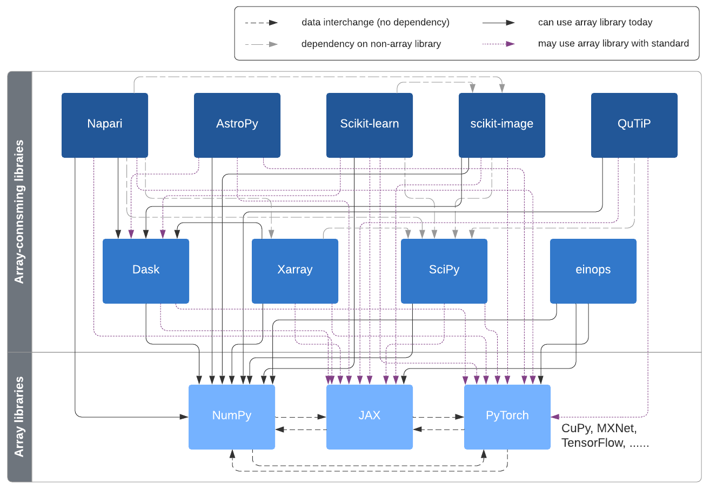
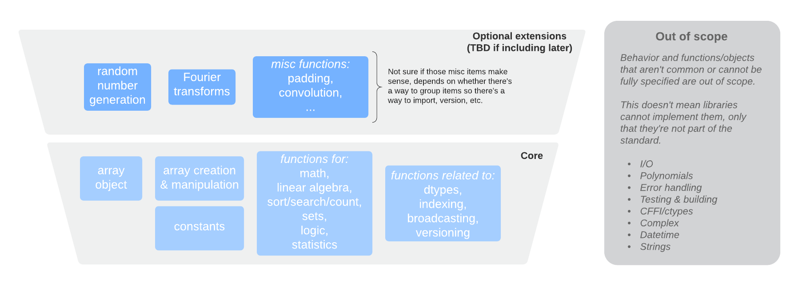
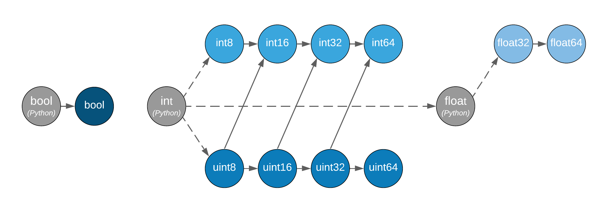

.. _NEP47:

========================================
NEP 47 — Adopting the array API standard
========================================

:Author: Ralf Gommers <ralf.gommers@gmail.com>
:Author: Stephan Hoyer <shoyer@gmail.com>
:Author: Aaron Meurer <asmeurer@gmail.com>
:Status: Draft
:Type: Standards Track
:Created: 2021-01-21
:Resolution:


Abstract
--------

We propose to adopt the `Python array API standard`_, developed by the
`Consortium for Python Data API Standards`_. Implementing this as a separate
new namespace in NumPy will allow authors of libraries which depend on NumPy
as well as end users to write code that is portable between NumPy and all
other array/tensor libraries that adopt this standard.

.. note::

    We expect that this NEP will remain in a draft state for quite a while.
    Given the large scope we don't expect to propose it for acceptance any
    time soon; instead, we want to solicit feedback on both the high-level
    design and implementation, and learn what needs describing better in this
    NEP or changing in either the implementation or the array API standard
    itself.


Motivation and Scope
--------------------

Python users have a wealth of choice for libraries and frameworks for
numerical computing, data science, machine learning, and deep learning. New
frameworks pushing forward the state of the art in these fields are appearing
every year. One unintended consequence of all this activity and creativity
has been fragmentation in multidimensional array (a.k.a. tensor) libraries -
which are the fundamental data structure for these fields. Choices include
NumPy, Tensorflow, PyTorch, Dask, JAX, CuPy, MXNet, and others.

The APIs of each of these libraries are largely similar, but with enough
differences that it’s quite difficult to write code that works with multiple
(or all) of these libraries. The array API standard aims to address that
issue, by specifying an API for the most common ways arrays are constructed
and used. The proposed API is quite similar to NumPy's API, and deviates mainly
in places where (a) NumPy made design choices that are inherently not portable
to other implementations, and (b) where other libraries consistently deviated
from NumPy on purpose because NumPy's design turned out to have issues or
unnecessary complexity.

For a longer discussion on the purpose of the array API standard we refer to
the `Purpose and Scope section of the array API standard <https://data-apis.github.io/array-api/latest/purpose_and_scope.html>`__
and the two blog posts announcing the formation of the Consortium [1]_ and
the release of the first draft version of the standard for community review [2]_.

The scope of this NEP includes:

- Adopting the 2021 version of the array API standard
- Adding a separate namespace, tentatively named ``numpy.array_api``
- Changes needed/desired outside of the new namespace, for example new dunder
  methods on the ``ndarray`` object
- Implementation choices, and differences between functions in the new
  namespace with those in the main ``numpy`` namespace
- A new array object conforming to the array API standard
- Maintenance effort and testing strategy
- Impact on NumPy's total exposed API surface and on other future and
  under-discussion design choices
- Relation to existing and proposed NumPy array protocols
  (``__array_ufunc__``, ``__array_function__``, ``__array_module__``).
- Required improvements to existing NumPy functionality

Out of scope for this NEP are:

- Changes in the array API standard itself. Those are likely to come up
  during review of this NEP, but should be upstreamed as needed and this NEP
  subsequently updated.


Usage and Impact
----------------

*This section will be fleshed out later, for now we refer to the use cases given
in* `the array API standard Use Cases section <https://data-apis.github.io/array-api/latest/use_cases.html>`__

In addition to those use cases, the new namespace contains functionality that
is widely used and supported by many array libraries. As such, it is a good
set of functions to teach to newcomers to NumPy and recommend as "best
practice". That contrasts with NumPy's main namespace, which contains many
functions and objects that have been superceded or we consider mistakes - but
that we can't remove because of backwards compatibility reasons.

The usage of the ``numpy.array_api`` namespace by downstream libraries is
intended to enable them to consume multiple kinds of arrays, *without having
to have a hard dependency on all of those array libraries*:



Adoption in downstream libraries
~~~~~~~~~~~~~~~~~~~~~~~~~~~~~~~~

The prototype implementation of the ``array_api`` namespace will be used with
SciPy, scikit-learn and other libraries of interest that depend on NumPy, in
order to get more experience with the design and find out if any important
parts are missing.

The pattern to support multiple array libraries is intended to be something
like::

    def somefunc(x, y):
        # Retrieves standard namespace. Raises if x and y have different
        # namespaces.  See Appendix for possible get_namespace implementation
        xp = get_namespace(x, y)
        out = xp.mean(x, axis=0) + 2*xp.std(y, axis=0)
        return out

The ``get_namespace`` call is effectively the library author opting in to
using the standard API namespace, and thereby explicitly supporting
all conforming array libraries.


The ``asarray`` / ``asanyarray`` pattern
````````````````````````````````````````

Many existing libraries use the same ``asarray`` (or ``asanyarray``) pattern
as NumPy itself does; accepting any object that can be coerced into a ``np.ndarray``.
We consider this design pattern problematic - keeping in mind the Zen of
Python, *"explicit is better than implicit"*, as well as the pattern being
historically problematic in the SciPy ecosystem for ``ndarray`` subclasses
and with over-eager object creation. All other array/tensor libraries are
more strict, and that works out fine in practice. We would advise authors of
new libraries to avoid the ``asarray`` pattern. Instead they should either
accept just NumPy arrays or, if they want to support multiple kinds of
arrays, check if the incoming array object supports the array API standard
by checking for ``__array_namespace__`` as shown in the example above.

Existing libraries can do such a check as well, and only call ``asarray`` if
the check fails. This is very similar to the ``__duckarray__`` idea in
:ref:`NEP30`.


.. _adoption-application-code:

Adoption in application code
~~~~~~~~~~~~~~~~~~~~~~~~~~~~

The new namespace can be seen by end users as a cleaned up and slimmed down
version of NumPy's main namespace. Encouraging end users to use this
namespace like::

    import numpy.array_api as xp

    x = xp.linspace(0, 2*xp.pi, num=100)
    y = xp.cos(x)

seems perfectly reasonable, and potentially beneficial - users get offered only
one function for each purpose (the one we consider best-practice), and they
then write code that is more easily portable to other libraries.


Backward compatibility
----------------------

No deprecations or removals of existing NumPy APIs or other backwards
incompatible changes are proposed.


High-level design
-----------------

The array API standard consists of approximately 120 objects, all of which
have a direct NumPy equivalent. This figure shows what is included at a high level:



The most important changes compared to what NumPy currently offers are:

- A new array object which:

    - conforms to the casting rules and indexing behaviour specified by the
      standard,
    - does not have methods other than dunder methods,
    - does not support the full range of NumPy indexing behaviour. Advanced
      indexing with integers is not supported. Only boolean indexing
      with a single (possibly multi-dimensional) boolean array is supported.
      An indexing expression that selects a single element returns a 0-D array
      rather than a scalar.

- Functions in the ``array_api`` namespace:

    - do not accept ``array_like`` inputs, only NumPy arrays and Python scalars
    - do not support ``__array_ufunc__`` and ``__array_function__``,
    - use positional-only and keyword-only parameters in their signatures,
    - have inline type annotations,
    - may have minor changes to signatures and semantics of individual
      functions compared to their equivalents already present in NumPy,
    - only support dtype literals, not format strings or other ways of
      specifying dtypes

- DLPack_ support will be added to NumPy,
- New syntax for "device support" will be added, through a ``.device``
  attribute on the new array object, and ``device=`` keywords in array creation
  functions in the ``array_api`` namespace,
- Casting rules that differ from those NumPy currently has. Output dtypes can
  be derived from input dtypes (i.e. no value-based casting), and 0-D arrays
  are treated like >=1-D arrays.
- Not all dtypes NumPy has are part of the standard. Only boolean, signed and
  unsigned integers, and floating-point dtypes up to ``float64`` are supported.
  Complex dtypes are expected to be added in the next version of the standard.
  Extended precision, string, void, object and datetime dtypes, as well as
  structured dtypes, are not included.

Improvements to existing NumPy functionality that are needed include:

- Add support for stacks of matrices to some functions in ``numpy.linalg``
  that are currently missing such support.
- Add the ``keepdims`` keyword to ``np.argmin`` and ``np.argmax``.
- Add a "never copy" mode to ``np.asarray``.


Functions in the ``array_api`` namespace
~~~~~~~~~~~~~~~~~~~~~~~~~~~~~~~~~~~~~~~~

Let's start with an example of a function implementation that shows the most
important differences with the equivalent function in the main namespace::

    def max(x: array, /, *,
            axis: Optional[Union[int, Tuple[int, ...]]] = None,
            keepdims: bool = False
        ) -> array:
        """
        Array API compatible wrapper for :py:func:`np.max <numpy.max>`.
        """
        return np.max._implementation(x, axis=axis, keepdims=keepdims)

This function does not accept ``array_like`` inputs, only ``ndarray``. There
are multiple reasons for this. Other array libraries all work like this.
Letting the user do coercion of lists, generators, or other foreign objects
separately results in a cleaner design with less unexpected behaviour.
It's higher-performance - less overhead from ``asarray`` calls. Static typing
is easier. Subclasses will work as expected. And the slight increase in verbosity
because users have to explicitly coerce to ``ndarray`` on rare occasions
seems like a small price to pay.

This function does not support ``__array_ufunc__`` nor ``__array_function__``.
These protocols serve a similar purpose as the array API standard module itself,
but through a different mechanisms. Because only ``ndarray`` instances are accepted,
dispatching via one of these protocols isn't useful anymore.

This function uses positional-only parameters in its signature. This makes code
more portable - writing ``max(x=x, ...)`` is no longer valid, hence if other
libraries call the first parameter ``input`` rather than ``x``, that is fine.
The rationale for keyword-only parameters (not shown in the above example) is
two-fold: clarity of end user code, and it being easier to extend the signature
in the future with keywords in the desired order.

This function has inline type annotations. Inline annotations are far easier to
maintain than separate stub files. And because the types are simple, this will
not result in a large amount of clutter with type aliases or unions like in the
current stub files NumPy has.


DLPack support for zero-copy data interchange
~~~~~~~~~~~~~~~~~~~~~~~~~~~~~~~~~~~~~~~~~~~~~~

The ability to convert one kind of array into another kind is valuable, and
indeed necessary when downstream libraries want to support multiple kinds of
arrays. This requires a well-specified data exchange protocol. NumPy already
supports two of these, namely the buffer protocol (i.e., PEP 3118), and
the ``__array_interface__`` (Python side) / ``__array_struct__`` (C side)
protocol. Both work similarly, letting the "producer" describe how the data
is laid out in memory so the "consumer" can construct its own kind of array
with a view on that data.

DLPack works in a very similar way. The main reasons to prefer DLPack over
the options already present in NumPy are:

1. DLPack is the only protocol with device support (e.g., GPUs using CUDA or
   ROCm drivers, or OpenCL devices). NumPy is CPU-only, but other array
   libraries are not. Having one protocol per device isn't tenable, hence
   device support is a must.
2. Widespread support. DLPack has the widest adoption of all protocols, only
   NumPy is missing support. And the experiences of other libraries with it
   are positive. This contrasts with the protocols NumPy does support, which
   are used very little - when other libraries want to interoperate with
   NumPy, they typically use the (more limited, and NumPy-specific)
   ``__array__`` protocol.

Adding support for DLPack to NumPy entails:

- Adding a ``ndarray.__dlpack__`` method
- Adding a ``from_dlpack`` function, which takes as input an object
  supporting ``__dlpack__``, and returns an ``ndarray``.

DLPack is currently a ~200 LoC header, and is meant to be included directly, so
no external dependency is needed. Implementation should be straightforward.


Syntax for device support
~~~~~~~~~~~~~~~~~~~~~~~~~

NumPy itself is CPU-only, so it clearly doesn't have a need for device support.
However, other libraries (e.g. TensorFlow, PyTorch, JAX, MXNet) support
multiple types of devices: CPU, GPU, TPU, and more exotic hardware.
To write portable code on systems with multiple devices, it's often necessary
to create new arrays on the same device as some other array, or check that
two arrays live on the same device. Hence syntax for that is needed.

The array object will have a ``.device`` attribute which enables comparing
devices of different arrays (they only should compare equal if both arrays are
from the same library and it's the same hardware device). Furthermore,
``device=`` keywords in array creation functions are needed. For example::

    def empty(shape: Union[int, Tuple[int, ...]], /, *,
              dtype: Optional[dtype] = None,
              device: Optional[device] = None) -> array:
        """
        Array API compatible wrapper for :py:func:`np.empty <numpy.empty>`.
        """
        return np.empty(shape, dtype=dtype, device=device)

The implementation for NumPy may be as simple as setting the device attribute to
the string ``'cpu'`` and raising an exception if array creation functions
encounter any other value.


Dtypes and casting rules
~~~~~~~~~~~~~~~~~~~~~~~~

The supported dtypes in this namespace are boolean, 8/16/32/64-bit signed and
unsigned integer, and 32/64-bit floating-point dtypes. These will be added to
the namespace as dtype literals with the expected names (e.g., ``bool``,
``uint16``, ``float64``).

The most obvious omissions are the complex dtypes. The rationale for the lack
of complex support in the first version of the array API standard is that several
libraries (PyTorch, MXNet) are still in the process of adding support for
complex dtypes. The next version of the standard is expected to include ``complex64``
and ``complex128`` (see `this issue <https://github.com/data-apis/array-api/issues/102>`__
for more details).

Specifying dtypes to functions, e.g. via the ``dtype=`` keyword, is expected
to only use the dtype literals. Format strings, Python builtin dtypes, or
string representations of the dtype literals are not accepted - this will
improve readability and portability of code at little cost.

Casting rules are only defined between different dtypes of the same kind. The
rationale for this is that mixed-kind (e.g., integer to floating-point)
casting behavior differs between libraries. NumPy's mixed-kind casting
behavior doesn't need to be changed or restricted, it only needs to be
documented that if users use mixed-kind casting, their code may not be
portable.



*Type promotion diagram. Promotion between any two types is given by their
join on this lattice. Only the types of participating arrays matter, not
their values. Dashed lines indicate that behaviour for Python scalars is
undefined on overflow. Boolean, integer and floating-point dtypes are not
connected, indicating mixed-kind promotion is undefined.*

The most important difference between the casting rules in NumPy and in the
array API standard is how scalars and 0-dimensional arrays are handled. In
the standard, array scalars do not exist and 0-dimensional arrays follow the
same casting rules as higher-dimensional arrays.

See the `Type Promotion Rules section of the array API standard <https://data-apis.github.io/array-api/latest/API_specification/type_promotion.html>`__
for more details.

.. note::

    It is not clear what the best way is to support the different casting rules
    for 0-dimensional arrays and no value-based casting. One option may be to
    implement this second set of casting rules, keep them private, mark the
    array API functions with a private attribute that says they adhere to
    these different rules, and let the casting machinery check whether for
    that attribute.

    This needs discussion.


Indexing
~~~~~~~~

An indexing expression that would return a scalar with ``ndarray``, e.g.
``arr_2d[0, 0]``, will return a 0-D array with the new array object. There are
several reasons for that: array scalars are largely considered a design mistake
which no other array library copied; it works better for non-CPU libraries
(typically arrays can live on the device, scalars live on the host); and it's
simply a consistent design. To get a Python scalar out of a 0-D array, one can
simply use the builtin for the type, e.g. ``float(arr_0d)``.

The other `indexing modes in the standard <https://data-apis.github.io/array-api/latest/API_specification/indexing.html>`__
do work largely the same as they do for ``numpy.ndarray``. One noteworthy
difference is that clipping in slice indexing (e.g., ``a[:n]`` where ``n`` is
larger than the size of the first axis) is unspecified behaviour, because
that kind of check can be expensive on accelerators.

The lack of advanced indexing, and boolean indexing being limited to a single
n-D boolean array, is due to those indexing modes not being suitable for all
types of arrays or JIT compilation. Their absence does not seem to be
problematic; if a user or library author wants to use them, they can do so
through zero-copy conversion to ``numpy.ndarray``. This will signal correctly
to whomever reads the code that it is then NumPy-specific rather than portable
to all conforming array types.


The array object
~~~~~~~~~~~~~~~~

The array object in the standard does not have methods other than dunder
methods. The rationale for that is that not all array libraries have methods
on their array object (e.g., TensorFlow does not). It also provides only a
single way of doing something, rather than have functions and methods that
are effectively duplicate.

Mixing operations that may produce views (e.g., indexing, ``nonzero``)
in combination with mutation (e.g., item or slice assignment) is
`explicitly documented in the standard to not be supported <https://data-apis.github.io/array-api/latest/design_topics/copies_views_and_mutation.html>`__.
This cannot easily be prohibited in the array object itself; instead this will
be guidance to the user via documentation.

The standard current does not prescribe a name for the array object itself.
We propose to simply name it ``ndarray``. This is the most obvious name, and
because of the separate namespace should not clash with ``numpy.ndarray``.


Implementation
--------------

.. note::

    This section needs a lot more detail, which will gradually be added when
    the implementation progresses.

A prototype of the ``array_api`` namespace can be found in
https://github.com/data-apis/numpy/tree/array-api/numpy/_array_api.
The docstring in its ``__init__.py`` has notes on completeness of the
implementation. The code for the wrapper functions also contains ``# Note:``
comments everywhere there is a difference with the NumPy API.
Two important parts that are not implemented yet are the new array object and
DLPack support. Functions may need changes to ensure the changed casting rules
are respected.

The array object
~~~~~~~~~~~~~~~~

Regarding the array object implementation, we plan to start with a regular
Python class that wraps a ``numpy.ndarray`` instance. Attributes and methods
can forward to that wrapped instance, applying input validation and
implementing changed behaviour as needed.

The casting rules are probably the most challenging part. The in-progress
dtype system refactor (NEPs 40-43) should make implementing the correct casting
behaviour easier - it is already moving away from value-based casting for
example.


The dtype objects
~~~~~~~~~~~~~~~~~

We must be able to compare dtypes for equality, and expressions like these must
be possible::

    np.array_api.some_func(..., dtype=x.dtype)

The above implies it would be nice to have ``np.array_api.float32 ==
np.array_api.ndarray(...).dtype``.

Dtypes should not be assumed to have a class hierarchy by users, however we are
free to implement it with a class hierarchy if that's convenient. We considered
the following options to implement dtype objects:

1. Alias dtypes to those in the main namespace. E.g., ``np.array_api.float32 =
   np.float32``.
2. Make the dtypes instances of ``np.dtype``. E.g., ``np.array_api.float32 =
   np.dtype(np.float32)``.
3. Create new singleton classes with only the required methods/attributes
   (currently just ``__eq__``).

It seems like (2) would be easiest from the perspective of interacting with
functions outside the main namespace. And (3) would adhere best to the
standard.

TBD: the standard does not yet have a good way to inspect properties of a
dtype, to ask questions like "is this an integer dtype?". Perhaps this is easy
enough to do for users, like so::

    def _get_dtype(dt_or_arr):
        return dt_or_arr.dtype if hasattr(dt_or_arr, 'dtype') else dt_or_arr

    def is_floating(dtype_or_array):
        dtype = _get_dtype(dtype_or_array)
        return dtype in (float32, float64)

    def is_integer(dtype_or_array):
        dtype = _get_dtype(dtype_or_array)
        return dtype in (uint8, uint16, uint32, uint64, int8, int16, int32, int64)

However it could make sense to add to the standard. Note that NumPy itself
currently does not have a great for asking such questions, see
`gh-17325 <https://github.com/numpy/numpy/issues/17325>`__.


Feedback from downstream library authors
~~~~~~~~~~~~~~~~~~~~~~~~~~~~~~~~~~~~~~~~

TODO - this can only be done after trying out some use cases

Leo Fang (CuPy): *"My impression is for CuPy we could simply take this new array object and s/numpy/cupy"*


Related Work
------------

:ref:`NEP37` contains a similar mechanism to retrieve a NumPy-like namespace.
In fact, NEP 37 inspired the (slightly simpler) mechanism in the array API
standard.

Other libraries have adopted large parts of NumPy's API, made changes where
necessary, and documented deviations. See for example
`the jax.numpy documentation <https://jax.readthedocs.io/en/latest/jax.numpy.html>`__
and `Difference between CuPy and NumPy <https://docs.cupy.dev/en/stable/reference/difference.html>`__.
The array API standard was constructed with the help of such comparisons, only
between many array libraries rather than only between NumPy and one other library.


Alternatives
------------


Appendix - a possible ``get_namespace`` implementation
------------------------------------------------------

The ``get_namespace`` function mentioned in the
:ref:`adoption-application-code` section can be implemented like::

    def get_namespace(*xs):
        # `xs` contains one or more arrays, or possibly Python scalars (accepting
        # those is a matter of taste, but doesn't seem unreasonable).
        namespaces = {
            x.__array_namespace__() if hasattr(x, '__array_namespace__') else None for x in xs if not isinstance(x, (bool, int, float, complex))
        }

        if not namespaces:
            # one could special-case np.ndarray above or use np.asarray here if
            # older numpy versions need to be supported.
            raise ValueError("Unrecognized array input")

        if len(namespaces) != 1:
            raise ValueError(f"Multiple namespaces for array inputs: {namespaces}")

        xp, = namespaces
        if xp is None:
            raise ValueError("The input is not a supported array type")

        return xp


Discussion
----------

- `First discussion on the mailing list about the array API standard <https://mail.python.org/pipermail/numpy-discussion/2020-November/081181.html>`__


References and Footnotes
------------------------

.. _Python array API standard: https://data-apis.github.io/array-api/latest

.. _Consortium for Python Data API Standards: https://data-apis.org/

.. _DLPack: https://github.com/dmlc/dlpack

.. [1] https://data-apis.org/blog/announcing_the_consortium/

.. [2] https://data-apis.org/blog/array_api_standard_release/


Copyright
---------

This document has been placed in the public domain. [1]_
