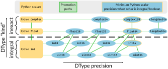

===========================================
NEP 50 — Promotion rules for Python scalars
===========================================
:Author: Sebastian Berg
:Status: Draft
:Type: Standards Track
:Created: 2021-01-10

Abstract
========

Since NumPy 1.7, promotion rules are defined through the "safe casting"
concept which relies on inspection of the actual values involved.
While these choices were well intended, they lead to complexity: both
in implementation and user experience.

There are two kinds of confusing results:

1. Value-based promotion means that values determine output types::

     np.result_type(np.int8, 1) == np.int8
     np.result_type(np.int8, 255) == np.int16

   This also holds when working with 0-D arrays (so-called "scalar arrays")::

     int64_0d_array = np.array(1, dtype=np.int64)
     np.result_type(np.int8, int64_0d_array) == np.int8

   This logic arises because ``1`` can be represented by an ``int8`` while
   ``255`` can be represented by an ``int16`` *or* ``uint8``.

   Because of this, the exact type is often ignored for 0-D arrays or
   NumPy scalars.

2. For a Python ``int``, ``float``, or ``complex`` the value is inspected as
   before.  But surprisingly *not* when the NumPy object is a 0-D array
   or NumPy scalar::

     np.result_type(np.array(1, dtype=np.uint8), 1) == np.int64
     np.result_type(np.int8(1), 1) == np.int64

   The reason is that the special value-based promotion is disabled when all
   objects are scalars or 0-D arrays.
   NumPy thus returns the same type as ``np.array(1)``, which is usually
   an ``int64`` (this depends on the system).

Note that the examples apply also to operations like multiplication,
addition, comparisons, and their corresponding functions like ``np.multiply``.

This NEP proposes to refactor the behaviour around two guiding principles:

1. Values must never influence result type.
2. NumPy scalars or 0-D arrays should behave consistently with their
   N-D counterparts.

We propose to remove all value-based logic and add special handling for
Python scalars to preserve some convenient behaviors.
Python scalars will be considered "weakly" typed.
When a NumPy array/scalar is combined with a Python integer, it will
be converted to the NumPy dtype, such that::

    np.array([1, 2, 3], dtype=np.uint8) + 1  # returns a uint8 array
    np.array([1, 2, 3], dtype=np.float32) + 2.  # returns a float32 array

There will be no dependence on the Python value itself.

The proposed changes also apply to ``np.can_cast(100, np.int8)``, however,
we expect that the behaviour in functions (promotion) will, in practice, be far
more important than the casting change itself.

Schema of the new proposed promotion rules
------------------------------------------

After the change, the promotions in NumPy will follow the schema below.
Promotion always occurs along the green lines:
from left to right within their kind and to a higher kind only when
necessary.
The result kind is always the largest kind of the inputs.
NumPy has one notable exception because it allows promotion of both ``int64``
and ``uint64`` to ``float64``.

The Python scalars are inserted at the very left of each "kind" and the
Python integer does not distinguish signed and unsigned.
Note, that when the promoting a Python scalar with a dtype of lower kind
category (boolean, integral, inexact) with a higher one, we  use the
minimum/default precision: that is ``float64``, ``complex128`` or ``int64``
(``int32`` is used on some systems, e.g. windows).

See the next section for examples to compare with this schema.

Examples of new behaviour
-------------------------

Since the schema and logic are difficult to read with respect to some cases,
these are examples of the new behaviour::

    np.uint8(1) + 1 == np.uint8(2)
    np.int16(2) + 2 == np.int16(4)

In the following the Python ``float`` and ``complex`` are "inexact", but the
NumPy value is integral, so we use at least ``float64``/``complex128``::

    np.uint16(3) + 3.0 == np.float64(6.0)
    np.int16(4) + 4j == np.complex128(4+4j)

But this does not happen for ``float`` to ``complex`` promotions, where
``float32`` and ``complex64`` have the same precision::

    np.float32(5) + 5j == np.complex64(5+5j)

The above table omits, ``bool``.  It is set below "integral", so that the
following hold::

    np.bool_(True) + 1 == np.int64(2)
    True + np.uint8(2) == np.uint8(3)

Motivation and Scope
====================

The motivation for changing the behaviour with respect to inspecting the value
of Python scalars and NumPy scalars/0-D arrays is, again, two-fold:

1. The special handling of NumPy scalars/0-D arrays as well as the value
   inspection can be very surprising to users.
2. The value-inspection logic is much harder to explain and implement.
   It is further harder to make it available to user defined DTypes through
   :ref:`NEP 42 <NEP42>`.
   Currently, this leads to a dual implementation of a new and an old (value
   sensitive) system.  Fixing this will greatly simplify the internal logic
   and make results more consistent.

We believe that the proposal of "weak" Python scalars will help users by
providing a clearer mental model for which datatype an operation will
result in.
This model fits well with the preservation of array precisions that NumPy
currently often has, and also aggressively does for in-place operations::

    arr += value

Preserves precision so long "kind" boundaries are not crossed.

And while some users will probably miss the value inspecting behavior even for
those cases where it seems useful, it quickly leads to surprises.  This may be
expected::

    np.array([100], dtype=np.uint8) + 1000 == np.array([1100], dtype=np.uint16)

But the following will then be a surprise::

    np.array([100], dtype=np.uint8) + 200 == np.array([44], dtype=np.uint8)

Considering this, we believe that the proposal follows the "principle of least
surprise".

Usage and Impact
================

There will be no transition period due to the difficulty and noise this is
expected to create.  In rare cases users may need to adjust code to avoid
reduced precision or incorrect results.

We plan to provide an *optional* warning mode capable of notifying users of
potential changes in behavior in most relevant cases.

Impact on ``can_cast``
----------------------

Can cast will never inspect the value anymore.  So that the following results
are expected to change from ``True`` to ``False``::

  np.can_cast(100, np.uint8)
  np.can_cast(np.int64(100), np.uint8)
  np.can_cast(np.array(100, dtype=np.int64), np.uint8)

We expect that the impact of this change will be small compared to that of
the following changes.

.. note::

    The first example where the input is a Python scalar could be preserved
    to some degree, but this is not currently planned.

Impact on operators and functions involving NumPy arrays or scalars
-------------------------------------------------------------------

The main impact on operations not involving Python scalars (``float``, ``int``,
``complex``) will be that 0-D arrays and NumPy scalars will never behave
value-sensitive.
This removes currently surprising cases.  For example::

  np.arange(10, dtype=np.uint8) + np.int64(1)
  # and:
  np.add(np.arange(10, dtype=np.uint8), np.int64(1))

Will return an int64 array because the type of ``np.int64(1)`` is strictly
honoured.

Impact on operators involving Python ``int``, ``float``, and ``complex``
------------------------------------------------------------------------

This NEP attempts to preserve the convenience that the old behaviour
gave when working with literal values.
The current value-based logic had some nice properties when "untyped",
literal Python scalars are involved::

  np.arange(10, dtype=np.int8) + 1  # returns an int8 array
  np.array([1., 2.], dtype=np.float32) * 3.5  # returns a float32 array

But led to complexity when it came to "unrepresentable" values::

  np.arange(10, dtype=np.int8) + 256  # returns int16
  np.array([1., 2.], dtype=np.float32) * 1e200  # returns float64

The proposal is to preserve this behaviour for the most part.  This is achieved
by considering Python ``int``, ``float``, and ``complex`` to be "weakly" typed
in these operations.
However, to mitigate user surprises, we plan to make conversion to the new type
more strict:  This means that the results will be unchanged in the first
two examples.  For the second one, the results will be the following::

  np.arange(10, dtype=np.int8) + 256  # raises a TypeError
  np.array([1., 2.], dtype=np.float32) * 1e200  # warning and returns infinity

The second one will warn because ``np.float32(1e200)`` overflows to infinity.
It will then do the calculation with ``inf`` as normally.

.. admonition:: Behaviour in other libraries

   Overflowing in the conversion rather than raising an error is a choice;
   it is one that is the default in most C setups (similar to NumPy C can be
   set up to raise an error due to the overflow, however).
   It is also for example the behaviour of ``pytorch`` 1.10.

Backward compatibility
======================

In general, code which only uses the default dtypes float64, or int32/int64
or more precise ones should not be affected.

However, the proposed changes will modify results in quite a few cases where
0-D or scalar values (with non-default dtypes) are mixed.
In many cases, these will be bug-fixes, however, there are certain changes
which may be particularly interesting.

The most important failure is probably the following example::

  arr = np.arange(100, dtype=np.uint8)  # storage array with low precision
  value = arr[10]

  # calculation continues with "value" without considering where it came from
  value * 100

Where previously the ``value * 100`` would cause an up-cast to int32/int64
(because value is a scalar).  The new behaviour will preserve the lower
precision unless explicitly dealt with (just as if ``value`` was an array).
This can lead to integer overflows and thus incorrect results beyond precision.
In many cases this may be silent, although NumPy usually gives warnings for the
scalar operators.

Similarliy, if the storage array is float32 a calculation may retain the lower
float32 precision rather than use the default float64.

Further issues can occur.  For example:

* Floating point comparisons, especially equality, may change when mixing
  precisions::

     np.float32(1/3) == 1/3  # was False, will be True.

* Certain operations are expected to start failing::

     np.array([1], np.uint8) * 1000
     np.array([1], np.uint8) == 1000  # possibly also

  to protect users in cases where previous value-based casting led to an
  upcast.  (Failures occur when converting ``1000`` to a ``uint8``.)

* Floating point overflow may occur in odder cases::

     np.float32(1e-30) * 1e50  # will return ``inf`` and a warning

  Because ``np.float32(1e50)`` returns ``inf``.  Previously, this would return
  a double precision result even if the ``1e50`` was not a 0-D array

In other cases, increased precision may occur.  For example::

  np.multiple(float32_arr, 2.)
  float32_arr * np.float64(2.)

Will both return a float64 rather than float32.  This improves precision but
slightly changes results and uses double the memory.

Changes due to the integer "ladder of precision"
------------------------------------------------

When creating an array from a Python integer, NumPy will try the following
types in order, with the result depending on the value::

    long (usually int64) → int64 → uint64 -> object

which is subtly different from the promotion described above.

This NEP currently does not include changing this ladder (although it may be
suggested in a separate document).
However, in mixed operations, this ladder will be ignored, since the value
will be ignored.  This means, that operations will never silently use the
``object`` dtype::

    np.array([3]) + 2**100  # Will error

The user will have to write one of::

    np.array([3]) + np.array(2**100)
    np.array([3]) + np.array(2**100, dtype=object)

As such implicit conversion to ``object`` should be rare and the work-around
is clear, we expect that the backwards compatibility concerns are fairly small.

Detailed description
====================

The following provides some additional details on the current "value based"
promotion logic, and then on the "weak scalar" promotion and how it is handled
internally.

State of the current "value based" promotion
---------------------------------------------

Before we can propose alternatives to the current datatype system,
it is helpful to review how "value based promotion" is used and can be useful.
Value based promotion allows for the following code to work::

    # Create uint8 array, as this is sufficient:
    uint8_arr = np.array([1, 2, 3], dtype=np.uint8)
    result = uint8_arr + 4
    result.dtype == np.uint8

    result = uint8_arr * (-1)
    result.dtype == np.int16  # upcast as little as possible.

Where especially the first part can be useful: The user knows that the input
is an integer array with a specific precision. Considering that plain ``+ 4``
retaining the previous datatype is intuitive.
Replacing this example with ``np.float32`` is maybe even more clear,
as float will rarely have overflows.
Without this behaviour, the above example would require writing ``np.uint8(4)``
and lack of the behaviour would make the following suprising::

    result = np.array([1, 2, 3], dtype=np.float32) * 2.
    result.dtype == np.float32

where lack of a special case would cause ``float64`` to be returned.

It is important to note that the behaviour also applies to universal functions
and zero dimensional arrays::

    # This logic is also used for ufuncs:
    np.add(uint8_arr, 4).dtype == np.uint8
    # And even if the other array is explicitly typed:
    np.add(uint8_arr, np.array(4, dtype=np.int64)).dtype == np.uint8 

To review, if we replace ``4`` with ``[4]`` to make it one dimensional, the
result will be different::

    # This logic is also used for ufuncs:
    np.add(uint8_arr, [4]).dtype == np.int64  # platform dependent
    # And even if the other array is explicitly typed:
    np.add(uint8_arr, np.array([4], dtype=np.int64)).dtype == np.int64

Proposed Weak Promotion
-----------------------

This proposal uses a "weak scalar" logic.  This means that Python ``int``, ``float``,
and ``complex`` are not assigned one of the typical dtypes, such as float64 or int64.
Rather, they are assigned a special abstract DType, similar to the "scalar" hierarchy
names: Integral, Floating, ComplexFloating.

When promotion occurs (as it does for ufuncs if no exact loop matches),
the other DType is able to decide how to regard the Python
scalar.  E.g. a ``UInt16`` promoting with an ``Integral`` will give ``UInt16``.

.. note::

    A default will most likely be provided in the future for user-defined DTypes.
    Most likely this will end up being the default integer/float, but in principle
    more complex schemes could be implemented.

At no time is the value used to decide the result of this promotion.  The value is only
considered when it is converted to the new dtype; this may raise an error.

Related Work
============

* `JAX promotion`_ also uses the weak-scalar concept.  However, it makes use
  of it also for most functions.  JAX further stores the "weak-type" information
  on the array: ``jnp.array(1)`` remains weakly typed.

Implementation
==============

Implemeting this NEP requires some additional machinery to be added to all
binary operators (or ufuncs), so that they attempt to use the "weak" logic
if possible.
There are two possible approaches to this:

1. The binary operator simply tries to call ``np.result_type()`` if this
   situation arises and converts the Python scalar to the result-type (if
   defined).
2. The binary operator indicates that an input was a Python scalar, and the
   ufunc dispatching/promotion machinery is used for the rest (see
   :ref:`NEP 42 <NEP42>`).  This allows more flexibility, but requires some
   additional logic in the ufunc machinery.

.. note::
   As of now, it is not quite clear which approach is better, either will
   give fairly equivalent results and 1. could be extended by 2. in the future
   if necessary.

It further requires removing all current special value-based code paths.

Unintuitively, a larger step in the implementation may be to implement a
solution to allow an error to be raised in the following example::

   np.arange(10, dtype=np.uint8) + 1000

Even though ``np.uint8(1000)`` returns the same value as ``np.uint8(232)``.

.. note::

    See alternatives, we may yet decide that this silent overflow is acceptable
    or at least a separate issue.

Alternatives
============

There are several design axes where different choices are possible.
The below sections outline these.

Use strongly-typed scalars or a mix of both
-------------------------------------------

The simplest solution to the value-based promotion/casting issue would be to use
strongly typed Python scalars, i.e. Python floats are considered double precision
and Python integers are always considered the same as the default integer dtype.

This would be the simplest solution, however, it would lead to many upcasts when
working with arrays of ``float32`` or ``int16``, etc.  The solution for these cases
would be to rely on in-place operations.
We currently believe that while less dangerous, this change would affect many users
and would be surprising more often than not (although expectations differ widely).

In principle, the weak vs. strong behaviour need not be uniform.  It would also
be possible to make Python floats use the weak behaviour, but Python integers use the
strong one, since integer overflows are far more surprising.

Do not use weak scalar logic in functions
-----------------------------------------

One alternative to this NEPs proposal is to narrow the use of weak types
to Python operators.

This has advantages and disadvantages:

* The main advantage is that limiting it to Python operators means that these
  "weak" types/dtypes are clearly ephemeral to short Python statements.
* A disadvantage is that ``np.multiply`` and ``*`` are less interchangable.
* Using "weak" promotion only for operators means that libraries do not have
  to worry about whether they want to "remember" that an input was a Python
  scalar initially.  On the other hand, it would add a the need for slightly
  different (or additional) logic for Python operators.
  (Technically, probably as a flag to the ufunc dispatching mechanism to toggle
  the weak logic.)
* ``__array_ufunc__`` is often used on its own to provide Python operator
  support for array-likes implementing it.  If operators are special, these
  array-likes may need a mechanism to match NumPy (e.g. a kwarg to ufuncs to
  enable weak promotion.)

NumPy scalars could be special
------------------------------

Many users expect that NumPy scalars should be different from NumPy
arrays, in that ``np.uint8(3) + 3`` should return an ``int64`` (or Python
integer), when ``uint8_arr + 3`` preserves the ``uint8`` dtype.

This alternative would be very close to the current behaviour for NumPy scalars
but it would cement a distinction between arrays and scalars (NumPy arrays
are "stronger" than Python scalars, but NumPy scalars are not).

Such a distinction is very much possible, however, at this time NumPy will
often (and silently) convert 0-D arrays to scalars.
It may thus make sense, to only consider this alternative if we also
change this silent conversion (sometimes refered to as "decay") behaviour.

Handling conversion of scalars when unsafe
------------------------------------------

Cases such as::

  np.arange(10, dtype=np.uint8) + 1000

should raise an error as per this NEP.  This could be relaxed to give a warning
or even ignore the "unsafe" conversion which (on all relevant hardware) would
lead to ``np.uint8(1000) == np.uint8(232)`` being used.

Allowing weakly typed arrays
----------------------------

One problem with having weakly typed Python scalars, but not weakly typed
arrays is that in many cases ``np.asarray()`` is called indiscriminately on
inputs.  To solve this issue JAX will consider the result of ``np.asarray(1)``
also to be weakly typed.
There are, however, two difficulties with this:

1. JAX noticed that it can be confusing that::

     np.broadcast_to(np.asarray(1), (100, 100))

   is a non 0-D array that "inherits" the weak typing. [2]_
2. Unlike JAX tensors, NumPy arrays are mutable, so assignment may need to
   cause it to be strongly typed?

A flag will likely be useful as an implementation detail (e.g. in ufuncs),
however, as of now we do not expect to have this as user API.
The main reason is that such a flag may be surprising for users if it is
passed out as a result from a function, rather than used only very localized.

.. admonition:: TODO

    Before accepting the NEP it may be good to discuss this issue further.
    Libraries may need clearer patterns to "propagate" the "weak" type, this
    could just be an ``np.asarray_or_literal()`` to preserve Python scalars,
    or a pattern of calling ``np.result_type()`` before ``np.asarray()``.

Keep using value-based logic for Python scalars
-----------------------------------------------

Some of the main issues with the current logic arise, because we apply it
to NumPy scalars and 0-D arrays, rather than the application to Python scalars.
We could thus consider to keep inspecting the value for Python scalars.

We reject this idea on the grounds that it will not remove the surprises
given earlier::

    np.uint8(100) + 1000 == np.uint16(1100)
    np.uint8(100) + 200 == np.uint8(44)

And adapting the precision based on the result value rather than the input
value might be possible for scalar operations, but is not feasible for array
operations.
This is because array operations need to allocate the result array before
performing the calculation.

Discussion
==========

* https://github.com/numpy/numpy/issues/2878
* https://mail.python.org/archives/list/numpy-discussion@python.org/thread/R7D65SNGJW4PD6V7N3CEI4NJUHU6QP2I/#RB3JLIYJITVO3BWUPGLN4FJUUIKWKZIW
* https://mail.python.org/archives/list/numpy-discussion@python.org/thread/NA3UBE3XAUTXFYBX6HPIOCNCTNF3PWSZ/#T5WAYQPRMI5UCK7PKPCE3LGK7AQ5WNGH
* Poll about the desired future behavior: https://discuss.scientific-python.org/t/poll-future-numpy-behavior-when-mixing-arrays-numpy-scalars-and-python-scalars/202

References and Footnotes
========================

.. [1] Each NEP must either be explicitly labeled as placed in the public domain (see
   this NEP as an example) or licensed under the `Open Publication License`_.

.. _Open Publication License: https://www.opencontent.org/openpub/

.. _JAX promotion: https://jax.readthedocs.io/en/latest/type_promotion.html

.. [2] https://github.com/numpy/numpy/pull/21103/files#r814188019

Copyright
=========

This document has been placed in the public domain. [1]_
