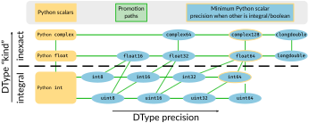

.. currentmodule:: numpy

.. _arrays.promotion:

****************************
Data type promotion in NumPy
****************************

When mixing two different data types, NumPy has to determine the appropriate
dtype for the result of the operation. This step is referred to as *promotion*
or *finding the common dtype*.

In typical cases, the user does not need to worry about the details of
promotion, since the promotion step usually ensures that the result will
either match or exceed the precision of the input.

For example, when the inputs are of the same dtype, the dtype of the result
matches the dtype of the inputs:

  >>> np.int8(1) + np.int8(1)
  np.int8(2)

Mixing two different dtypes normally produces a result with the dtype of the
higher precision input:

  >>> np.int8(4) + np.int64(8)  # 64 > 8
  np.int64(12)
  >>> np.float32(3) + np.float16(3)  # 32 > 16
  np.float32(6.0)

In typical cases, this does not lead to surprises. However, if you work with
non-default dtypes like unsigned integers and low-precision floats, or if you
mix NumPy integers, NumPy floats, and Python scalars, some
details of NumPy promotion rules may be relevant. Note that these detailed
rules do not always match those of other languages [#hist-reasons]_.

Numerical dtypes come in four "kinds" with a natural hierarchy.

1. unsigned integers (``uint``)
2. signed integers (``int``)
3. float (``float``)
4. complex (``complex``)

In addition to kind, NumPy numerical dtypes also have an associated precision, specified
in bits. Together, the kind and precision specify the dtype. For example, a
``uint8`` is an unsigned integer stored using 8 bits.

The result of an operation will always be of an equal or higher kind of any of
the inputs. Furthermore, the result will always have a precision greater than
or equal to those of the inputs. Already, this can lead to some examples which
may be unexpected:

1. When mixing floating point numbers and integers, the precision of the
   integer may force the result to a higher precision floating point. For
   example, the result of an operation involving ``int64`` and ``float16``
   is ``float64``.
2. When mixing unsigned and signed integers with the same precision, the
   result will have *higher* precision than either inputs. Additionally,
   if one of them has 64bit precision already, no higher precision integer
   is available and for example an operation involving ``int64`` and ``uint64``
   gives ``float64``.

Please see the `Numerical promotion` section and image below for details
on both.

Detailed behavior of Python scalars
-----------------------------------
Since NumPy 2.0 [#NEP50]_, an important point in our promotion rules is
that although operations involving two NumPy dtypes never lose precision,
operations involving a NumPy dtype and a Python scalar (``int``, ``float``,
or ``complex``) *can* lose precision. For instance, it is probably intuitive
that the result of an operation between a Python integer and a NumPy integer
should be a NumPy integer. However, Python integers have arbitrary precision
whereas all NumPy dtypes have fixed precision, so the arbitrary precision
of Python integers cannot be preserved.

More generally, NumPy considers the "kind" of Python scalars, but ignores
their precision when determining the result dtype. This is often convenient.
For instance, when working with arrays of a low precision dtype, it is usually
desirable for simple operations with Python scalars to preserve the dtype.

  >>> arr_float32 = np.array([1, 2.5, 2.1], dtype="float32")
  >>> arr_float32 + 10.0  # undesirable to promote to float64
  array([11. , 12.5, 12.1], dtype=float32)
  >>> arr_int16 = np.array([3, 5, 7], dtype="int16")
  >>> arr_int16 + 10  # undesirable to promote to int64
  array([13, 15, 17], dtype=int16)

In both cases, the result precision is dictated by the NumPy dtype.
Because of this, ``arr_float32 + 3.0`` behaves the same as
``arr_float32 + np.float32(3.0)``, and ``arr_int16 + 10`` behaves as
``arr_int16 + np.int16(10.)``.

As another example, when mixing NumPy integers with a Python ``float``
or ``complex``, the result always has type ``float64`` or ``complex128``:

  >> np.int16(1) + 1.0
  np.float64(2.0)

However, these rules can also lead to surprising behavior when working with
low precision dtypes.

First, since the Python value is converted to a NumPy one before the operation
can by performed, operations can fail with an error when the result seems
obvious. For instance, ``np.int8(1) + 1000`` cannot continue because ``1000``
exceeds the maximum value of an ``int8``. When the Python scalar
cannot be coerced to the NumPy dtype, an error is raised:

  >>> np.int8(1) + 1000
  Traceback (most recent call last):
    ...
  OverflowError: Python integer 1000 out of bounds for int8
  >>> np.int64(1) * 10**100
  Traceback (most recent call last):
  ...
  OverflowError: Python int too large to convert to C long
  >>> np.float32(1) + 1e300
  np.float32(inf)
  ... RuntimeWarning: overflow encountered in cast

Second, since the Python float or integer precision is always ignored, a low
precision NumPy scalar will keep using its lower precision unless explicitly
converted to a higher precision NumPy dtype or Python scalar (e.g. via ``int()``,
``float()``, or ``scalar.item()``). This lower precision may be detrimental to
some calculations or lead to incorrect results, especially in the case of integer
overflows:

  >>> np.int8(100) + 100  # the result exceeds the capacity of int8
  np.int8(-56)
  ... RuntimeWarning: overflow encountered in scalar add

Note that NumPy warns when overflows occur for scalars, but not for arrays;
e.g., ``np.array(100, dtype="uint8") + 100`` will *not* warn.

Numerical promotion
-------------------

The following image shows the numerical promotion rules with the kinds
on the vertical axis and the precision on the horizontal axis.

The input dtype with the higher kind determines the kind of the result dtype.
The result dtype has a precision as low as possible without appearing to the
left of either input dtype in the diagram.

Note the following specific rules and observations:

1. When a Python ``float`` or ``complex`` interacts with a NumPy integer
   the result will be ``float64`` or ``complex128`` (yellow border).
   NumPy booleans will also be cast to the default integer [#default-int]_.
   This is not relevant when additionally NumPy floating point values are
   involved.
2. The precision is drawn such that ``float16 < int16 < uint16`` because
   large ``uint16`` do not fit ``int16`` and large ``int16`` will lose precision
   when stored in a ``float16``.
   This pattern however is broken since NumPy always considers ``float64``
   and ``complex128`` to be acceptable promotion results for any integer
   value.
3. A special case is that NumPy promotes many combinations of signed and
   unsigned integers to ``float64``.  A higher kind is used here because no
   signed integer dtype is sufficiently precise to hold a ``uint64``.

Exceptions to the general promotion rules
-----------------------------------------

In NumPy promotion refers to what specific functions do with the result and
in some cases, this means that NumPy may deviate from what the `np.result_type`
would give.

Behavior of ``sum`` and ``prod``
~~~~~~~~~~~~~~~~~~~~~~~~~~~~~~~~
``np.sum`` and ``np.prod`` will always return the default integer type
when summing over integer values (or booleans).  This is usually an ``int64``.
The reason for this is that integer summations are otherwise very likely
to overflow and give confusing results.
This rule also applies to the underlying ``np.add.reduce`` and
``np.multiply.reduce``.

Notable behavior with NumPy or Python integer scalars
~~~~~~~~~~~~~~~~~~~~~~~~~~~~~~~~~~~~~~~~~~~~~~~~~~~~~
NumPy promotion refers to the result dtype and operation precision,
but the operation will sometimes dictate that result.
Division always returns floating point values and comparison always booleans.

This leads to what may appear as "exceptions" to the rules:

* NumPy comparisons with Python integers or mixed precision integers always
  return the correct result.  The inputs will never be cast in a way which
  loses precision.
* Equality comparisons between types which cannot be promoted will be
  considered all ``False`` (equality) or all ``True`` (not-equal).
* Unary math functions like ``np.sin`` that always return floating point
  values, accept any Python integer input by converting it to ``float64``.
* Division always returns floating point values and thus also allows divisions
  between any NumPy integer with any Python integer value by casting both
  to ``float64``.

In principle, some of these exceptions may make sense for other functions.
Please raise an issue if you feel this is the case.

Notable behavior with Python builtin type classes
~~~~~~~~~~~~~~~~~~~~~~~~~~~~~~~~~~~~~~~~~~~~~~~~~

When combining Python's builtin scalar *types* (i.e., ``float``, ``int``,
or ``complex``, not scalar *values*), the promotion rules can appear
surprising:

  >>> np.result_type(7, np.array([1], np.float32))
  dtype('float32')  # The scalar value '7' does not impact type promotion
  >>> np.result_type(type(7), np.array([1], np.float32))
  dtype('float64')  # The *type* of the scalar value '7' does impact promotion
  # Similar situations happen with Python's float and complex types

The reason for this behavior is that NumPy converts ``int`` to its default
integer type, and uses that type for promotion:

  >>> np.result_type(int)
  dtype('int64')

See also :ref:`dtype-constructing-from-python-types` for more details.

Promotion of non-numerical datatypes
------------------------------------

NumPy extends the promotion to non-numerical types, although in many cases
promotion is not well defined and simply rejected.

The following rules apply:

* NumPy byte strings (``np.bytes_``) can be promoted to unicode strings
  (``np.str_``).  However, casting the bytes to unicode will fail for
  non-ascii characters.
* For some purposes NumPy will promote almost any other datatype to strings.
  This applies to array creation or concatenation.
* The array constructors like ``np.array()`` will use ``object`` dtype when
  there is no viable promotion.
* Structured dtypes can promote when their field names and order matches.
  In that case all fields are promoted individually.
* NumPy ``timedelta`` can in some cases promote with integers.

.. note::
    Some of these rules are somewhat surprising, and are being considered for
    change in the future. However, any backward-incompatible changes have to
    be weighed against the risks of breaking existing code. Please raise an
    issue if you have particular ideas about how promotion should work.

Details of promoted ``dtype`` instances
---------------------------------------
The above discussion has mainly dealt with the behavior when mixing different
DType classes.
A ``dtype`` instance attached to an array can carry additional information
such as byte-order, metadata, string length, or exact structured dtype layout.

While the string length or field names of a structured dtype are important,
NumPy considers byte-order, metadata, and the exact layout of a structured
dtype as storage details.

During promotion NumPy does *not* take these storage details into account:

* Byte-order is converted to native byte-order.
* Metadata attached to the dtype may or may not be preserved.
* Resulting structured dtypes will be packed (but aligned if inputs were).

This behaviors is the best behavior for most programs where storage details
are not relevant to the final results and where the use of incorrect byte-order
could drastically slow down evaluation.

.. [#hist-reasons] To a large degree, this may just be for choices made early
   on in NumPy's predecessors.  For more details, see :ref:`NEP 50 <NEP50>`.

.. [#NEP50] See also :ref:`NEP 50 <NEP50>` which changed the rules for
   NumPy 2.0. Previous versions of NumPy would sometimes return higher
   precision results based on the input value of Python scalars.
   Further, previous versions of NumPy would typically ignore the higher
   precision of NumPy scalars or 0-D arrays for promotion purposes.

.. [#default-int] The default integer is marked as ``int64`` in the schema
   but is ``int32`` on 32bit platforms.  However, most modern systems are 64bit.
