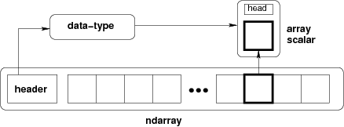

.. _arrays:

*************
Array objects
*************

.. currentmodule:: numpy

NumPy provides an N-dimensional array type, the :ref:`ndarray
<arrays.ndarray>`, which describes a collection of "items" of the same
type. The items can be :ref:`indexed <arrays.indexing>` using for
example N integers.

All ndarrays are :term:`homogenous`: every item takes up the same size
block of memory, and all blocks are interpreted in exactly the same
way. How each item in the array is to be interpreted is specified by a
separate :ref:`data-type object <arrays.dtypes>`, one of which is associated
with every array. In addition to basic types (integers, floats,
*etc.*), the data type objects can also represent data structures.

An item extracted from an array, *e.g.*, by indexing, is represented
by a Python object whose type is one of the :ref:`array scalar types
<arrays.scalars>` built in NumPy. The array scalars allow easy manipulation
of also more complicated arrangements of data.

   **Figure**
   Conceptual diagram showing the relationship between the three
   fundamental objects used to describe the data in an array: 1) the
   ndarray itself, 2) the data-type object that describes the layout
   of a single fixed-size element of the array, 3) the array-scalar
   Python object that is returned when a single element of the array
   is accessed.

.. toctree::
   :maxdepth: 2

   arrays.ndarray
   arrays.scalars
   arrays.dtypes
   arrays.indexing
   arrays.nditer
   arrays.classes
   maskedarray
   arrays.interface
   arrays.datetime
