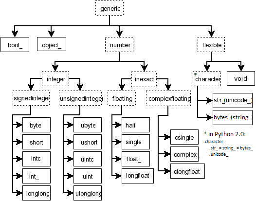

.. _arrays.scalars:

*******
Scalars
*******

.. currentmodule:: numpy

Python defines only one type of a particular data class (there is only
one integer type, one floating-point type, etc.). This can be
convenient in applications that don't need to be concerned with all
the ways data can be represented in a computer.  For scientific
computing, however, more control is often needed.

In NumPy, there are 24 new fundamental Python types to describe
different types of scalars. These type descriptors are mostly based on
the types available in the C language that CPython is written in, with
several additional types compatible with Python's types.

Array scalars have the same attributes and methods as :class:`ndarrays
<ndarray>`. [#]_ This allows one to treat items of an array partly on
the same footing as arrays, smoothing out rough edges that result when
mixing scalar and array operations.

Array scalars live in a hierarchy (see the Figure below) of data
types. They can be detected using the hierarchy: For example,
``isinstance(val, np.generic)`` will return :const:`True` if *val* is
an array scalar object. Alternatively, what kind of array scalar is
present can be determined using other members of the data type
hierarchy. Thus, for example ``isinstance(val, np.complexfloating)``
will return :const:`True` if *val* is a complex valued type, while
:const:`isinstance(val, np.flexible)` will return true if *val* is one
of the flexible itemsize array types (:class:`string`,
:class:`unicode`, :class:`void`).

   **Figure:** Hierarchy of type objects representing the array data
   types. Not shown are the two integer types :class:`intp` and
   :class:`uintp` which just point to the integer type that holds a
   pointer for the platform. All the number types can be obtained
   using bit-width names as well.

.. [#] However, array scalars are immutable, so none of the array
       scalar attributes are settable.

.. _arrays.scalars.character-codes:

.. _arrays.scalars.built-in:

Built-in scalar types
=====================

The built-in scalar types are shown below. Along with their (mostly)
C-derived names, the integer, float, and complex data-types are also
available using a bit-width convention so that an array of the right
size can always be ensured (e.g. :class:`int8`, :class:`float64`,
:class:`complex128`). Two aliases (:class:`intp` and :class:`uintp`)
pointing to the integer type that is sufficiently large to hold a C pointer
are also provided. The C-like names are associated with character codes,
which are shown in the table. Use of the character codes, however,
is discouraged.

Some of the scalar types are essentially equivalent to fundamental
Python types and therefore inherit from them as well as from the
generic array scalar type:

====================  ================================
Array scalar type     Related Python type
====================  ================================
:class:`int_`         :class:`IntType` (Python 2 only)
:class:`float_`       :class:`FloatType`
:class:`complex_`     :class:`ComplexType`
:class:`bytes_`       :class:`BytesType`
:class:`unicode_`     :class:`UnicodeType`
====================  ================================

The :class:`bool_` data type is very similar to the Python
:class:`BooleanType` but does not inherit from it because Python's
:class:`BooleanType` does not allow itself to be inherited from, and
on the C-level the size of the actual bool data is not the same as a
Python Boolean scalar.

.. warning::

   The :class:`bool_` type is not a subclass of the :class:`int_` type
   (the :class:`bool_` is not even a number type). This is different
   than Python's default implementation of :class:`bool` as a
   sub-class of int.

.. warning::

   The :class:`int_` type does **not** inherit from the
   :class:`int` built-in under Python 3, because type :class:`int` is no
   longer a fixed-width integer type.

.. tip:: The default data type in NumPy is :class:`float_`.

In the tables below, ``platform?`` means that the type may not be
available on all platforms. Compatibility with different C or Python
types is indicated: two types are compatible if their data is of the
same size and interpreted in the same way.

Booleans:

===================  =============================  ===============
Type                 Remarks                        Character code
===================  =============================  ===============
:class:`bool_`       compatible: Python bool        ``'?'``
:class:`bool8`       8 bits
===================  =============================  ===============

Integers:

===================  =============================  ===============
:class:`byte`        compatible: C char             ``'b'``
:class:`short`       compatible: C short            ``'h'``
:class:`intc`        compatible: C int              ``'i'``
:class:`int_`        compatible: Python int         ``'l'``
:class:`longlong`    compatible: C long long        ``'q'``
:class:`intp`        large enough to fit a pointer  ``'p'``
:class:`int8`        8 bits
:class:`int16`       16 bits
:class:`int32`       32 bits
:class:`int64`       64 bits
===================  =============================  ===============

Unsigned integers:

===================  =============================  ===============
:class:`ubyte`       compatible: C unsigned char    ``'B'``
:class:`ushort`      compatible: C unsigned short   ``'H'``
:class:`uintc`       compatible: C unsigned int     ``'I'``
:class:`uint`        compatible: Python int         ``'L'``
:class:`ulonglong`   compatible: C long long        ``'Q'``
:class:`uintp`       large enough to fit a pointer  ``'P'``
:class:`uint8`       8 bits
:class:`uint16`      16 bits
:class:`uint32`      32 bits
:class:`uint64`      64 bits
===================  =============================  ===============

Floating-point numbers:

===================  =============================  ===============
:class:`half`                                       ``'e'``
:class:`single`      compatible: C float            ``'f'``
:class:`double`      compatible: C double
:class:`float_`      compatible: Python float       ``'d'``
:class:`longfloat`   compatible: C long float       ``'g'``
:class:`float16`     16 bits
:class:`float32`     32 bits
:class:`float64`     64 bits
:class:`float96`     96 bits, platform?
:class:`float128`    128 bits, platform?
===================  =============================  ===============

Complex floating-point numbers:

===================  =============================  ===============
:class:`csingle`                                    ``'F'``
:class:`complex_`    compatible: Python complex     ``'D'``
:class:`clongfloat`                                 ``'G'``
:class:`complex64`   two 32-bit floats
:class:`complex128`  two 64-bit floats
:class:`complex192`  two 96-bit floats,
                     platform?
:class:`complex256`  two 128-bit floats,
                     platform?
===================  =============================  ===============

Any Python object:

===================  =============================  ===============
:class:`object_`     any Python object              ``'O'``
===================  =============================  ===============

.. note::

   The data actually stored in :term:`object arrays <object array>`
   (*i.e.*, arrays having dtype :class:`object_`) are references to
   Python objects, not the objects themselves. Hence, object arrays
   behave more like usual Python :class:`lists <list>`, in the sense
   that their contents need not be of the same Python type.

   The object type is also special because an array containing
   :class:`object_` items does not return an :class:`object_` object
   on item access, but instead returns the actual object that
   the array item refers to.

The following data types are :term:`flexible`. They have no predefined
size: the data they describe can be of different length in different
arrays. (In the character codes ``#`` is an integer denoting how many
elements the data type consists of.)

===================  ==============================  ========
:class:`bytes_`      compatible: Python bytes        ``'S#'``
:class:`unicode_`    compatible: Python unicode/str  ``'U#'``
:class:`void`                                        ``'V#'``
===================  ==============================  ========

.. warning::

   See :ref:`Note on string types<string-dtype-note>`.

   Numeric Compatibility: If you used old typecode characters in your
   Numeric code (which was never recommended), you will need to change
   some of them to the new characters. In particular, the needed
   changes are ``c -> S1``, ``b -> B``, ``1 -> b``, ``s -> h``, ``w ->
   H``, and ``u -> I``. These changes make the type character
   convention more consistent with other Python modules such as the
   :mod:`struct` module.

Attributes
==========

The array scalar objects have an :obj:`array priority
<__array_priority__>` of :c:data:`NPY_SCALAR_PRIORITY`
(-1,000,000.0). They also do not (yet) have a :attr:`ctypes <ndarray.ctypes>`
attribute. Otherwise, they share the same attributes as arrays:

.. autosummary::
   :toctree: generated/

   generic.flags
   generic.shape
   generic.strides
   generic.ndim
   generic.data
   generic.size
   generic.itemsize
   generic.base
   generic.dtype
   generic.real
   generic.imag
   generic.flat
   generic.T
   generic.__array_interface__
   generic.__array_struct__
   generic.__array_priority__
   generic.__array_wrap__

Indexing
========
.. seealso:: :ref:`arrays.indexing`, :ref:`arrays.dtypes`

Array scalars can be indexed like 0-dimensional arrays: if *x* is an
array scalar,

- ``x[()]`` returns a copy of array scalar
- ``x[...]`` returns a 0-dimensional :class:`ndarray`
- ``x['field-name']`` returns the array scalar in the field *field-name*.
  (*x* can have fields, for example, when it corresponds to a structured data type.)

Methods
=======

Array scalars have exactly the same methods as arrays. The default
behavior of these methods is to internally convert the scalar to an
equivalent 0-dimensional array and to call the corresponding array
method. In addition, math operations on array scalars are defined so
that the same hardware flags are set and used to interpret the results
as for :ref:`ufunc <ufuncs>`, so that the error state used for ufuncs
also carries over to the math on array scalars.

The exceptions to the above rules are given below:

.. autosummary::
   :toctree: generated/

   generic
   generic.__array__
   generic.__array_wrap__
   generic.squeeze
   generic.byteswap
   generic.__reduce__
   generic.__setstate__
   generic.setflags

Defining new types
==================

There are two ways to effectively define a new array scalar type
(apart from composing structured types :ref:`dtypes <arrays.dtypes>` from
the built-in scalar types): One way is to simply subclass the
:class:`ndarray` and overwrite the methods of interest. This will work to
a degree, but internally certain behaviors are fixed by the data type of
the array.  To fully customize the data type of an array you need to
define a new data-type, and register it with NumPy. Such new types can only
be defined in C, using the :ref:`NumPy C-API <c-api>`.
