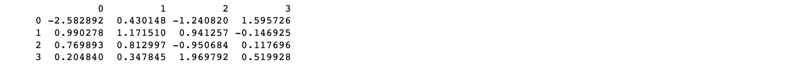
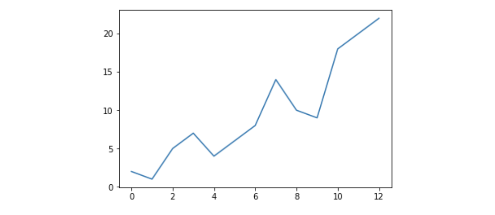
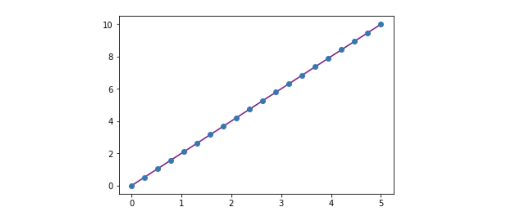
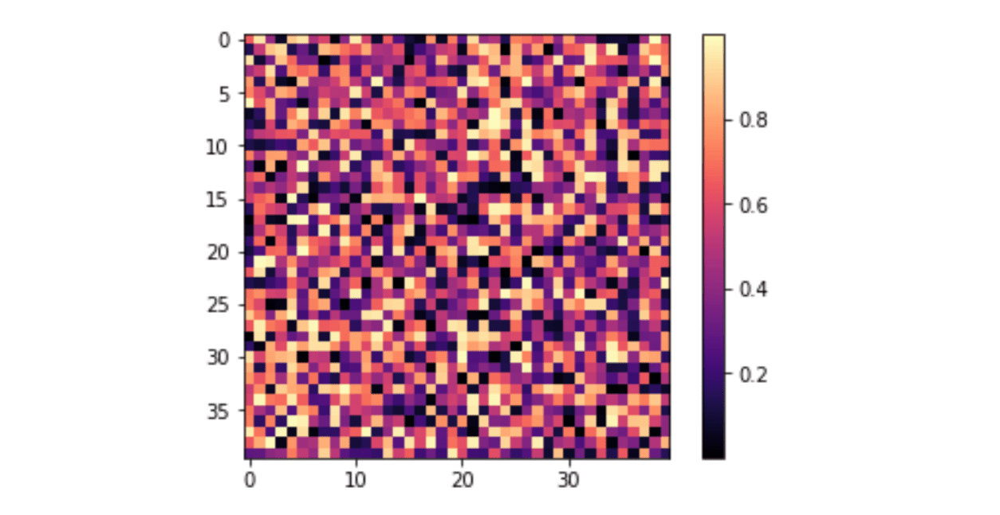

****************************************
NumPy: The Absolute Basics for Beginners
****************************************

This is a working document for a future section introducing NumPy to absolute beginners. If you have comments or suggestions, please don’t hesitate to reach out!

-----

.. image:: images/NumPy_logo.svg

-----

Welcome to NumPy!
-----------------

NumPy (**Numerical Python**) is an open source Python library that's used in almost every field of science and engineering. It's the universal standard for working with numerical data in Python, and it's at the core of the scientific Python and PyData ecosystems. NumPy users include everyone from beginning coders to experienced researchers doing state-of-the-art scientific and industrial research and development. The NumPy API is used extensively in Pandas, SciPy, Matplotlib, scikit-learn, scikit-image and most other data science and scientific Python packages. 

The NumPy library contains multidimentional array and matrix data structures (you'll find more information about this in later sections). It provides **ndarray**, a homogeneous n-dimensional array object, with methods to efficiently operate on it. NumPy can be used to perform a wide variety of mathematical operations on arrays.  It adds powerful data structures to Python that guarantee efficient calculations with arrays and matrices and it supplies an enormous library of high-level mathematical functions that operate on these array and matrices. 

`Learn more about NumPy here <https://docs.scipy.org/doc/numpy-1.17.0/user/whatisnumpy.html>`_!

Installing NumPy
----------------
  
To install NumPy, we strongly recommend using a scientific Python distribution. If you're looking for the full instructions for installing NumPy on your operating system, you can `find all of the details here <https://www.scipy.org/install.html>`_.

  
If you already have Python, you can install NumPy with

::

  conda install numpy
  
or 

::

  pip install numpy
  
If you don't have Python yet, you might want to consider using `Anaconda <https://www.anaconda.com/>`_. It's the easiest way to get started. The good thing about getting this distribution is is the fact that you don’t need to worry too much about separately installing NumPy or any of the major packages that you’ll be using for your data analyses, like pandas, Scikit-Learn, etc.

You can find all of the installation details in the `Installation <https://www.scipy.org/install.html>`_ section at scipy.org.

How to import NumPy
-------------------

Any time you want to use a package or library in your code, you first need to make it accessible. 

In order to start using NumPy and all of the functions available in NumPy, you'll need to import it. This can be easily done with this import statement:

::

  import numpy as np 

(We shorten "numpy" to "np" in order to save time and also to keep code standardized so that anyone working with your code can easily understand and run it.)

What’s the difference between a Python list and a NumPy array? 
--------------------------------------------------------------
  
NumPy gives you an enormous range of fast and efficient numerically-related options. While a Python list can contain different data types within a single list, all of the elements in a NumPy array should be homogenous. The mathematical operations that are meant to be performed on arrays wouldn't be possible if the arrays weren't homogenous. 

**Why use NumPy?**

NumPy arrays are faster and more compact than Python lists. An array consumes less memory and is convenient to use. NumPy uses much less memory to store data and it provides a mechanism of specifying the data types. This allows the code to be optimised even further. 

What is an array?
-----------------

An array is a central data structure of the NumPy library. An array is a grid of values and it contains information about the raw data, how to locate an element, and how to interpret an element. It has a grid of elements that can be indexed in `various ways <https://numpy.org/devdocs/user/quickstart.html#indexing-slicing-and-iterating>`_. The elements are all of the same type, referred to as the array **dtype**. 

An array can be indexed by a tuple of nonnegative integers, by booleans, by another array, or by integers. The **rank** of the array is the number of dimensions. The **shape** of the array is a tuple of integers giving the size of the array along each dimension.

One way we can initialize NumPy arrays is from nested Python lists. 

::

  a = np.array([[1 , 2, 3, 4], [5, 6, 7, 8], [9, 10, 11, 12]])

We can access the elements in the array using square brackets. When you're accessing elements, remember that indexing in NumPy starts at 0. That means that if you want to access the first element in your array, you'll be accessing element "0".

::

  print(a[0])

**Output:**

::

  [1 2 3 4]

More information about arrays
-----------------------------

::

  1D array, 2D array, ndarray, vector, matrix

------

You might occasionally hear an array referred to as an "ndarray," which is shorthand for "N-dimensional array." You might also hear **1-D**, or one-dimensional array, **2-D**, or two-dimensional array, and so on. The numpy `ndarray` class is used to represent both matrices and vectors. A **vector** is an array with a single column, while a **matrix** refers to an array with multiple columns.

**What are the attributes of an array?**

An array is usually a fixed-size container of items of the same type and size. The number of dimensions and items in an array is defined by its shape. The shape of an array is a tuple of non-negative integers that specify the sizes of each dimension. 

In NumPy, dimensions are called **axes**. This means that if you have a 2D array that looks like this:

::

  [[0., 0., 0.],
   [1., 1., 1.]]

Your array has 2 axes. The first axis has a length of 2 and the second axis has a length of 3.

Just like in other Python container objects, the contents of an array can be accessed and modified by indexing or slicing the array. Different arrays can share the same data, so changes made on one array might be visible in another. 

Array **attributes** reflect information intrinsic to the array itself. If you need to get, or even set, poperties of an array without creating a new array, you can often access an array through its attributes. 

`Read more about array attributes here <https://docs.scipy.org/doc/numpy/reference/arrays.ndarray.html>`_ and learn about `array objects here <https://docs.scipy.org/doc/numpy-1.17.0/reference/arrays.html>`_.

How to create a basic array
---------------------------

::

  np.array()
  np.zeros() 
  np.ones() 
  np.empty() 
  np.arange() 
  np.linspace()
  dtype

-----

To create a NumPy array, you can use the function **np.array()**.

All you need to do to create a simple array is pass a list to it. If you choose to, you can also specify the type of data in your list. `You can find more information about data types here <https://numpy.org/devdocs/user/quickstart.html#arrays-dtypes>`_.

::

    import numpy as np

    # create a 1-D array
    a = np.array([1, 2, 3])

You can visualize your array this way:

Besides creating an array from a sequence of elements, you can easily create an array filled with 0s:

::

  # Create a 1D array with 2 elements, both 0s
  np.zeros(2)

**Output:**

::

  array([0., 0.])

Or an array filled with 1s:

::

  # Create a 1D array with 2 elements, both 1s
  np.ones(2)

**Output:**

::

  array([1., 1.])
  
Or even an empty array! The function *empty* creates an array whose initial content is random and depends on the state of the memory. 

::

  # Create an empty array with 2 elements
  np.empty(2)

You can create an array with a range of elements:

::

  # Create a 1D array containing the numbers 0,1,2,3
  np.arange(4)

**Output:**

::

  array([0, 1, 2, 3])

And even an array that contains a range of evenly spaced interval. To do this, you will specify the **first number**, **last number**, and the **step size**.

::

  np.arange(2,9,2)

**Output:**

::

  array([2, 4, 6, 8])

You can also use **np.linspace()** to create an array with values that are spaced linearly in a specified interval:

::

  np.linspace(0,10,5)

**Output:**

::

  array([ 0. ,  2.5,  5. ,  7.5, 10. ])

**Specifying your data type**

While the default data type is floating point (**float64**), you can expecity specify which data type you want using **dtype**.

::

  array = np.ones(2, dtype=int)
  array

**Output:**

::

  array([1, 1])

`Learn more about creating arrays here <https://docs.scipy.org/doc/numpy-1.17.0/user/quickstart.html#array-creation>`_.

Adding, removing, and sorting elements
--------------------------------------

::

  np.append()
  np.delete() 
  np.sort()

-----

If you start with this array:

::

  arr = np.array([1, 2, 3, 4, 5, 6, 7, 8])
 

**Append**

You can add elements to your array any time with **np.append()**. Make sure to specify the array and the elements you want to include.
::

  np.append(arr, [1,2])

**Output**

::

  array([1, 2, 3, 4, 5, 6, 7, 8, 1, 2])

**Delete**

You can delete an element with **np.delete()**. If you want to delete the element in position 1 of your array, you can run:

::

  np.delete(arr, 1)

**Output**

::

  array([1, 3, 4, 5, 6, 7, 8])

**Sort**

Sorting an element is simple with **np.sort()**. You can specify the axis, kind, and order when you call the function. `Read more about sorting an array here <https://docs.scipy.org/doc/numpy/reference/generated/numpy.sort.html>`_.

If you start with this array:

::

  arr = np.array([2, 1, 5, 3, 7, 4, 6, 8])

You can quickly sort the numbers in ascending order with:

::

  np.sort(arr)

**Output:**

::

  array([1, 2, 3, 4, 5, 6, 7, 8])

In addition to sort, which returns a sorted copy of an array, you can use:

**argsort**, which is an `indirect sort along a specified axis <https://docs.scipy.org/doc/numpy-1.17.0/reference/generated/numpy.argsort.html#numpy.argsort>`_,
**lexsort**, which is an `indirect stable sort on multiple keys <https://docs.scipy.org/doc/numpy-1.17.0/reference/generated/numpy.lexsort.html#numpy.lexsort>`_,
**searchsorted**, which will `find elements in a sorted array <https://docs.scipy.org/doc/numpy-1.17.0/reference/generated/numpy.searchsorted.html#numpy.searchsorted>`_, and 
**partition**, which is a `partial sort  <https://docs.scipy.org/doc/numpy-1.17.0/reference/generated/numpy.partition.html#numpy.partition>`_.

How do you know the shape and size of an array?
-----------------------------------------------

::

  ndarray.ndim() 
  ndarray.size()
  ndarray.shape()

-----

**ndarray.ndim** will tell you the number of axes, or dimensions, of the array.

**ndarray.size** will tell you the total number of elements of the array. This is the *product* of the elements of the array's shape.

**ndarray.shape** will display a tuple of integers that indicate the number of elements stored along each dimension of the array. If, for example, you have a 2D array with 2 rows and 3 columns, the shape of your array is (2,3).

For example, if you create this array:

::

      import numpy as np
      array_example = np.array([[[0, 1, 2, 3]
                                 [4, 5, 6, 7]],

                                 [[0, 1, 2, 3]
                                  [4, 5, 6, 7]],

                                  [0 ,1 ,2, 3]
                                  [4, 5, 6, 7]]])

To find the number of dimensions of the array, run:

::

    array_example.ndim

**Output:**

::

  3

To find the total number of elements in the array, run:

::
  
  array_example.size
  

**Output:**

::

  24

And to find the shape of your array, run:

::

  array_example.shape

**Output:**

::

  (3,2,4)

Can you reshape an array?
-------------------------

::

  np.reshape()

-----
  
**Yes!**

Using **np.reshape()** will give a new shape to an array without changing the data. Just remember that when you use the reshape method, the array you want to produce needs to have the same number of elements as the original array. If you start with an array with 12 elements, you'll need to make sure that your new array also has a total of 12 elements.

If you start with this array:

::

  a = np.arange(6)
  print(a)

**Output:**

::

  [0 1 2 3 4 5]

You can use **reshape()** to reshape your array. For example, you can reshape this array to an array with three rows and two columns:

::

  b = a.reshape(3,2)
  print(b)

**Output:**

::

  [[0 1]
   [2 3]
   [4 5]]

With np.reshape, you can specify a few optional parameters:

::

  numpy.reshape(a, newshape, order)

**a** is the array to be reshaped.

**newshape** is the new shape you want. You can specify an integer or a tuple of integers. If you specify an integer, the result wil be an array of that length. The shape should be compatible with the original shape.

**order:** 'C' means to read/write the elements using C-like index order,  ‘F’ means to read / write the elements using Fortran-like index order, ‘A’ means to read / write the elements in Fortran-like index order if a is Fortran contiguous in memory, C-like order otherwise. (This is an optional parameter and doesn't need to be specified.)

`Learn more about shape manipulation here <https://docs.scipy.org/doc/numpy-1.17.0/user/quickstart.html#shape-manipulation>`_.

How to convert a 1D array into a 2D array (how to add a new axis to an array)
-----------------------------------------------------------------------------

::

  np.newaxis
  np.expand_dims

-----

You can use **np.newaxis** and **np.expand_dims** to increase the dimensions of your existing array.

Using **np.newaxis** will increase the dimensions of your array by one dimension when used once. This means that a **1D** array will become a **2D** array, a **2D** array will be come a **3D** array, and so on. 

For example, if you start with this array:

::

  a = np.array([1, 2, 3, 4, 5, 6])
  a.shape

**Output:**

::

  (6,)

You can use **np.newaxis** to add a new axis:

::

  a2 = a[np.newaxis]
  a2.shape

**Output:**

::

  (1, 6)

You can explicitly convert a 1D array with either a row vector or a column vector using np.newaxis. For example, you can convert a 1D array to a row vector by inserting an axis  along the first dimension:

::

  row_vector = a[np.newaxis, :]
  row_vector.shape

**Output:**

::

  (1, 6)

Or, for a column vector, you can insert an axis along the second dimension:

::

  col_vector = a[:, np.newaxis]
  col_vector.shape

**Output:**

::

  (6, 1)

You can also expand an array by inserting a new axis at a specified position with **np.expand_dims**.

For example, if you start with this array:

::

  a = np.array([1, 2, 3, 4, 5, 6])
  a.shape

**Output:**

::

  (6,)

You can use **np.expand_dims** to add an axis at index position 1 with:

::

  b = np.expand_dims(a, axis=1)
  b.shape

**Output:**

::

  (6, 1)

You can add an axis at index position 0 with:

::

  c = np.expand_dims(a, axis=0)
  c.shape

**Output:**

::

  (1, 6)

Indexing and slicing
--------------------

You can index and slice NumPy arrays in the same ways you can slice Python lists.

::

   # create a 1-D array
    data = np.array([1,2,3])

    # print the first element of the array
    print(data[0])
    print(data[1])
    print(data[0:2])
    print(data[1:])
    print(data[-2:])

**Output:**

::

  1
  2
  [1 2]
  [2 3]

You can visualize it this way:

.. image:: images/np_indexing.png

You may want to take a section of your array or specific array elements to use in further analysis or additional operations. To do that, you'll need to subset, slice, and/or index your arrays. 

If you want to select values from your array that fulfill certain conditions, it's straightforward with NumPy. 

For example, if you start with this array:

::

  a = np.array([[1 , 2, 3, 4], [5, 6, 7, 8], [9, 10, 11, 12]])

You can easily print all of the values in the array that are less than 5

::

  print(a[a<5])

**Output:**

::
  
  [1 2 3 4]

You can also select, for example, numbers that are equal to or greater than 5, and use that condition to index an array.

::

  five_up = (a >= 5)
  print(a[five_up])

**Output:**

::

  [ 5  6  7  8  9 10 11 12]

You can select elements that are divisible by 2:

::

  divisible_by_2 = a[a%2==0]
  print(divisible_by_2)

**Output:**

::

  [ 2  4  6  8 10 12]

Or you can select elements that satisfy two conditions using the **&** and **|** operators:

::

  c = a[(a > 2) & (a < 11)]
  print(c)

**Output:**

::

  [ 3  4  5  6  7  8  9 10]

While it would be incredibly inefficient for this array, you can also make use of the logical operators **&** and **|** in order to return boolean values that specify whether or not the values in an array fulfill a certain condition. This can be useful with arrays that contain names or other categorical values.

::

  five_up = (array > 5) | (array == 5)
  print(five_up)

**Output:**

::

  [[False False False False]
   [ True  True  True  True]
   [ True  True  True  True]] 

You can also use **np.where()** to select elements or indices from an array. 

Starting with this array:

::

  a = np.array([[1 , 2, 3, 4], [5, 6, 7, 8], [9, 10, 11, 12]])

You can use **np.where()** to print the indices of elements that are, for example, less than 5:

::

  b = np.where(a<5)
  print(b)

**Output:**

::

  (array([0, 0, 0, 0]), array([0, 1, 2, 3]))

In this example, a tuple of arrays was returned: one for each dimension. The first array represents the row indices where this value is found, and the second array represents the column indices where the values is found.

If you want to generate a list of coordinates where the elements exist, you can zip the arrays, iterate over the list of coordinates, and print them. For example:

::

  list_of_coordinates= list(zip(b[0], b[1]))

  for cord in list_of_coordinates:
      print(cord)

**Output:**

::

  (0, 0)
  (0, 1)
  (0, 2)
  (0, 3)

You can also use **np.where()** to print the elements in array that are less than 5 with:

::

  print(a[b])

**Output:**

::

  [1 2 3 4]

If the element you're looking for doesn't exist in the array, then the returned array of indices will be empty. For example:

::

  not_there = np.where(a == 42)
  print(not_there)

**Output:**

::

  (array([], dtype=int64), array([], dtype=int64))

`Learn more about indexing and slicing here <https://docs.scipy.org/doc/numpy-1.17.0/user/quickstart.html#indexing-slicing-and-iterating>`_ and `here <https://docs.scipy.org/doc/numpy-1.17.0/user/basics.indexing.html>`_.

`Read more about the where function here <https://docs.scipy.org/doc/numpy-1.15.1/reference/generated/numpy.where.html>`_.

How to create an array from existing data
-----------------------------------------

::

  slicing and indexing

  np.vstack()
  np.hstack()
  np.hsplit()
  
  .view()
  .copy()

-----

You can easily use create a new array from a section of an existing array. Let's say you have this array:

::

  array([ 1,  2,  3,  4,  5,  6,  7,  8,  9, 10])

You can create a new array from a section of your array any time by specifying where you want to slice your array.

::

  arr1 = array[3:8]
  arr1

**Output:**

::

  array([4, 5, 6, 7, 8])

Here, you grabbed a section of your array from index position 3 through index position 8.

You can also stack two existing arrays, both vertically and horizontally. Let's say you have two arrays: 

a_1:

::

  array([[1, 1],
       [2, 2]])

and a_2:

::

  array([[3, 3],
       [4, 4]])

You can stack them vertically with **vstack**:

::

  np.vstack((a_1, a_2))

**Output:**

::

  array([[1, 1],
       [2, 2],
       [3, 3],
       [4, 4]])

Or stack them horizontally with **hstack**:

::

  np.hstack((a_1, a_2))

**Output:**

::

  array([[1, 1, 3, 3],
       [2, 2, 4, 4]])

`Learn more about stacking and splitting arrays here <https://docs.scipy.org/doc/numpy-1.17.0/user/quickstart.html#stacking-together-different-arrays>`_.

You can split an array into several smaller arrays using hsplit. You can specify either the number of equally shaped arrays to return or the columns *after* which the division should occur.

Let's say you have this array:

::

  array([[ 1,  2,  3,  4,  5,  6,  7,  8,  9, 10, 11, 12],
       [13, 14, 15, 16, 17, 18, 19, 20, 21, 22, 23, 24]])

If you wanted to split this array into three equally shaped arrays, you would run:

::

  np.hsplit(array,3)

**Output:**

::

  [array([[ 1,  2,  3,  4],
        [13, 14, 15, 16]]), array([[ 5,  6,  7,  8],
        [17, 18, 19, 20]]), array([[ 9, 10, 11, 12],
        [21, 22, 23, 24]])]

If you wanted to split your array after the third and fourth column, you'd run:

::

  np.hsplit(array,(3,4))

**Output:**

::

  [array([[ 1,  2,  3],
        [13, 14, 15]]), array([[ 4],
        [16]]), array([[ 5,  6,  7,  8,  9, 10, 11, 12],
        [17, 18, 19, 20, 21, 22, 23, 24]])]

You can use the **view** method to create a new array object that looks at the same data (a *shallow copy*)

Let's say you create this array:

::

  a = np.array([[1 , 2, 3, 4], [5, 6, 7, 8], [9, 10, 11, 12]])

You can create a new array with the same data using:

::

  b = a.view()

Using the **copy** method will make a complete copy of the array and its data (a *deep copy*). To use this on your array, you could run:

::

  c = a.copy()
 
`Learn more about copies and views here <https://docs.scipy.org/doc/numpy-1.17.0/user/quickstart.html#copies-and-views>`_.

Basic array operations
----------------------

::

  Addition, subtraction, multiplication, division, and more!

-----

Once you've created your arrays, you can start to work with them. 
Let's say, for example, that you've created two arrays, one called "data" and one called "ones" 

.. image:: images/np_array_dataones.png

You can add the arrays together with the plus sign.

::

  data + ones

.. image:: images/np_data_plus_ones.png

You can, of course, do more than just addition!

::

  data - ones
  data * data
  data / data

.. image:: images/np_sub_mult_divide.png

Basic operations are simple with NumPy. If you want to find the sum of the elements in an array, you'd use **sum()**. This works for 1D arrays, 2D arrays, and arrays in higher dimentions.

::

  a = np.array([1, 2, 3, 4])

  # Add all of the elements in the array
  a.sum()

**Output:**

::

  10

To add the rows or the columns in a 2D array, you would specify the axis.

If you start with this array:

::

  b = np.array([[1, 1], [2, 2]])

You can sum the rows with:

::
  
  b.sum(axis=0)

**Output:**

::

  array([3, 3])

You can sum the columns with:

::

  b.sum(axis=1)

**Output:**

::

  array([2, 4])

`Learn more about basic operations here <https://docs.scipy.org/doc/numpy-1.17.0/user/quickstart.html#basic-operations>`_.

Broadcasting
------------

There are times when you might want to carry out an operation between an array and a single number (also called *an operation between a vector and a scalar*) or between arrays of two different sizes. For example, your array (we'll call it "data") might contain information about distance in miles but you want to convert the information to kilometers. You can perform this operation with: 

::

  data * 1.6

.. image:: images/np_multiply_broadcasting.png

NumPy understands that the multiplication should happen with each cell. That concept is called **broadcasting**. Broadcasting is a mechanism that allows NumPy to perform operations n arrays of different shapes. The dimensions of your array must be compatible, for example when they're equal or when one of them is 1. If the dimensions are not compatible, you will get a value error. 

`Learn more about broadcasting here <https://docs.scipy.org/doc/numpy-1.17.0/user/basics.broadcasting.html>`_.

More useful array operations
-----------------------------------

::

  Maximum, minimum, sum, mean, product, standard deviation, and more

NumPy also performs aggregation functions. In addition to `min`,  `max`, and `sum`, you can easily run **mean** to get the average, **prod** to get the result of multiplying the elements together, **std** to get the standard deviation, and more.

::

  data.max()
  data.min()
  data.sum()

.. image:: images/np_aggregation.png

Let's start with this array, called "A"

::

 [[0.45053314 0.17296777 0.34376245 0.5510652]
 [0.54627315 0.05093587 0.40067661 0.55645993]
 [0.12697628 0.82485143 0.26590556 0.56917101]]

It's very common to want to aggregate along a row or column. By default, every NumPy aggregation function will return the aggregate of the entire array. To find the sum or the minimum of the elements in your array, run:

::

  A.sum()

Or

::

  A.min()

**Output:**

::

  # Sum
  4.8595783866706

::

  # Minimum
  0.050935870838424435

You can specify on which axis you want the aggregation function to be computed. For example, you can find the minimum value within each column by specifying **axis=0**.

::

  A.min(axis=0)

**Output:**

::

  array([0.12697628, 0.05093587, 0.26590556, 0.5510652 ])

The four values listed above correspond to the number of columns in your array. With a four-column array, you will get four values as your result.

`Read more about functions here <https://docs.scipy.org/doc/numpy/reference/arrays.ndarray.html>`_ and `calculations here <https://docs.scipy.org/doc/numpy-1.17.0/reference/arrays.ndarray.html#calculation>`_.

How to inspect the size and shape of a NumPy array
--------------------------------------------------

::

  np.shape()
  np.size()

-----

You can get the dimensions of a NumPy array any time using **ndarray.shape**. NumPy will return the dimensions of the array as a tuple.

For example, if you create this array:

::

  np_arr = np.array([[1 , 2, 3, 4], [5, 6, 7, 8], [9, 10, 11, 12]])

You can use **np.shape** to find the shape of your array.

::

  np_arr.shape

**Output:**

::

  (3, 4)

This output tells you that your array has three rows and four columns.

You can find just the number of rows by specifying [0]:

::

  num_of_rows = np_arr.shape[0]
 
  print('Number of Rows : ', num_of_rows)

**Output:**

::

  Number of Rows :  3

Or just the number of columns by specifying [1]:

::

  num_of_columns = np_arr.shape[1]
 
  print('Number of Columns : ', num_of_columns) 

**Output:**

::
  
  Number of Columns :  4

It's also easy to find the total number of elements in your array:

::

  print(np_arr.shape[0] * np_arr.shape[1])

**Output:**

::

  12

You can use **np.shape()** with a 1D array as well. If you create this array:

::

  arr = np.array([1, 2, 3, 4, 5, 6, 7, 8])

You can print the shape and then length of the array.

::

  print('Shape of 1D array: ', arr.shape)
  print('Length of 1D array: ', arr.shape[0])

**Output:**

::

  Shape of 1D array:  (8,)
  Length of 1D array:  8

You can get the dimensions of an array using **np.size()**.

::

  # get number of rows in array
  num_of_rows2 = np.size(np_arr, 0)
 
  # get number of columns in 2D numpy array
  num_of_columns2 = np.size(np_arr, 1)
 
  print('Number of Rows : ', num_of_rows2)
  print('Number of Columns : ', num_of_columns2)

**Output:**

::

  Number of Rows :  3
  Number of Columns: 4

You can print the total number of elements as well:

::
  
  print('Total number of elements in  array : ', np.size(np_arr))

**Output:**

::

  Total number of elements in  array :  12

This also works for 3D arrays:

::

  arr3D = np.array([ [[1, 1, 1, 1], [2, 2, 2, 2], [3, 3, 3, 3]],
                 [[4, 4, 4, 4], [5, 5, 5, 5], [6, 6, 6, 6]] ])

You can easily print the size of the axis:

::

  print('Axis 0 size : ', np.size(arr3D, 0))
  print('Axis 1 size : ', np.size(arr3D, 1))
  print('Axis 2 size : ', np.size(arr3D, 2))

**Output:**

::

  Axis 0 size :  2
  Axis 1 size :  3
  Axis 2 size :  4

You can print the total number of elements:

::

  print(np.size(arr3D))

**Output:**

::

  24

You can also use **np.size()** with 1D arrays:

::

  # Create a 1D array
  arr = np.array([1, 2, 3, 4, 5, 6, 7, 8])

  # Determine the length
  print('Length of 1D numpy array : ', np.size(arr))

**Output:**

::

  Length of 1D numpy array :  8

*Remember that if you check the size of your array and it equals 0, your array is empty.*

Creating matrices
-----------------

You can pass Python lists of lists to create a matrix to represent them in NumPy.

::

  np.array([[1,2],[3,4]])

.. image:: images/np_create_matrix.png

Indexing and slicing operations are useful when you're manipulating matrices:

::

  data[0,1]
  data[1:3]
  data[0:2,0]

.. image:: images/np_matrix_indexing.png

You can aggregate matrices the same way you aggregated vectors:

::

  data.max()
  data.min()
  data.sum()

.. image:: images/np_matrix_aggregation.png

You can aggregate all the values in a matrix and you can aggregate them across columns or rows using the `axis` parameter:

::
  
  data.max(axis=0)
  data.max(axis=1)

.. image:: images/np_matrix_aggregation_row.png

Once you've created your matrices, you can add and multiply them using arithmetic operators if you have two matrices that are the same size.

::

  data + ones

.. image:: images/np_matrix_arithmetic.png

You can do these arithmetic operations on matrices of different sizes, but only if one matrix has only one column or one row. In this case, NumPy will use its broadcast rules for the operation.

::

  data + ones_row

.. image:: images/np_matrix_broadcasting.png

Be aware that when NumPy prints N-Dimensional arrays, the last axis is looped over the fastest while the first axis is the slowest. That means that 

::

  np.ones((4,3,2))

Will print out like this:

**Output:**

::

  array([[[1., 1.],
        [1., 1.],
        [1., 1.]],

       [[1., 1.],
        [1., 1.],
        [1., 1.]],

       [[1., 1.],
        [1., 1.],
        [1., 1.]],

       [[1., 1.],
        [1., 1.],
        [1., 1.]]])

 
There are often instances where we want NumPy to initialize the values of an array. NumPy offers methods like ones(), zeros() and random.random() for these instances. All you need to do is pass in the number of elements you want it to generate.

::

  np.ones(3)
  mp.zeros(3)
  np.random.random((3)
  
.. image:: images/np_ones_zeros_random.png

Generating random numbers
-------------------------

The use of random number generation is an important part of the configuration and evaluation of machine learning algorithms. Whether you neeed to randomly initialize weights in an artificial neural network, split data into random sets, or randomly shuffle your dataset, being able to generate random numbers (actually, repeatable pseudo-random numbers) is essential.

You have a number of options when using NumPy for random number generation. Random Generator is NumPy's replacement for RandomState. The main difference between them is that Generator relies on an additional BitGenerator to manage state and generate the random bits, which are transformed into random values.

With Generator.integers, you can generate random integers from low (remember that this is inclusive with NumPy) to high (exclusive). You can set *endopoint=True* to make the high number inclusive. 

You can generate a 2 x 4 array of random integers between 0 and 4 with

::

  rng.integers(5, size=(2, 4))

**Output:**

::

  array([[4, 0, 2, 1],
       [3, 2, 2, 0]])

You can also use the **ones()**, **zeros()**, and **random()** methods to create an array if you give them a tuple describing the diminsions of the matrix.

::

  np.ones(3,2)
  mp.zeros(3,2)
  np.random.random((3,2)

.. image:: images/np_ones_zeros_matrix.png

How to get the unique items and the counts
------------------------------------------

::

  np.unique()

-----

You can find the unique elements in an array easily with **np.unique**. 

For example, if you start with this array:

::

  a = np.array([11, 11, 12, 13, 14, 15, 16, 17, 12, 13, 11, 14, 18, 19, 20])

you can use **np.unique**

::

  unique_values = np.unique(a)
  print(unique_values)

**Output:**

::

  [11 12 13 14 15 16 17 18 19 20]

To get the indices of unique values in a NumPy array (an array of first index positions of unique values in the array), just pass the **return_index** argument in **np.unique()** as well as your array.

::

  indices_list = np.unique(a, return_index=True)
  print(indices_list)

**Output:**

::

  [ 0  2  3  4  5  6  7 12 13 14]

You can pass the **return_counts** argument in **np.unique()** along with your array to get the frequency count of unique values in a NumPy array.

::

  unique_values, occurrence_count = np.unique(a, return_counts=True)
  print(occurrence_count)

**Output:**

::

  [3 2 2 2 1 1 1 1 1 1]

This also works with 2D arrays. If you start with this array:

::

  a2D = np.array([[1, 2, 3, 4] ,[5, 6, 7, 8] , [9, 10, 11, 12],  [1, 2, 3, 4]])

You can find the unique values with:

::

  unique_values = np.unique(a2D)
  print(unique_values)

**Output:**

::

  [ 1  2  3  4  5  6  7  8  9 10 11 12]

If the axis argument isn't passed, your 2D array will be flattened. 

To get the unique rows or columns, make sure to pass the **axis** argument. To find the unique rows, speciify **axis=0** and for columns, specify **axis=1**.

::

  unique_rows = np.unique(a2D, axis=0)
  print(unique_rows)

**Output:**

::

  [[ 1  2  3  4]
   [ 5  6  7  8]
   [ 9 10 11 12]]

To get the unique rows, occurrence count, and index position, you can use:

::

  unique_rows, occurence_count, indices = np.unique(a2D, axis=0, return_counts=True, return_index=True)
  print('Unique Rows: ', '\n', unique_rows) 
  print('Occurrence Count:', '\n', occurence_count)
  print('Indices: ', '\n', indices)

**Output:**

::

  Unique Rows:  
   [[ 1  2  3  4]
   [ 5  6  7  8]
   [ 9 10 11 12]]
  Occurrence Count: 
   [0 1 2]
  Indices:  
   [2 1 1]

Transposing and reshaping a matrix
----------------------------------

::

  np.reshape()
  T

-----

It's common to need to rotate your matrices. NumPy arrays have the property **T** that allows you to transpose a matrix.

.. image:: images/np_transposing_reshaping.png

You may also need to switch the dimensions of a matrix. This can happen when, for example, you have a model that expects a certain input shape that is different from your dataset. This is where the **reshape** method can be useful. You simply need to pass in the new dimensions that you want for the matrix.

::

  data.reshape(2,3)
  data.reshape(3,2)

.. image:: images/np_reshape.png

How to reverse an array
-----------------------

::

  np.flip

-----
 
NumPy's **np.flip()** function allows you to flip, or reverse, the contents of an array along an axis. When using np.flip, specify the array you would like to reverse and the axis. If you don't specify the axis, NumPy will reverse the contents along all of the axes of your input array. 

**Reversing a 1D array**

If you begin with a 1D array like this one:

::

  arr = np.array([1, 2, 3, 4, 5, 6, 7, 8])

You can reverse it with: 

::

  reversed_arr = np.flip(arr)

If you want to print your reversed array, you can run:

::

  print('Reversed Array: ', reversed_arr)

**Output:**

::

  Reversed Array:  [8 7 6 5 4 3 2 1]

**Reversing a 2D array**

A 2D array works much the same way.

If you start with this array:

::

  arr2D = np.array([[1 , 2, 3, 4], [5, 6, 7, 8], [9, 10, 11, 12]])

You can reverse the content in all of the rows and all of the columns with:

::

  reversed_arr = np.flip(arr2D)
 
  print('Reversed Array: ')
  print(reversed_arr)

**Output:**

::

  Reversed Array: 
  [[12 11 10  9]
   [ 8  7  6  5]
   [ 4  3  2  1]]

You can easily reverse only the rows with:

::

  reversed_arr_rows = np.flip(arr2D, axis=0)
 
  print('Reversed Array: ')
  print(reversed_arr_rows)

**Output:**

::

  Reversed Array: 
  [[ 9 10 11 12]
   [ 5  6  7  8]
   [ 1  2  3  4]]

Or reverse only the columns with:

::

  reversed_arr_columns = np.flip(arr2D, axis=1)
 
  print('Reversed Array columns: ')
  print(reversed_arr_columns)

**Output:**

::

  Reversed Array columns: 
  [[ 4  3  2  1]
   [ 8  7  6  5]
   [12 11 10  9]]

You can also reverse the contents of only one column or row. For example, you can reverse the contents of the row at index position 1 (the second row):

::

  arr2D[1] = np.flip(arr2D[1])
   
  print('Reversed Array: ')
  print(arr2D)

**Output:**

::

  Reversed Array: 
  [[ 1  2  3  4]
   [ 5  6  7  8]
   [ 9 10 11 12]]

You can also reverse the column at index position 1 (the second column):

::

  arr2D[:,1] = np.flip(arr2D[:,1])
   
  print('Reversed Array: ')
  print(arr2D)

**Output:**

::

  Reversed Array: 
  [[ 1 10  3  4]
   [ 5  6  7  8]
   [ 9  2 11 12]]

Reshaping and flattening multidimensional arrays
------------------------------------------------

::

  .flatten()
  .ravel()
  
There are two popular ways to flatten an array: **.flatten()** and **.ravel()**. The primary difference between the two is that the new array created using **ravel()** is actually a reference to the parent array. This means that any changes to the new array will affect the parent array as well. Since ravel does not create a copy, it's memory efficient. 

If you start with this array:

::

  array = np.array([[1 , 2, 3, 4], [5, 6, 7, 8], [9, 10, 11, 12]])

You can use **flatten** to flatten your array into a 1D array.

::

  array.flatten()

**Output:**

::

  array([ 1,  2,  3,  4,  5,  6,  7,  8,  9, 10, 11, 12])

When you use **flatten**, changes to your new array won't change the parent array.

For example:

::

  a1 = array.flatten()  
  a1[0] = 100
  print('Original array: ')
  print(array)
  print('New array: ')
  print(a1)

**Output:**

::

  Original array: 
  [[ 1  2  3  4]
   [ 5  6  7  8]
   [ 9 10 11 12]]
  New array: 
  [100   2   3   4   5   6   7   8   9  10  11  12]

But when you use **ravel**, the changes you make to the new array will affect the parent array.

For example:

::

  a2 = array.ravel()  
  a2[0] = 101 
  print('Original array: ')
  print(array)
  print('New array: ')
  print(a2)

**Output:**

::

  Original array: 
  [[101   2   3   4]
   [  5   6   7   8]
   [  9  10  11  12]]
  New array: 
  [101   2   3   4   5   6   7   8   9  10  11  12]

How to access the docstring for more information
---------------------------------------------------

::

  help()
  ?
  ??

-----

When it comes to the data science ecosystem, Python and NumPy are built with the user in mind. One of the best examples of thiis is the built-in access to documentation. Every object contains the reference to a string, which is known as the **docstring**. In most cases, this docstring contains a quick and concise summary of the object and how to use it. Python has a built-in **help()** function that can help you access this information. This means that nearly any time you need more information, you can use **help()** to quickly find the information that you need.

For example,

::

  help(max)

Will return

::

  Help on built-in function max in module builtins:

  max(...)
      max(iterable, *[, default=obj, key=func]) -> value
      max(arg1, arg2, *args, *[, key=func]) -> value
      
      With a single iterable argument, return its biggest item. The
      default keyword-only argument specifies an object to return if
      the provided iterable is empty.
      With two or more arguments, return the largest argument.

Because access to additional information is so useful, IPython uses the **?** character as a shorthand for accessing this documentation along with other relevant information.

For example,

::

  max?

Will return

::

  Docstring:
  max(iterable, *[, default=obj, key=func]) -> value
  max(arg1, arg2, *args, *[, key=func]) -> value

  With a single iterable argument, return its biggest item. The
  default keyword-only argument specifies an object to return if
  the provided iterable is empty.
  With two or more arguments, return the largest argument.
  Type:      builtin_function_or_method
  
You can even use this notation for object methods and objects themselves.

Let's say you create this array:

::

  a = np.array([1, 2, 3, 4, 5, 6])

Running

::

  a?
  
Will return a lot of useful information.

::

  Type:            ndarray
  String form:     [1 2 3 4 5 6]
  Length:          6
  File:            ~/anaconda3/lib/python3.7/site-packages/numpy/__init__.py
  Docstring:       <no docstring>
  Class docstring:
  ndarray(shape, dtype=float, buffer=None, offset=0,
          strides=None, order=None)

  An array object represents a multidimensional, homogeneous array
  of fixed-size items.  An associated data-type object describes the
  format of each element in the array (its byte-order, how many bytes it
  occupies in memory, whether it is an integer, a floating point number,
  or something else, etc.)

  Arrays should be constructed using `array`, `zeros` or `empty` (refer
  to the See Also section below).  The parameters given here refer to
  a low-level method (`ndarray(...)`) for instantiating an array.

  For more information, refer to the `numpy` module and examine the
  methods and attributes of an array.

  Parameters
  ----------
  (for the __new__ method; see Notes below)

  shape : tuple of ints
      Shape of created array.
  dtype : data-type, optional
      Any object that can be interpreted as a numpy data type.
  buffer : object exposing buffer interface, optional
      Used to fill the array with data.
  offset : int, optional
      Offset of array data in buffer.
  strides : tuple of ints, optional
      Strides of data in memory.
  order : {'C', 'F'}, optional
      Row-major (C-style) or column-major (Fortran-style) order.

  Attributes
  ----------
  T : ndarray
      Transpose of the array.
  data : buffer
      The array's elements, in memory.
  dtype : dtype object
      Describes the format of the elements in the array.
  flags : dict
      Dictionary containing information related to memory use, e.g.,
      'C_CONTIGUOUS', 'OWNDATA', 'WRITEABLE', etc.
  flat : numpy.flatiter object
      Flattened version of the array as an iterator.  The iterator
      allows assignments, e.g., ``x.flat = 3`` (See `ndarray.flat` for
      assignment examples; TODO).
  imag : ndarray
      Imaginary part of the array.
  real : ndarray
      Real part of the array.
  size : int
      Number of elements in the array.
  itemsize : int
      The memory use of each array element in bytes.
  nbytes : int
      The total number of bytes required to store the array data,
      i.e., ``itemsize * size``.
  ndim : int
      The array's number of dimensions.
  shape : tuple of ints
      Shape of the array.
  strides : tuple of ints
      The step-size required to move from one element to the next in
      memory. For example, a contiguous ``(3, 4)`` array of type
      ``int16`` in C-order has strides ``(8, 2)``.  This implies that
      to move from element to element in memory requires jumps of 2 bytes.
      To move from row-to-row, one needs to jump 8 bytes at a time
      (``2 * 4``).
  ctypes : ctypes object
      Class containing properties of the array needed for interaction
      with ctypes.
  base : ndarray
      If the array is a view into another array, that array is its `base`
      (unless that array is also a view).  The `base` array is where the
      array data is actually stored.

  See Also
  --------
  array : Construct an array.
  zeros : Create an array, each element of which is zero.
  empty : Create an array, but leave its allocated memory unchanged (i.e.,
          it contains "garbage").
  dtype : Create a data-type.

  Notes
  -----
  There are two modes of creating an array using ``__new__``:

  1. If `buffer` is None, then only `shape`, `dtype`, and `order`
     are used.
  2. If `buffer` is an object exposing the buffer interface, then
     all keywords are interpreted.

  No ``__init__`` method is needed because the array is fully initialized
  after the ``__new__`` method.

  Examples
  --------
  These examples illustrate the low-level `ndarray` constructor.  Refer
  to the `See Also` section above for easier ways of constructing an
  ndarray.

  First mode, `buffer` is None:

  >>> np.ndarray(shape=(2,2), dtype=float, order='F')
  array([[ -1.13698227e+002,   4.25087011e-303],
         [  2.88528414e-306,   3.27025015e-309]])         #random

  Second mode:

  >>> np.ndarray((2,), buffer=np.array([1,2,3]),
  ...            offset=np.int_().itemsize,
  ...            dtype=int) # offset = 1*itemsize, i.e. skip first element
  array([2, 3])

This also works for functions and other objects that **you** create. Just remember to include a docstring with your function using a string literal (**""" """** or **''' '''** around your documentation).

For example, if you create this function:

::

  def double(a):
    '''Return a * 2'''
    return a * 2

You can run

::

  double?

Which will return

::

  Signature: double(a)
  Docstring: Return a * 2
  File:      ~/Desktop/<ipython-input-23-b5adf20be596>
  Type:      function

You can reach another level of information by reading the source code of the object you're interested in. Using a double question mark (**??**) allows you to access the source code.

For example, running:

::

  double??

Will return 

::

  Signature: double(a)
  Source:   
  def double(a):
      '''Return a * 2'''
      return a * 2
  File:      ~/Desktop/<ipython-input-23-b5adf20be596>
  Type:      function

If the object in question is compiled in a language other than Python, using ?? will return the same information as ?. You'll find this with a lot of built-in objects and types, for example:

::

  len?

**Output:**

::

  Signature: len(obj, /)
  Docstring: Return the number of items in a container.
  Type:      builtin_function_or_method

and

::

  len??

**Output:**

::

  ​Signature: len(obj, /)
  Docstring: Return the number of items in a container.
  Type:      builtin_function_or_method

Have the same output because they were compiled in a programming language other than Python.

Working with mathematical formulas
----------------------------------

Implementing mathematical formulas that work on arrays is one of the things that make NumPy so highly regarded in the scientific Python community. 

For example, this is the mean square error formula (a central formula used in supervised machine learning models that deal with regression):

.. image:: images/np_MSE_formula.png

Implementing this formula is simple and straightforward in NumPy:

.. image:: images/np_MSE_implementation.png

What makes this work so well is that `predictions` and `labels` can contain one or a thousand values. They only need to be the same size. 

You can visualize it this way:

.. image:: images/np_mse_viz1.png

In this example, both the predictions and labels vectors contain three values, meaning `n` has a value of three. After we carry out subtractions the values in the vector are squared. Then NumPy sums the values, and your result is the error value for that prediction and a score for the quality of the model.

.. image:: images/np_mse_viz2.png

.. image:: images/np_MSE_explanation2.png

How to save and load NumPy objects
----------------------------------

::

  np.save()
  np.savez()
  np.savetxt()
  np.load()
  np.loadtxt()

-----

You will, at some point, want to save your arrays to disk and load them back without having to re-run the code. Fortunately, there are several ways to save and load objects with Numpy. The ndarray objects can be saved to and loaded from the disk files with **loadtxt** and **savetxt** functions that handle normal text files, **load** and **save** functions that handle NumPy binary files with a **.npy** file extension, and a **savez** function that handles NumPy files with a .npz file extension.

The **.npy** and **.npz** files store data, shape, dtype, and other information required to reconstruct the ndarray in a way that allows the array to be correctly retrieved, even when the file is on another machine with different architecture.

If you want to store a single ndarray object, store it as a .npy file using **np.save**. If you want to store more than one ndarray object in a single file, save it as a .npz file using **np.savez**. You can also `save several arrays into a single file in compressed npz format <https://docs.scipy.org/doc/numpy/reference/generated/numpy.savez_compressed.html>`_ with **np.savez_compressed**.

It's easy to save and load and array with **np.save()**. Just make sure to specify the array you want to save and a file name.  For example, if you create this array:

::

  a = np.array([1, 2, 3, 4, 5, 6])

You can save it as "filename.npy" with

::

  np.save('filename',a)

You can use **np.load()** to reconstruct your array.

::

  b = np.load('filename.npy')

If you want to check your array, you can run:

::

  print(b)

**Output:**

::

  [1 2 3 4 5 6]

You can save a NumPy array as a plain text file like a **.csv** or **.txt** file with **np.savetxt**.

For example, if you create this array:

::

  csv_arr = np.array([1, 2, 3, 4, 5, 6, 7, 8])

You can easily save it as a .csv file with the name "new_file.csv" like this:

::

  np.savetxt('new_file.csv', csv_arr)

The **savetxt()** and **loadtxt()** functions accept additional optional parameters such as header, footer, and delimiter. While text files can be easier for sharing, .npy and .npz files are faster to retrieve.

With savetxt, you can specify headers, footers, comments, and more. `Read more about savetxt here <https://docs.scipy.org/doc/numpy/reference/generated/numpy.savetxt.html>`_.

You can read more about `save <https://docs.scipy.org/doc/numpy/reference/generated/numpy.save.html>`_ here, `savez <https://docs.scipy.org/doc/numpy/reference/generated/numpy.savez.html>`_ here, and `load <https://docs.scipy.org/doc/numpy/reference/generated/numpy.load.html>`_ here. 
You can read more about `savetxt <https://docs.scipy.org/doc/numpy/reference/generated/numpy.savetxt.html>`_ here, and `loadtxt <https://docs.scipy.org/doc/numpy/reference/generated/numpy.loadtxt.html>`_ here.

Learn more about `input and output routines here <https://docs.scipy.org/doc/numpy/reference/routines.io.html>`_.

**Be aware that loading files that contain object arrays with np.load() uses the pickle module which is not secure against erroneous or maliciously constructed data. Consider passing allow_pickle=False to load data that is known not to contain object arrays for the safer handling of untrusted sources.**

Importing and exporting a CSV
-----------------------------

It's simple to read in a CSV that contains existing information. The best and easiest way to do this is to use Pandas.

::

  import pandas as pd

  # If all of your columns are the same type:
  x = pd.read_csv('music.csv').values

  # You can also simply select the columns you need:
  x = pd.read_csv('music.csv', columns=['float_colname_1', ...]).values

.. image:: images/np_pandas.png

It's simple to use Pandas in order to export your array as well. If you are new to NumPy, you may want to  create a pandas dataframe from the values in your array and then write the data frame to a CSV file with pandas.

If you created this array "a"

::

  [[-2.58289208,  0.43014843, -1.24082018,  1.59572603],
  [ 0.99027828,  1.17150989,  0.94125714, -0.14692469],
  [ 0.76989341,  0.81299683, -0.95068423,  0.11769564],
  [ 0.20484034,  0.34784527,  1.96979195,  0.51992837]]

You could create a Pandas dataframe

::

  df = pd.DataFrame(a)
  print(df)

You can easily save your dataframe with

::

  df.to_csv('pd.csv')

And read your CSV with

::

  pd.read_csv('pd.csv')

.. image:: images/np_readcsv.png

You can also save your array with the NumPy "savetxt" method.

::

  np.savetxt('np.csv', a, fmt='%.2f', delimiter=',', header=" 1,  2,  3,  4")

Read your saved CSV any time with a command such as

::

  cat np.csv

**Output:**

::

  #  1,  2,  3,  4
  -2.58,0.43,-1.24,1.60
  0.99,1.17,0.94,-0.15
  0.77,0.81,-0.95,0.12
  0.20,0.35,1.97,0.52

Plotting arrays with Matplotlib
-------------------------------

If you need to generate a plot for your values, it's very simple with `Matplotlib <https://matplotlib.org/>`_. 

For example, you may have an array like this one:

::

  A = np.array([2, 1, 5, 7, 4, 6, 8, 14, 10, 9, 18, 20, 22])

If you already have Matplotlib installed, you can import it with

::
  
  import matplotlib.pyplot as plt
  # If you're using Jupyter Notebook, you may also want to run the following line of code
   to display your code in the notebook
  %matplotlib inline

All you need to do to plot your values is run

::

  plt.plot(A)
  plt.show()

**Output:**

For example, you can plot a 1D array like this:

::

  x = np.linspace(0, 5, 20)
  y = np.linspace(0, 10, 20)
  plt.plot(x, y, 'purple') # line  
  plt.plot(x, y, 'o')      # dots

With Matplotlib, you have access to an enormous number of visualization options.

::

  image = np.random.rand(40, 40)
  plt.imshow(image, cmap=plt.cm.magma)

  plt.colorbar()

To read more about Matplotlib and what it can do, take a look at `the official documentation <https://matplotlib.org/>`_. For directions regarding installing Matplotlib, see the official `installation section <https://matplotlib.org/users/installing.html>`_.

-------------------------------------------------------

*Image credits: Jay Alammar http://jalammar.github.io/*

