****************************************
NumPy: the absolute basics for beginners
****************************************

.. currentmodule:: numpy

Welcome to the absolute beginner's guide to NumPy!

NumPy (**Num**\ erical **Py**\ thon) is an open source Python library that's
widely used in science and engineering. The NumPy library contains
multidimensional array data structures, such as the homogeneous, N-dimensional
``ndarray``, and a large library of functions that operate efficiently on these
data structures. Learn more about NumPy at :ref:`What is NumPy <whatisnumpy>`,
and if you have comments or suggestions, please
`reach out <https://numpy.org/community/>`_!

How to import NumPy
-------------------

After `installing NumPy <https://numpy.org/install/>`_, it may be imported
into Python code like::

  import numpy as np

This widespread convention allows access to NumPy features with a short,
recognizable prefix (``np.``) while distinguishing NumPy features from others
that have the same name.

Reading the example code
------------------------

Throughout the NumPy documentation, you will find blocks that look like::

  >>> a = np.array([[1, 2, 3],
  ...               [4, 5, 6]])
  >>> a.shape
  (2, 3)

Text preceded by ``>>>`` or ``...`` is **input**, the code that you would
enter in a script or at a Python prompt. Everything else is **output**, the
results of running your code. Note that ``>>>`` and ``...`` are not part of the
code and may cause an error if entered at a Python prompt.

To run the code in the examples, you can copy and paste it into a Python script or
REPL, or use the experimental interactive examples in the browser provided in various
locations in the documentation.

Why use NumPy?
--------------

Python lists are excellent, general-purpose containers. They can be
"heterogeneous", meaning that they can contain elements of a variety of types,
and they are quite fast when used to perform individual operations on a handful
of elements.

Depending on the characteristics of the data and the types of operations that
need to be performed, other containers may be more appropriate; by exploiting
these characteristics, we can improve speed, reduce memory consumption, and
offer a high-level syntax for performing a variety of common processing tasks.
NumPy shines when there are large quantities of "homogeneous" (same-type) data
to be processed on the CPU.

What is an "array"?
-------------------

In computer programming, an array is a structure for storing and retrieving
data. We often talk about an array as if it were a grid in space, with each
cell storing one element of the data. For instance, if each element of the
data were a number, we might visualize a "one-dimensional" array like a
list:

.. math::

    \begin{array}{|c||c|c|c|}
    \hline
    1 & 5 & 2 & 0 \\
    \hline
    \end{array}

A two-dimensional array would be like a table:

.. math::

    \begin{array}{|c||c|c|c|}
    \hline
    1 & 5 & 2 & 0 \\
    \hline
    8 & 3 & 6 & 1 \\
    \hline
    1 & 7 & 2 & 9 \\
    \hline
    \end{array}

A three-dimensional array would be like a set of tables, perhaps stacked
as though they were printed on separate pages. In NumPy, this idea is
generalized to an arbitrary number of dimensions, and so the fundamental
array class is called ``ndarray``: it represents an "N-dimensional
array".

Most NumPy arrays have some restrictions. For instance:

- All elements of the array must be of the same type of data.
- Once created, the total size of the array can't change.
- The shape must be "rectangular", not "jagged"; e.g., each row of
  a two-dimensional array must have the same number of columns.

When these conditions are met, NumPy exploits these characteristics to
make the array faster, more memory efficient, and more convenient to use than
less restrictive data structures.

For the remainder of this document, we will use the word "array" to refer to
an instance of ``ndarray``.

Array fundamentals
------------------

One way to initialize an array is using a Python sequence, such as a list.
For example::

    >>> a = np.array([1, 2, 3, 4, 5, 6])
    >>> a
    array([1, 2, 3, 4, 5, 6])

Elements of an array can be accessed in :ref:`various ways
<quickstart.indexing-slicing-and-iterating>`. For instance, we can access an
individual element of this array as we would access an element in the original
list: using the integer index of the element within square brackets.

    >>> a[0]
    1

.. note::

     As with built-in Python sequences, NumPy arrays are "0-indexed": the first
     element of the array is accessed using index ``0``, not ``1``.

Like the original list, the array is mutable.

    >>> a[0] = 10
    >>> a
    array([10,  2,  3,  4,  5,  6])

Also like the original list, Python slice notation can be used for indexing.

    >>> a[:3]
    array([10, 2, 3])

One major difference is that slice indexing of a list copies the elements into
a new list, but slicing an array returns a *view*: an object that refers to the
data in the original array. The original array can be mutated using the view.

    >>> b = a[3:]
    >>> b
    array([4, 5, 6])
    >>> b[0] = 40
    >>> a
    array([ 10,  2,  3, 40,  5,  6])

See :ref:`basics.copies-and-views` for a more comprehensive explanation of when
array operations return views rather than copies.

Two- and higher-dimensional arrays can be initialized from nested Python
sequences::

    >>> a = np.array([[1, 2, 3, 4], [5, 6, 7, 8], [9, 10, 11, 12]])
    >>> a
    array([[ 1,  2,  3,  4],
           [ 5,  6,  7,  8],
           [ 9, 10, 11, 12]])

In NumPy, a dimension of an array is sometimes referred to as an "axis". This
terminology may be useful to disambiguate between the dimensionality of an
array and the dimensionality of the data represented by the array. For
instance, the array ``a`` could represent three points, each lying within a
four-dimensional space, but ``a`` has only two "axes".

Another difference between an array and a list of lists is that an
element of the array can be accessed by specifying the index along each
axis within a *single* set of square brackets, separated by commas.
For instance, the element ``8`` is in row ``1`` and column ``3``:

    >>> a[1, 3]
    8

.. note::

    It is familiar practice in mathematics to refer to elements of a matrix
    by the row index first and the column index second. This happens to be true
    for two-dimensional arrays, but a better mental model is to think of
    the column index as coming *last* and the row index as *second to last*.
    This generalizes to arrays with *any* number of dimensions.

.. note::

    You might hear of a 0-D (zero-dimensional) array referred to as a "scalar",
    a 1-D (one-dimensional) array as a "vector", a 2-D (two-dimensional) array
    as a "matrix", or an N-D (N-dimensional, where "N" is typically an integer
    greater than 2) array as a "tensor". For clarity, it is best to avoid the
    mathematical terms when referring to an array because the mathematical
    objects with these names behave differently than arrays (e.g. "matrix"
    multiplication is fundamentally different from "array" multiplication), and
    there are other objects in the scientific Python ecosystem that have these
    names (e.g. the fundamental data structure of PyTorch is the "tensor").

Array attributes
----------------

*This section covers the* ``ndim``, ``shape``, ``size``, *and* ``dtype``
*attributes of an array*.

-----

The number of dimensions of an array is contained in the ``ndim`` attribute.

    >>> a.ndim
    2

The shape of an array is a tuple of non-negative integers that specify the
number of elements along each dimension.

    >>> a.shape
    (3, 4)
    >>> len(a.shape) == a.ndim
    True

The fixed, total number of elements in array is contained in the ``size``
attribute.

    >>> a.size
    12
    >>> import math
    >>> a.size == math.prod(a.shape)
    True

Arrays are typically "homogeneous", meaning that they contain elements of
only one "data type". The data type is recorded in the ``dtype`` attribute.

    >>> a.dtype
    dtype('int64')  # "int" for integer, "64" for 64-bit

:ref:`Read more about array attributes here <arrays.ndarray>` and learn about
:ref:`array objects here <arrays>`.

How to create a basic array
---------------------------

*This section covers* ``np.zeros()``, ``np.ones()``,
``np.empty()``, ``np.arange()``, ``np.linspace()``

-----

Besides creating an array from a sequence of elements, you can easily create an
array filled with ``0``'s::

  >>> np.zeros(2)
  array([0., 0.])

Or an array filled with ``1``'s::

  >>> np.ones(2)
  array([1., 1.])

Or even an empty array! The function ``empty`` creates an array whose initial
content is random and depends on the state of the memory. The reason to use
``empty`` over ``zeros`` (or something similar) is speed - just make sure to
fill every element afterwards! ::

  >>> # Create an empty array with 2 elements
  >>> np.empty(2) #doctest: +SKIP
  array([3.14, 42.  ])  # may vary

You can create an array with a range of elements::

  >>> np.arange(4)
  array([0, 1, 2, 3])

And even an array that contains a range of evenly spaced intervals. To do this,
you will specify the **first number**, **last number**, and the **step size**. ::

  >>> np.arange(2, 9, 2)
  array([2, 4, 6, 8])

You can also use ``np.linspace()`` to create an array with values that are
spaced linearly in a specified interval::

  >>> np.linspace(0, 10, num=5)
  array([ 0. ,  2.5,  5. ,  7.5, 10. ])

**Specifying your data type**

While the default data type is floating point (``np.float64``), you can explicitly
specify which data type you want using the ``dtype`` keyword. ::

  >>> x = np.ones(2, dtype=np.int64)
  >>> x
  array([1, 1])

:ref:`Learn more about creating arrays here <quickstart.array-creation>`

Adding, removing, and sorting elements
--------------------------------------

*This section covers* ``np.sort()``, ``np.concatenate()``

-----

Sorting an array is simple with ``np.sort()``. You can specify the axis, kind,
and order when you call the function.

If you start with this array::

  >>> arr = np.array([2, 1, 5, 3, 7, 4, 6, 8])

You can quickly sort the numbers in ascending order with::

  >>> np.sort(arr)
  array([1, 2, 3, 4, 5, 6, 7, 8])

In addition to sort, which returns a sorted copy of an array, you can use:

- `argsort`, which is an indirect sort along a specified axis,
- `lexsort`, which is an indirect stable sort on multiple keys,
- `searchsorted`, which will find elements in a sorted array, and
- `partition`, which is a partial sort.

To read more about sorting an array, see: `sort`.

If you start with these arrays::

  >>> a = np.array([1, 2, 3, 4])
  >>> b = np.array([5, 6, 7, 8])

You can concatenate them with ``np.concatenate()``. ::

  >>> np.concatenate((a, b))
  array([1, 2, 3, 4, 5, 6, 7, 8])

Or, if you start with these arrays::

  >>> x = np.array([[1, 2], [3, 4]])
  >>> y = np.array([[5, 6]])

You can concatenate them with::

  >>> np.concatenate((x, y), axis=0)
  array([[1, 2],
         [3, 4],
         [5, 6]])

In order to remove elements from an array, it's simple to use indexing to select
the elements that you want to keep.

To read more about concatenate, see: `concatenate`.

How do you know the shape and size of an array?
-----------------------------------------------

*This section covers* ``ndarray.ndim``, ``ndarray.size``, ``ndarray.shape``

-----

``ndarray.ndim`` will tell you the number of axes, or dimensions, of the array.

``ndarray.size`` will tell you the total number of elements of the array. This
is the *product* of the elements of the array's shape.

``ndarray.shape`` will display a tuple of integers that indicate the number of
elements stored along each dimension of the array. If, for example, you have a
2-D array with 2 rows and 3 columns, the shape of your array is ``(2, 3)``.

For example, if you create this array::

  >>> array_example = np.array([[[0, 1, 2, 3],
  ...                            [4, 5, 6, 7]],
  ...
  ...                           [[0, 1, 2, 3],
  ...                            [4, 5, 6, 7]],
  ...
  ...                           [[0 ,1 ,2, 3],
  ...                            [4, 5, 6, 7]]])

To find the number of dimensions of the array, run::

  >>> array_example.ndim
  3

To find the total number of elements in the array, run::

  >>> array_example.size
  24

And to find the shape of your array, run::

  >>> array_example.shape
  (3, 2, 4)

Can you reshape an array?
-------------------------

*This section covers* ``arr.reshape()``

-----

**Yes!**

Using ``arr.reshape()`` will give a new shape to an array without changing the
data. Just remember that when you use the reshape method, the array you want to
produce needs to have the same number of elements as the original array. If you
start with an array with 12 elements, you'll need to make sure that your new
array also has a total of 12 elements.

If you start with this array::

  >>> a = np.arange(6)
  >>> print(a)
  [0 1 2 3 4 5]

You can use ``reshape()`` to reshape your array. For example, you can reshape
this array to an array with three rows and two columns::

  >>> b = a.reshape(3, 2)
  >>> print(b)
  [[0 1]
   [2 3]
   [4 5]]

With ``np.reshape``, you can specify a few optional parameters::

  >>> np.reshape(a, shape=(1, 6), order='C')
  array([[0, 1, 2, 3, 4, 5]])

``a`` is the array to be reshaped.

``shape`` is the new shape you want. You can specify an integer or a tuple of
integers. If you specify an integer, the result will be an array of that length.
The shape should be compatible with the original shape.

``order:`` ``C`` means to read/write the elements using C-like index order,
``F`` means to read/write the elements using Fortran-like index order, ``A``
means to read/write the elements in Fortran-like index order if a is Fortran
contiguous in memory, C-like order otherwise. (This is an optional parameter and
doesn't need to be specified.)

If you want to learn more about C and Fortran order, you can
:ref:`read more about the internal organization of NumPy arrays here <numpy-internals>`.
Essentially, C and Fortran orders have to do with how indices correspond
to the order the array is stored in memory. In Fortran, when moving through
the elements of a two-dimensional array as it is stored in memory, the **first**
index is the most rapidly varying index. As the first index moves to the next
row as it changes, the matrix is stored one column at a time.
This is why Fortran is thought of as a **Column-major language**.
In C on the other hand, the **last** index changes
the most rapidly. The matrix is stored by rows, making it a **Row-major
language**. What you do for C or Fortran depends on whether it's more important
to preserve the indexing convention or not reorder the data.

:ref:`Learn more about shape manipulation here <quickstart.shape-manipulation>`.

How to convert a 1D array into a 2D array (how to add a new axis to an array)
-----------------------------------------------------------------------------

*This section covers* ``np.newaxis``, ``np.expand_dims``

-----

You can use ``np.newaxis`` and ``np.expand_dims`` to increase the dimensions of
your existing array.

Using ``np.newaxis`` will increase the dimensions of your array by one dimension
when used once. This means that a **1D** array will become a **2D** array, a
**2D** array will become a **3D** array, and so on.

For example, if you start with this array::

  >>> a = np.array([1, 2, 3, 4, 5, 6])
  >>> a.shape
  (6,)

You can use ``np.newaxis`` to add a new axis::

  >>> a2 = a[np.newaxis, :]
  >>> a2.shape
  (1, 6)

You can explicitly convert a 1D array to either a row vector or a column
vector using ``np.newaxis``. For example, you can convert a 1D array to a row
vector by inserting an axis along the first dimension::

  >>> row_vector = a[np.newaxis, :]
  >>> row_vector.shape
  (1, 6)

Or, for a column vector, you can insert an axis along the second dimension::

  >>> col_vector = a[:, np.newaxis]
  >>> col_vector.shape
  (6, 1)

You can also expand an array by inserting a new axis at a specified position
with ``np.expand_dims``.

For example, if you start with this array::

  >>> a = np.array([1, 2, 3, 4, 5, 6])
  >>> a.shape
  (6,)

You can use ``np.expand_dims`` to add an axis at index position 1 with::

  >>> b = np.expand_dims(a, axis=1)
  >>> b.shape
  (6, 1)

You can add an axis at index position 0 with::

  >>> c = np.expand_dims(a, axis=0)
  >>> c.shape
  (1, 6)

Find more information about :ref:`newaxis here <arrays.indexing>` and
``expand_dims`` at `expand_dims`.

Indexing and slicing
--------------------

You can index and slice NumPy arrays in the same ways you can slice Python
lists. ::

  >>> data = np.array([1, 2, 3])

  >>> data[1]
  2
  >>> data[0:2]
  array([1, 2])
  >>> data[1:]
  array([2, 3])
  >>> data[-2:]
  array([2, 3])

You can visualize it this way:

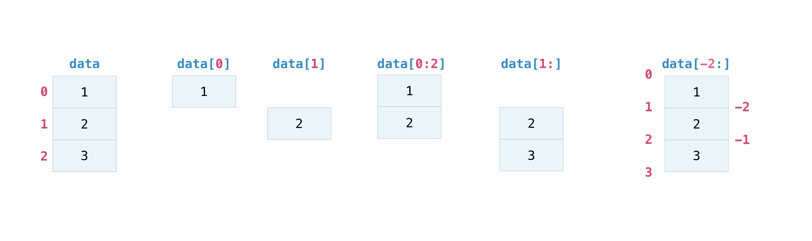

You may want to take a section of your array or specific array elements to use
in further analysis or additional operations. To do that, you'll need to subset,
slice, and/or index your arrays.

If you want to select values from your array that fulfill certain conditions,
it's straightforward with NumPy.

For example, if you start with this array::

  >>> a = np.array([[1, 2, 3, 4], [5, 6, 7, 8], [9, 10, 11, 12]])

You can easily print all of the values in the array that are less than 5. ::

  >>> print(a[a < 5])
  [1 2 3 4]

You can also select, for example, numbers that are equal to or greater than 5,
and use that condition to index an array. ::

  >>> five_up = (a >= 5)
  >>> print(a[five_up])
  [ 5  6  7  8  9 10 11 12]

You can select elements that are divisible by 2::

  >>> divisible_by_2 = a[a%2==0]
  >>> print(divisible_by_2)
  [ 2  4  6  8 10 12]

Or you can select elements that satisfy two conditions using the ``&`` and ``|``
operators::

  >>> c = a[(a > 2) & (a < 11)]
  >>> print(c)
  [ 3  4  5  6  7  8  9 10]

You can also make use of the logical operators **&** and **|** in order to
return boolean values that specify whether or not the values in an array fulfill
a certain condition. This can be useful with arrays that contain names or other
categorical values. ::

  >>> five_up = (a > 5) | (a == 5)
  >>> print(five_up)
  [[False False False False]
   [ True  True  True  True]
   [ True  True  True True]]

You can also use ``np.nonzero()`` to select elements or indices from an array.

Starting with this array::

  >>> a = np.array([[1, 2, 3, 4], [5, 6, 7, 8], [9, 10, 11, 12]])

You can use ``np.nonzero()`` to print the indices of elements that are, for
example, less than 5::

  >>> b = np.nonzero(a < 5)
  >>> print(b)
  (array([0, 0, 0, 0]), array([0, 1, 2, 3]))

In this example, a tuple of arrays was returned: one for each dimension. The
first array represents the row indices where these values are found, and the
second array represents the column indices where the values are found.

If you want to generate a list of coordinates where the elements exist, you can
zip the arrays, iterate over the list of coordinates, and print them. For
example::

  >>> list_of_coordinates= list(zip(b[0], b[1]))

  >>> for coord in list_of_coordinates:
  ...     print(coord)
  (np.int64(0), np.int64(0))
  (np.int64(0), np.int64(1))
  (np.int64(0), np.int64(2))
  (np.int64(0), np.int64(3))

You can also use ``np.nonzero()`` to print the elements in an array that are less
than 5 with::

  >>> print(a[b])
  [1 2 3 4]

If the element you're looking for doesn't exist in the array, then the returned
array of indices will be empty. For example::

  >>> not_there = np.nonzero(a == 42)
  >>> print(not_there)
  (array([], dtype=int64), array([], dtype=int64))

Learn more about :ref:`indexing and slicing here <quickstart.indexing-slicing-and-iterating>`
and :ref:`here <basics.indexing>`.

Read more about using the nonzero function at: `nonzero`.

How to create an array from existing data
-----------------------------------------

*This section covers* ``slicing and indexing``, ``np.vstack()``, ``np.hstack()``,
``np.hsplit()``, ``.view()``, ``copy()``

-----

You can easily create a new array from a section of an existing array.

Let's say you have this array:

::

  >>> a = np.array([1,  2,  3,  4,  5,  6,  7,  8,  9, 10])

You can create a new array from a section of your array any time by specifying
where you want to slice your array. ::

  >>> arr1 = a[3:8]
  >>> arr1
  array([4, 5, 6, 7, 8])

Here, you grabbed a section of your array from index position 3 through index
position 8 but not including position 8 itself.

*Reminder: Array indexes begin at 0. This means the first element of the array is at index 0,
the second element is at index 1, and so on.*

You can also stack two existing arrays, both vertically and horizontally. Let's
say you have two arrays, ``a1`` and ``a2``::

  >>> a1 = np.array([[1, 1],
  ...                [2, 2]])

  >>> a2 = np.array([[3, 3],
  ...                [4, 4]])

You can stack them vertically with ``vstack``::

  >>> np.vstack((a1, a2))
  array([[1, 1],
         [2, 2],
         [3, 3],
         [4, 4]])

Or stack them horizontally with ``hstack``::

  >>> np.hstack((a1, a2))
  array([[1, 1, 3, 3],
         [2, 2, 4, 4]])

You can split an array into several smaller arrays using ``hsplit``. You can
specify either the number of equally shaped arrays to return or the columns
*after* which the division should occur.

Let's say you have this array::

  >>> x = np.arange(1, 25).reshape(2, 12)
  >>> x
  array([[ 1,  2,  3,  4,  5,  6,  7,  8,  9, 10, 11, 12],
         [13, 14, 15, 16, 17, 18, 19, 20, 21, 22, 23, 24]])

If you wanted to split this array into three equally shaped arrays, you would
run::

  >>> np.hsplit(x, 3)
    [array([[ 1,  2,  3,  4],
           [13, 14, 15, 16]]), array([[ 5,  6,  7,  8],
           [17, 18, 19, 20]]), array([[ 9, 10, 11, 12],
           [21, 22, 23, 24]])]

If you wanted to split your array after the third and fourth column, you'd run::

  >>> np.hsplit(x, (3, 4))
    [array([[ 1,  2,  3],
           [13, 14, 15]]), array([[ 4],
           [16]]), array([[ 5,  6,  7,  8,  9, 10, 11, 12],
           [17, 18, 19, 20, 21, 22, 23, 24]])]

:ref:`Learn more about stacking and splitting arrays here <quickstart.stacking-arrays>`.

You can use the ``view`` method to create a new array object that looks at the
same data as the original array (a *shallow copy*).

Views are an important NumPy concept! NumPy functions, as well as operations
like indexing and slicing, will return views whenever possible. This saves
memory and is faster (no copy of the data has to be made). However it's
important to be aware of this - modifying data in a view also modifies the
original array!

Let's say you create this array::

  >>> a = np.array([[1, 2, 3, 4], [5, 6, 7, 8], [9, 10, 11, 12]])

Now we create an array ``b1`` by slicing ``a`` and modify the first element of
``b1``. This will modify the corresponding element in ``a`` as well! ::

  >>> b1 = a[0, :]
  >>> b1
  array([1, 2, 3, 4])
  >>> b1[0] = 99
  >>> b1
  array([99,  2,  3,  4])
  >>> a
  array([[99,  2,  3,  4],
         [ 5,  6,  7,  8],
         [ 9, 10, 11, 12]])

Using the ``copy`` method will make a complete copy of the array and its data (a
*deep copy*). To use this on your array, you could run::

  >>> b2 = a.copy()

:ref:`Learn more about copies and views here <quickstart.copies-and-views>`.

Basic array operations
----------------------

*This section covers addition, subtraction, multiplication, division, and more*

-----

Once you've created your arrays, you can start to work with them.  Let's say,
for example, that you've created two arrays, one called "data" and one called
"ones"

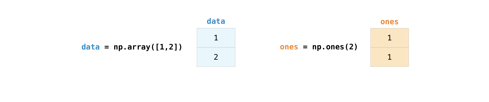

You can add the arrays together with the plus sign.

::

  >>> data = np.array([1, 2])
  >>> ones = np.ones(2, dtype=int)
  >>> data + ones
  array([2, 3])

You can, of course, do more than just addition!

::

  >>> data - ones
  array([0, 1])
  >>> data * data
  array([1, 4])
  >>> data / data
  array([1., 1.])

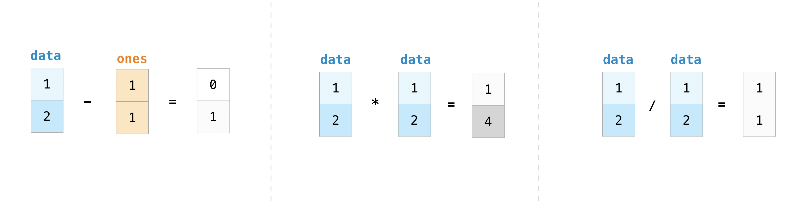

Basic operations are simple with NumPy. If you want to find the sum of the
elements in an array, you'd use ``sum()``. This works for 1D arrays, 2D arrays,
and arrays in higher dimensions. ::

  >>> a = np.array([1, 2, 3, 4])

  >>> a.sum()
  10

To add the rows or the columns in a 2D array, you would specify the axis.

If you start with this array::

  >>> b = np.array([[1, 1], [2, 2]])

You can sum over the axis of rows with::

  >>> b.sum(axis=0)
  array([3, 3])

You can sum over the axis of columns with::

  >>> b.sum(axis=1)
  array([2, 4])

:ref:`Learn more about basic operations here <quickstart.basic-operations>`.

Broadcasting
------------

There are times when you might want to carry out an operation between an array
and a single number (also called *an operation between a vector and a scalar*)
or between arrays of two different sizes. For example, your array (we'll call it
"data") might contain information about distance in miles but you want to
convert the information to kilometers. You can perform this operation with::

  >>> data = np.array([1.0, 2.0])
  >>> data * 1.6
  array([1.6, 3.2])

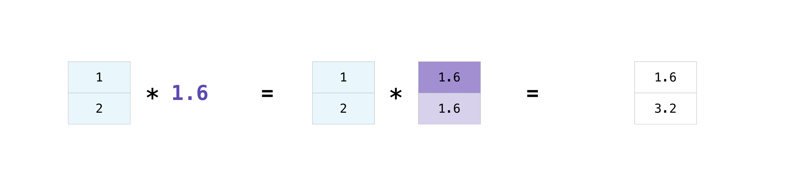

NumPy understands that the multiplication should happen with each cell. That
concept is called **broadcasting**. Broadcasting is a mechanism that allows
NumPy to perform operations on arrays of different shapes. The dimensions of
your array must be compatible, for example, when the dimensions of both arrays
are equal or when one of them is 1. If the dimensions are not compatible, you
will get a ``ValueError``.

:ref:`Learn more about broadcasting here <basics.broadcasting>`.

More useful array operations
----------------------------

*This section covers maximum, minimum, sum, mean, product, standard deviation, and more*

-----

NumPy also performs aggregation functions. In addition to ``min``, ``max``, and
``sum``, you can easily run ``mean`` to get the average, ``prod`` to get the
result of multiplying the elements together, ``std`` to get the standard
deviation, and more. ::

  >>> data.max()
  2.0
  >>> data.min()
  1.0
  >>> data.sum()
  3.0

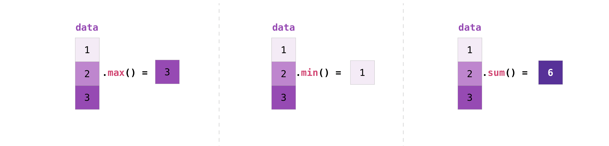

Let's start with this array, called "a" ::

  >>> a = np.array([[0.45053314, 0.17296777, 0.34376245, 0.5510652],
  ...               [0.54627315, 0.05093587, 0.40067661, 0.55645993],
  ...               [0.12697628, 0.82485143, 0.26590556, 0.56917101]])

It's very common to want to aggregate along a row or column. By default, every
NumPy aggregation function will return the aggregate of the entire array. To
find the sum or the minimum of the elements in your array, run::

  >>> a.sum()
  4.8595784

Or::

  >>> a.min()
  0.05093587

You can specify on which axis you want the aggregation function to be computed.
For example, you can find the minimum value within each column by specifying
``axis=0``. ::

  >>> a.min(axis=0)
  array([0.12697628, 0.05093587, 0.26590556, 0.5510652 ])

The four values listed above correspond to the number of columns in your array.
With a four-column array, you will get four values as your result.

Read more about :ref:`array methods here <array.ndarray.methods>`.

Creating matrices
-----------------

You can pass Python lists of lists to create a 2-D array (or "matrix") to
represent them in NumPy. ::

  >>> data = np.array([[1, 2], [3, 4], [5, 6]])
  >>> data
  array([[1, 2],
         [3, 4],
         [5, 6]])

Indexing and slicing operations are useful when you're manipulating matrices::

  >>> data[0, 1]
  2
  >>> data[1:3]
  array([[3, 4],
         [5, 6]])
  >>> data[0:2, 0]
  array([1, 3])

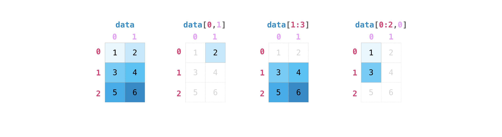

You can aggregate matrices the same way you aggregated vectors::

  >>> data.max()
  6
  >>> data.min()
  1
  >>> data.sum()
  21

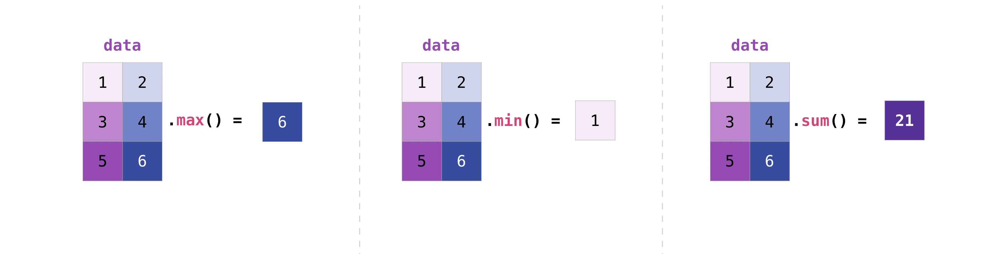

You can aggregate all the values in a matrix and you can aggregate them across
columns or rows using the ``axis`` parameter. To illustrate this point, let's
look at a slightly modified dataset::

  >>> data = np.array([[1, 2], [5, 3], [4, 6]])
  >>> data
  array([[1, 2],
         [5, 3],
         [4, 6]])
  >>> data.max(axis=0)
  array([5, 6])
  >>> data.max(axis=1)
  array([2, 5, 6])

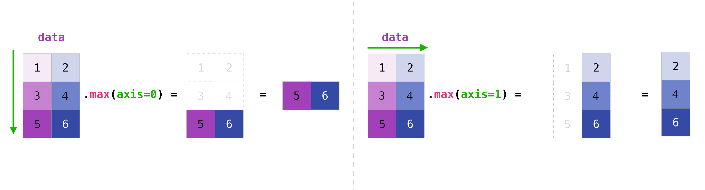

Once you've created your matrices, you can add and multiply them using
arithmetic operators if you have two matrices that are the same size. ::

  >>> data = np.array([[1, 2], [3, 4]])
  >>> ones = np.array([[1, 1], [1, 1]])
  >>> data + ones
  array([[2, 3],
         [4, 5]])

You can do these arithmetic operations on matrices of different sizes, but only
if one matrix has only one column or one row. In this case, NumPy will use its
broadcast rules for the operation. ::

  >>> data = np.array([[1, 2], [3, 4], [5, 6]])
  >>> ones_row = np.array([[1, 1]])
  >>> data + ones_row
  array([[2, 3],
         [4, 5],
         [6, 7]])

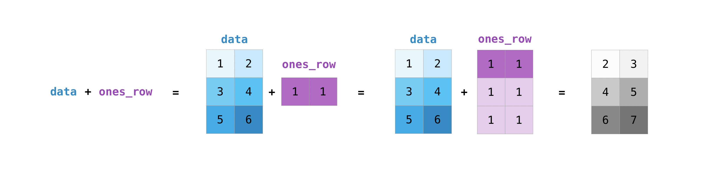

Be aware that when NumPy prints N-dimensional arrays, the last axis is looped
over the fastest while the first axis is the slowest. For instance::

  >>> np.ones((4, 3, 2))
  array([[[1., 1.],
          [1., 1.],
          [1., 1.]],
  <BLANKLINE>
         [[1., 1.],
          [1., 1.],
          [1., 1.]],
  <BLANKLINE>
         [[1., 1.],
          [1., 1.],
          [1., 1.]],
  <BLANKLINE>
         [[1., 1.],
          [1., 1.],
          [1., 1.]]])

There are often instances where we want NumPy to initialize the values of an
array. NumPy offers functions like ``ones()`` and ``zeros()``, and the
``random.Generator`` class for random number generation for that.
All you need to do is pass in the number of elements you want it to generate::

  >>> np.ones(3)
  array([1., 1., 1.])
  >>> np.zeros(3)
  array([0., 0., 0.])
  >>> rng = np.random.default_rng()  # the simplest way to generate random numbers
  >>> rng.random(3) #doctest: +SKIP
  array([0.63696169, 0.26978671, 0.04097352])

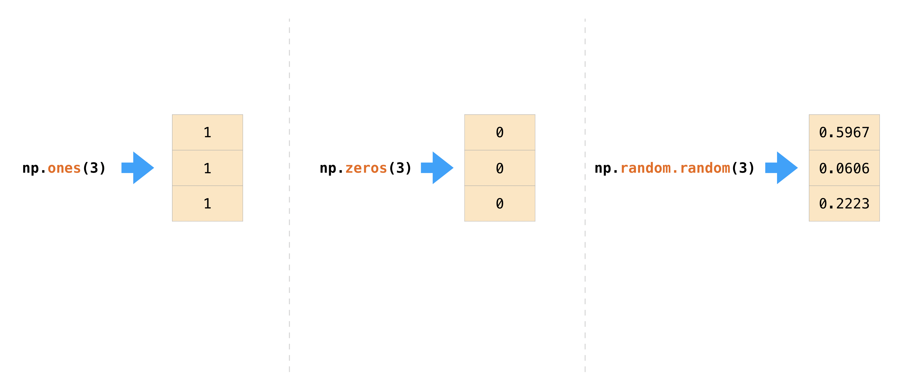

You can also use ``ones()``, ``zeros()``, and ``random()`` to create
a 2D array if you give them a tuple describing the dimensions of the matrix::

  >>> np.ones((3, 2))
  array([[1., 1.],
         [1., 1.],
         [1., 1.]])
  >>> np.zeros((3, 2))
  array([[0., 0.],
         [0., 0.],
         [0., 0.]])
  >>> rng.random((3, 2)) #doctest: +SKIP
  array([[0.01652764, 0.81327024],
         [0.91275558, 0.60663578],
         [0.72949656, 0.54362499]])  # may vary

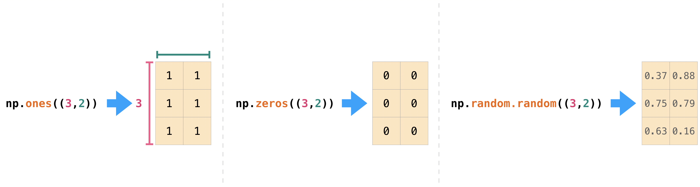

Read more about creating arrays, filled with ``0``'s, ``1``'s, other values or
uninitialized, at :ref:`array creation routines <routines.array-creation>`.

Generating random numbers
-------------------------

The use of random number generation is an important part of the configuration
and evaluation of many numerical and machine learning algorithms. Whether you
need to randomly initialize weights in an artificial neural network, split data
into random sets, or randomly shuffle your dataset, being able to generate
random numbers (actually, repeatable pseudo-random numbers) is essential.

With ``Generator.integers``, you can generate random integers from low (remember
that this is inclusive with NumPy) to high (exclusive). You can set
``endpoint=True`` to make the high number inclusive.

You can generate a 2 x 4 array of random integers between 0 and 4 with::

  >>> rng.integers(5, size=(2, 4)) #doctest: +SKIP
  array([[2, 1, 1, 0],
         [0, 0, 0, 4]])  # may vary

:ref:`Read more about random number generation here <numpyrandom>`.

How to get unique items and counts
----------------------------------

*This section covers* ``np.unique()``

-----

You can find the unique elements in an array easily with ``np.unique``.

For example, if you start with this array::

  >>> a = np.array([11, 11, 12, 13, 14, 15, 16, 17, 12, 13, 11, 14, 18, 19, 20])

you can use ``np.unique`` to print the unique values in your array::

  >>> unique_values = np.unique(a)
  >>> print(unique_values)
  [11 12 13 14 15 16 17 18 19 20]

To get the indices of unique values in a NumPy array (an array of first index
positions of unique values in the array), just pass the ``return_index``
argument in ``np.unique()`` as well as your array. ::

  >>> unique_values, indices_list = np.unique(a, return_index=True)
  >>> print(indices_list)
  [ 0  2  3  4  5  6  7 12 13 14]

You can pass the ``return_counts`` argument in ``np.unique()`` along with your
array to get the frequency count of unique values in a NumPy array. ::

  >>> unique_values, occurrence_count = np.unique(a, return_counts=True)
  >>> print(occurrence_count)
  [3 2 2 2 1 1 1 1 1 1]

This also works with 2D arrays!
If you start with this array::

  >>> a_2d = np.array([[1, 2, 3, 4], [5, 6, 7, 8], [9, 10, 11, 12], [1, 2, 3, 4]])

You can find unique values with::

  >>> unique_values = np.unique(a_2d)
  >>> print(unique_values)
  [ 1  2  3  4  5  6  7  8  9 10 11 12]

If the axis argument isn't passed, your 2D array will be flattened.

If you want to get the unique rows or columns, make sure to pass the ``axis``
argument. To find the unique rows, specify ``axis=0`` and for columns, specify
``axis=1``. ::

  >>> unique_rows = np.unique(a_2d, axis=0)
  >>> print(unique_rows)
  [[ 1  2  3  4]
   [ 5  6  7  8]
   [ 9 10 11 12]]

To get the unique rows, index position, and occurrence count, you can use::

  >>> unique_rows, indices, occurrence_count = np.unique(
  ...      a_2d, axis=0, return_counts=True, return_index=True)
  >>> print(unique_rows)
  [[ 1  2  3  4]
   [ 5  6  7  8]
   [ 9 10 11 12]]
  >>> print(indices)
  [0 1 2]
  >>> print(occurrence_count)
  [2 1 1]

To learn more about finding the unique elements in an array, see `unique`.

Transposing and reshaping a matrix
----------------------------------

*This section covers* ``arr.reshape()``, ``arr.transpose()``, ``arr.T``

-----

It's common to need to transpose your matrices. NumPy arrays have the property
``T`` that allows you to transpose a matrix.

You may also need to switch the dimensions of a matrix. This can happen when,
for example, you have a model that expects a certain input shape that is
different from your dataset. This is where the ``reshape`` method can be useful.
You simply need to pass in the new dimensions that you want for the matrix. ::

  >>> data.reshape(2, 3)
  array([[1, 2, 3],
         [4, 5, 6]])
  >>> data.reshape(3, 2)
  array([[1, 2],
         [3, 4],
         [5, 6]])

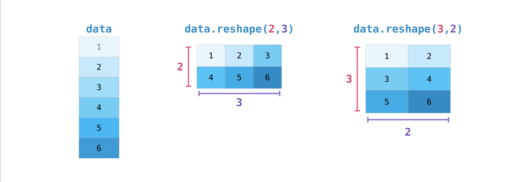

You can also use ``.transpose()`` to reverse or change the axes of an array
according to the values you specify.

If you start with this array::

  >>> arr = np.arange(6).reshape((2, 3))
  >>> arr
  array([[0, 1, 2],
         [3, 4, 5]])

You can transpose your array with ``arr.transpose()``. ::

  >>> arr.transpose()
  array([[0, 3],
         [1, 4],
         [2, 5]])

You can also use ``arr.T``::

    >>> arr.T
    array([[0, 3],
           [1, 4],
           [2, 5]])

To learn more about transposing and reshaping arrays, see `transpose` and
`reshape`.

How to reverse an array
-----------------------

*This section covers* ``np.flip()``

-----

NumPy's ``np.flip()`` function allows you to flip, or reverse, the contents of
an array along an axis. When using ``np.flip()``, specify the array you would like
to reverse and the axis. If you don't specify the axis, NumPy will reverse the
contents along all of the axes of your input array.

**Reversing a 1D array**

If you begin with a 1D array like this one::

  >>> arr = np.array([1, 2, 3, 4, 5, 6, 7, 8])

You can reverse it with::

  >>> reversed_arr = np.flip(arr)

If you want to print your reversed array, you can run::

  >>> print('Reversed Array: ', reversed_arr)
  Reversed Array:  [8 7 6 5 4 3 2 1]

**Reversing a 2D array**

A 2D array works much the same way.

If you start with this array::

  >>> arr_2d = np.array([[1, 2, 3, 4], [5, 6, 7, 8], [9, 10, 11, 12]])

You can reverse the content in all of the rows and all of the columns with::

  >>> reversed_arr = np.flip(arr_2d)
  >>> print(reversed_arr)
  [[12 11 10  9]
   [ 8  7  6  5]
   [ 4  3  2  1]]

You can easily reverse only the *rows* with::

  >>> reversed_arr_rows = np.flip(arr_2d, axis=0)
  >>> print(reversed_arr_rows)
  [[ 9 10 11 12]
   [ 5  6  7  8]
   [ 1  2  3  4]]

Or reverse only the *columns* with::

  >>> reversed_arr_columns = np.flip(arr_2d, axis=1)
  >>> print(reversed_arr_columns)
  [[ 4  3  2  1]
   [ 8  7  6  5]
   [12 11 10  9]]

You can also reverse the contents of only one column or row. For example, you
can reverse the contents of the row at index position 1 (the second row)::

  >>> arr_2d[1] = np.flip(arr_2d[1])
  >>> print(arr_2d)
  [[ 1  2  3  4]
   [ 8  7  6  5]
   [ 9 10 11 12]]

You can also reverse the column at index position 1 (the second column)::

  >>> arr_2d[:,1] = np.flip(arr_2d[:,1])
  >>> print(arr_2d)
  [[ 1 10  3  4]
   [ 8  7  6  5]
   [ 9  2 11 12]]

Read more about reversing arrays at `flip`.

Reshaping and flattening multidimensional arrays
------------------------------------------------

*This section covers* ``.flatten()``, ``ravel()``

-----

There are two popular ways to flatten an array: ``.flatten()`` and ``.ravel()``.
The primary difference between the two is that the new array created using
``ravel()`` is actually a reference to the parent array (i.e., a "view"). This
means that any changes to the new array will affect the parent array as well.
Since ``ravel`` does not create a copy, it's memory efficient.

If you start with this array::

  >>> x = np.array([[1, 2, 3, 4], [5, 6, 7, 8], [9, 10, 11, 12]])

You can use ``flatten`` to flatten your array into a 1D array. ::

  >>> x.flatten()
  array([ 1,  2,  3,  4,  5,  6,  7,  8,  9, 10, 11, 12])

When you use ``flatten``, changes to your new array won't change the parent
array.

For example::

  >>> a1 = x.flatten()
  >>> a1[0] = 99
  >>> print(x)  # Original array
  [[ 1  2  3  4]
   [ 5  6  7  8]
   [ 9 10 11 12]]
  >>> print(a1)  # New array
  [99  2  3  4  5  6  7  8  9 10 11 12]

But when you use ``ravel``, the changes you make to the new array will affect
the parent array.

For example::

  >>> a2 = x.ravel()
  >>> a2[0] = 98
  >>> print(x)  # Original array
  [[98  2  3  4]
   [ 5  6  7  8]
   [ 9 10 11 12]]
  >>> print(a2)  # New array
  [98  2  3  4  5  6  7  8  9 10 11 12]

Read more about ``flatten`` at `ndarray.flatten` and ``ravel`` at `ravel`.

How to access the docstring for more information
------------------------------------------------

*This section covers* ``help()``, ``?``, ``??``

-----

When it comes to the data science ecosystem, Python and NumPy are built with the
user in mind. One of the best examples of this is the built-in access to
documentation. Every object contains the reference to a string, which is known
as the **docstring**. In most cases, this docstring contains a quick and concise
summary of the object and how to use it. Python has a built-in ``help()``
function that can help you access this information. This means that nearly any
time you need more information, you can use ``help()`` to quickly find the
information that you need.

For example::

  >>> help(max)
  Help on built-in function max in module builtins:
  <BLANKLINE>
  max(...)
      max(iterable, *[, default=obj, key=func]) -> value
      max(arg1, arg2, *args, *[, key=func]) -> value
  <BLANKLINE>
      With a single iterable argument, return its biggest item. The
      default keyword-only argument specifies an object to return if
      the provided iterable is empty.
      With two or more arguments, return the largest argument.
  <BLANKLINE>

Because access to additional information is so useful, IPython uses the ``?``
character as a shorthand for accessing this documentation along with other
relevant information. IPython is a command shell for interactive computing in
multiple languages.
`You can find more information about IPython here <https://ipython.org/>`_.

For example:

.. code-block:: ipython

  In [0]: max?
  max(iterable, *[, default=obj, key=func]) -> value
  max(arg1, arg2, *args, *[, key=func]) -> value

  With a single iterable argument, return its biggest item. The
  default keyword-only argument specifies an object to return if
  the provided iterable is empty.
  With two or more arguments, return the largest argument.
  Type:      builtin_function_or_method

You can even use this notation for object methods and objects themselves.

Let's say you create this array::

  >>> a = np.array([1, 2, 3, 4, 5, 6])

Then you can obtain a lot of useful information (first details about ``a`` itself,
followed by the docstring of ``ndarray`` of which ``a`` is an instance):

.. code-block:: ipython

  In [1]: a?
  Type:            ndarray
  String form:     [1 2 3 4 5 6]
  Length:          6
  File:            ~/anaconda3/lib/python3.9/site-packages/numpy/__init__.py
  Docstring:       <no docstring>
  Class docstring:
  ndarray(shape, dtype=float, buffer=None, offset=0,
          strides=None, order=None)

  An array object represents a multidimensional, homogeneous array
  of fixed-size items.  An associated data-type object describes the
  format of each element in the array (its byte-order, how many bytes it
  occupies in memory, whether it is an integer, a floating point number,
  or something else, etc.)

  Arrays should be constructed using `array`, `zeros` or `empty` (refer
  to the See Also section below).  The parameters given here refer to
  a low-level method (`ndarray(...)`) for instantiating an array.

  For more information, refer to the `numpy` module and examine the
  methods and attributes of an array.

  Parameters
  ----------
  (for the __new__ method; see Notes below)

  shape : tuple of ints
          Shape of created array.
  ...

This also works for functions and other objects that **you** create. Just
remember to include a docstring with your function using a string literal
(``""" """`` or ``''' '''`` around your documentation).

For example, if you create this function::

  >>> def double(a):
  ...   '''Return a * 2'''
  ...   return a * 2

You can obtain information about the function:

.. code-block:: ipython

  In [2]: double?
  Signature: double(a)
  Docstring: Return a * 2
  File:      ~/Desktop/<ipython-input-23-b5adf20be596>
  Type:      function

You can reach another level of information by reading the source code of the
object you're interested in. Using a double question mark (``??``) allows you to
access the source code.

For example:

.. code-block:: ipython

  In [3]: double??
  Signature: double(a)
  Source:
  def double(a):
      '''Return a * 2'''
      return a * 2
  File:      ~/Desktop/<ipython-input-23-b5adf20be596>
  Type:      function

If the object in question is compiled in a language other than Python, using
``??`` will return the same information as ``?``. You'll find this with a lot of
built-in objects and types, for example:

.. code-block:: ipython

  In [4]: len?
  Signature: len(obj, /)
  Docstring: Return the number of items in a container.
  Type:      builtin_function_or_method

and :

.. code-block:: ipython

  In [5]: len??
  Signature: len(obj, /)
  Docstring: Return the number of items in a container.
  Type:      builtin_function_or_method

have the same output because they were compiled in a programming language other
than Python.

Working with mathematical formulas
----------------------------------

The ease of implementing mathematical formulas that work on arrays is one of
the things that make NumPy so widely used in the scientific Python community.

For example, this is the mean square error formula (a central formula used in
supervised machine learning models that deal with regression):

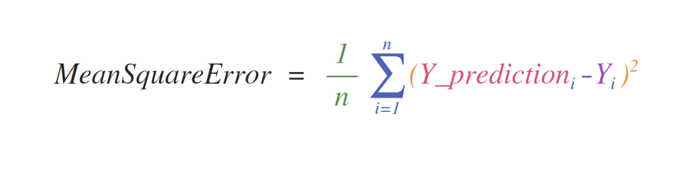

Implementing this formula is simple and straightforward in NumPy:

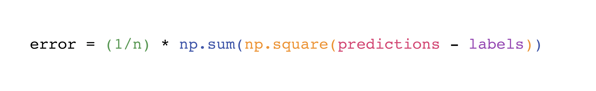

What makes this work so well is that ``predictions`` and ``labels`` can contain
one or a thousand values. They only need to be the same size.

You can visualize it this way:

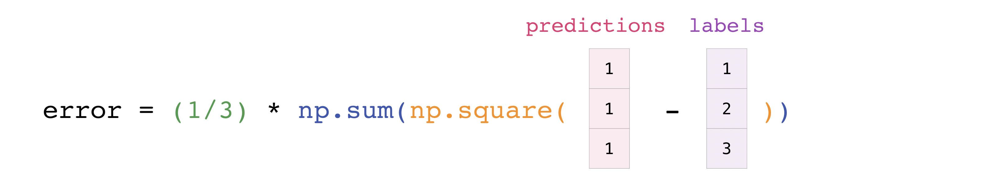

In this example, both the predictions and labels vectors contain three values,
meaning ``n`` has a value of three. After we carry out subtractions the values
in the vector are squared. Then NumPy sums the values, and your result is the
error value for that prediction and a score for the quality of the model.

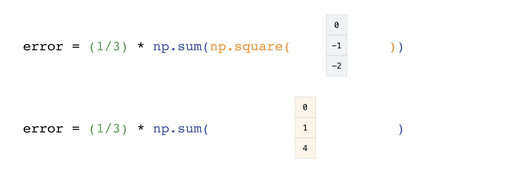

How to save and load NumPy objects
----------------------------------

*This section covers* ``np.save``, ``np.savez``, ``np.savetxt``,
``np.load``, ``np.loadtxt``

-----

You will, at some point, want to save your arrays to disk and load them back
without having to re-run the code. Fortunately, there are several ways to save
and load objects with NumPy. The ndarray objects can be saved to and loaded from
the disk files with ``loadtxt`` and ``savetxt`` functions that handle normal
text files, ``load`` and ``save`` functions that handle NumPy binary files with
a **.npy** file extension, and a ``savez`` function that handles NumPy files
with a **.npz** file extension.

The **.npy** and **.npz** files store data, shape, dtype, and other information
required to reconstruct the ndarray in a way that allows the array to be
correctly retrieved, even when the file is on another machine with different
architecture.

If you want to store a single ndarray object, store it as a .npy file using
``np.save``. If you want to store more than one ndarray object in a single file,
save it as a .npz file using ``np.savez``. You can also save several arrays
into a single file in compressed npz format with `savez_compressed`.

It's easy to save and load an array with ``np.save()``. Just make sure to
specify the array you want to save and a file name. For example, if you create
this array::

  >>> a = np.array([1, 2, 3, 4, 5, 6])

You can save it as "filename.npy" with::

  >>> np.save('filename', a)

You can use ``np.load()`` to reconstruct your array. ::

  >>> b = np.load('filename.npy')

If you want to check your array, you can run::

  >>> print(b)
  [1 2 3 4 5 6]

You can save a NumPy array as a plain text file like a **.csv** or **.txt** file
with ``np.savetxt``.

For example, if you create this array::

  >>> csv_arr = np.array([1, 2, 3, 4, 5, 6, 7, 8])

You can easily save it as a .csv file with the name "new_file.csv" like this::

  >>> np.savetxt('new_file.csv', csv_arr)

You can quickly and easily load your saved text file using ``loadtxt()``::

  >>> np.loadtxt('new_file.csv')
  array([1., 2., 3., 4., 5., 6., 7., 8.])

The ``savetxt()`` and ``loadtxt()`` functions accept additional optional
parameters such as header, footer, and delimiter. While text files can be easier
for sharing, .npy and .npz files are smaller and faster to read. If you need more
sophisticated handling of your text file (for example, if you need to work with
lines that contain missing values), you will want to use the `genfromtxt`
function.

With `savetxt`, you can specify headers, footers, comments, and more.

Learn more about :ref:`input and output routines here <routines.io>`.

Importing and exporting a CSV
-----------------------------

.. save a csv

   >>> with open('music.csv', 'w') as fid:
   ...     n = fid.write('Artist,Genre,Listeners,Plays\n')
   ...     n = fid.write('Billie Holiday,Jazz,1300000,27000000\n')
   ...     n = fid.write('Jimmie Hendrix,Rock,2700000,70000000\n')
   ...     n = fid.write('Miles Davis,Jazz,1500000,48000000\n')
   ...     n = fid.write('SIA,Pop,2000000,74000000\n')

It's simple to read in a CSV that contains existing information. The best and
easiest way to do this is to use
`Pandas <https://pandas.pydata.org>`_. ::

  >>> import pandas as pd

  >>> # If all of your columns are the same type:
  >>> x = pd.read_csv('music.csv', header=0).values
  >>> print(x)
  [['Billie Holiday' 'Jazz' 1300000 27000000]
   ['Jimmie Hendrix' 'Rock' 2700000 70000000]
   ['Miles Davis' 'Jazz' 1500000 48000000]
   ['SIA' 'Pop' 2000000 74000000]]

  >>> # You can also simply select the columns you need:
  >>> x = pd.read_csv('music.csv', usecols=['Artist', 'Plays']).values
  >>> print(x)
  [['Billie Holiday' 27000000]
   ['Jimmie Hendrix' 70000000]
   ['Miles Davis' 48000000]
   ['SIA' 74000000]]

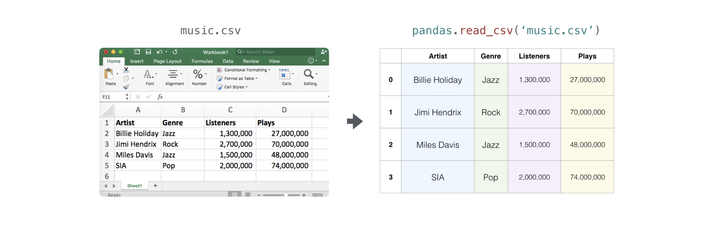

It's simple to use Pandas in order to export your array as well. If you are new
to NumPy, you may want to  create a Pandas dataframe from the values in your
array and then write the data frame to a CSV file with Pandas.

If you created this array "a" ::

  >>> a = np.array([[-2.58289208,  0.43014843, -1.24082018, 1.59572603],
  ...               [ 0.99027828, 1.17150989,  0.94125714, -0.14692469],
  ...               [ 0.76989341,  0.81299683, -0.95068423, 0.11769564],
  ...               [ 0.20484034,  0.34784527,  1.96979195, 0.51992837]])

.. for doctests
   The continuous integration truncates dataframe display without this setting.
   >>> pd.set_option('display.max_columns', 10)

You could create a Pandas dataframe ::

  >>> df = pd.DataFrame(a)
  >>> print(df)
            0         1         2         3
  0 -2.582892  0.430148 -1.240820  1.595726
  1  0.990278  1.171510  0.941257 -0.146925
  2  0.769893  0.812997 -0.950684  0.117696
  3  0.204840  0.347845  1.969792  0.519928

You can easily save your dataframe with::

  >>> df.to_csv('pd.csv')

And read your CSV with::

  >>> data = pd.read_csv('pd.csv')

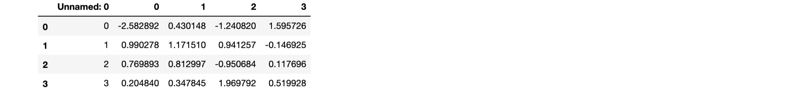

You can also save your array with the NumPy ``savetxt`` method. ::

  >>> np.savetxt('np.csv', a, fmt='%.2f', delimiter=',', header='1,  2,  3,  4')

If you're using the command line, you can read your saved CSV any time with a
command such as::

  $ cat np.csv
  #  1,  2,  3,  4
  -2.58,0.43,-1.24,1.60
  0.99,1.17,0.94,-0.15
  0.77,0.81,-0.95,0.12
  0.20,0.35,1.97,0.52

Or you can open the file any time with a text editor!

If you're interested in learning more about Pandas, take a look at the
`official Pandas documentation <https://pandas.pydata.org/index.html>`_.
Learn how to install Pandas with the
`official Pandas installation information <https://pandas.pydata.org/pandas-docs/stable/install.html>`_.

Plotting arrays with Matplotlib
-------------------------------

If you need to generate a plot for your values, it's very simple with
`Matplotlib <https://matplotlib.org/>`_.

For example, you may have an array like this one::

  >>> a = np.array([2, 1, 5, 7, 4, 6, 8, 14, 10, 9, 18, 20, 22])

If you already have Matplotlib installed, you can import it with::

  >>> import matplotlib.pyplot as plt

  # If you're using Jupyter Notebook, you may also want to run the following
  # line of code to display your code in the notebook:

  %matplotlib inline

All you need to do to plot your values is run::

  >>> plt.plot(a)

  # If you are running from a command line, you may need to do this:
  # >>> plt.show()

.. plot:: user/plots/matplotlib1.py
   :align: center
   :include-source: 0

For example, you can plot a 1D array like this::

  >>> x = np.linspace(0, 5, 20)
  >>> y = np.linspace(0, 10, 20)
  >>> plt.plot(x, y, 'purple') # line
  >>> plt.plot(x, y, 'o')      # dots

.. plot:: user/plots/matplotlib2.py
   :align: center
   :include-source: 0

With Matplotlib, you have access to an enormous number of visualization options. ::

  >>> fig = plt.figure()
  >>> ax = fig.add_subplot(projection='3d')
  >>> X = np.arange(-5, 5, 0.15)
  >>> Y = np.arange(-5, 5, 0.15)
  >>> X, Y = np.meshgrid(X, Y)
  >>> R = np.sqrt(X**2 + Y**2)
  >>> Z = np.sin(R)

  >>> ax.plot_surface(X, Y, Z, rstride=1, cstride=1, cmap='viridis')

.. plot:: user/plots/matplotlib3.py
   :align: center
   :include-source: 0

To read more about Matplotlib and what it can do, take a look at
`the official documentation <https://matplotlib.org/>`_.
For directions regarding installing Matplotlib, see the official
`installation section <https://matplotlib.org/users/installing.html>`_.

-------------------------------------------------------

*Image credits: Jay Alammar https://jalammar.github.io/*
