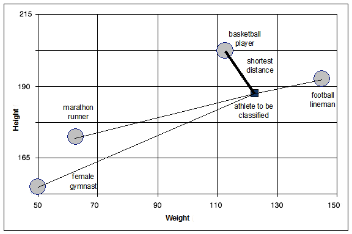

.. _basics.broadcasting:
.. _array-broadcasting-in-numpy:

************
Broadcasting
************

.. seealso::
    :class:`numpy.broadcast`   

The term broadcasting describes how NumPy treats arrays with different
shapes during arithmetic operations. Subject to certain constraints,
the smaller array is "broadcast" across the larger array so that they
have compatible shapes. Broadcasting provides a means of vectorizing
array operations so that looping occurs in C instead of Python. It does
this without making needless copies of data and usually leads to
efficient algorithm implementations. There are, however, cases where
broadcasting is a bad idea because it leads to inefficient use of memory
that slows computation.

NumPy operations are usually done on pairs of arrays on an
element-by-element basis.  In the simplest case, the two arrays must
have exactly the same shape, as in the following example:

  >>> a = np.array([1.0, 2.0, 3.0])
  >>> b = np.array([2.0, 2.0, 2.0])
  >>> a * b
  array([ 2.,  4.,  6.])

NumPy's broadcasting rule relaxes this constraint when the arrays'
shapes meet certain constraints. The simplest broadcasting example occurs
when an array and a scalar value are combined in an operation:

>>> a = np.array([1.0, 2.0, 3.0])
>>> b = 2.0
>>> a * b
array([ 2.,  4.,  6.])

The result is equivalent to the previous example where ``b`` was an array.
We can think of the scalar ``b`` being *stretched* during the arithmetic
operation into an array with the same shape as ``a``. The new elements in
``b`` are simply copies of the original scalar. The stretching analogy is
only conceptual.  NumPy is smart enough to use the original scalar value
without actually making copies so that broadcasting operations are as
memory and computationally efficient as possible.

The code in the second example is more efficient than that in the first
because broadcasting moves less memory around during the multiplication
(``b`` is a scalar rather than an array).

General Broadcasting Rules
==========================
When operating on two arrays, NumPy compares their shapes element-wise.
It starts with the trailing (i.e. rightmost) dimensions and works its
way left.  Two dimensions are compatible when

1) they are equal, or
2) one of them is 1

If these conditions are not met, a
``ValueError: operands could not be broadcast together`` exception is 
thrown, indicating that the arrays have incompatible shapes. The size of 
the resulting array is the size that is not 1 along each axis of the inputs.

Arrays do not need to have the same *number* of dimensions.  For example,
if you have a ``256x256x3`` array of RGB values, and you want to scale
each color in the image by a different value, you can multiply the image
by a one-dimensional array with 3 values. Lining up the sizes of the
trailing axes of these arrays according to the broadcast rules, shows that
they are compatible::

  Image  (3d array): 256 x 256 x 3
  Scale  (1d array):             3
  Result (3d array): 256 x 256 x 3

When either of the dimensions compared is one, the other is
used.  In other words, dimensions with size 1 are stretched or "copied"
to match the other.

In the following example, both the ``A`` and ``B`` arrays have axes with
length one that are expanded to a larger size during the broadcast
operation::

  A      (4d array):  8 x 1 x 6 x 1
  B      (3d array):      7 x 1 x 5
  Result (4d array):  8 x 7 x 6 x 5

Here are some more examples::

  A      (2d array):  5 x 4
  B      (1d array):      1
  Result (2d array):  5 x 4

  A      (2d array):  5 x 4
  B      (1d array):      4
  Result (2d array):  5 x 4

  A      (3d array):  15 x 3 x 5
  B      (3d array):  15 x 1 x 5
  Result (3d array):  15 x 3 x 5

  A      (3d array):  15 x 3 x 5
  B      (2d array):       3 x 5
  Result (3d array):  15 x 3 x 5

  A      (3d array):  15 x 3 x 5
  B      (2d array):       3 x 1
  Result (3d array):  15 x 3 x 5

Here are examples of shapes that do not broadcast::

  A      (1d array):  3
  B      (1d array):  4 # trailing dimensions do not match

  A      (2d array):      2 x 1
  B      (3d array):  8 x 4 x 3 # second from last dimensions mismatched

An example of broadcasting in practice::

 >>> x = np.arange(4)
 >>> xx = x.reshape(4,1)
 >>> y = np.ones(5)
 >>> z = np.ones((3,4))

 >>> x.shape
 (4,)

 >>> y.shape
 (5,)

 >>> x + y
 ValueError: operands could not be broadcast together with shapes (4,) (5,)

 >>> xx.shape
 (4, 1)

 >>> y.shape
 (5,)

 >>> (xx + y).shape
 (4, 5)

 >>> xx + y
 array([[ 1.,  1.,  1.,  1.,  1.],
        [ 2.,  2.,  2.,  2.,  2.],
        [ 3.,  3.,  3.,  3.,  3.],
        [ 4.,  4.,  4.,  4.,  4.]])

 >>> x.shape
 (4,)

 >>> z.shape
 (3, 4)

 >>> (x + z).shape
 (3, 4)

 >>> x + z
 array([[ 1.,  2.,  3.,  4.],
        [ 1.,  2.,  3.,  4.],
        [ 1.,  2.,  3.,  4.]])

Broadcasting provides a convenient way of taking the outer product (or
any other outer operation) of two arrays. The following example shows an
outer addition operation of two 1-d arrays::

  >>> a = np.array([0.0, 10.0, 20.0, 30.0])
  >>> b = np.array([1.0, 2.0, 3.0])
  >>> a[:, np.newaxis] + b
  array([[  1.,   2.,   3.],
         [ 11.,  12.,  13.],
         [ 21.,  22.,  23.],
         [ 31.,  32.,  33.]])

Here the ``newaxis`` index operator inserts a new axis into ``a``,
making it a two-dimensional ``4x1`` array.  Combining the ``4x1`` array
with ``b``, which has shape ``(3,)``, yields a ``4x3`` array.

A Practical Example: Vector Quantization
========================================

Broadcasting comes up quite often in real world problems. A typical example
occurs in the vector quantization (VQ) algorithm used in information theory,
classification, and other related areas. The basic operation in VQ finds
the closest point in a set of points, called ``codes`` in VQ jargon, to a given
point, called the ``observation``. In the very simple, two-dimensional case
shown below, the values in ``observation`` describe the weight and height of an
athlete to be classified. The ``codes`` represent different classes of
athletes. [#f1]_ Finding the closest point requires calculating the distance
between observation and each of the codes. The shortest distance provides the
best match. In this example, ``codes[0]`` is the closest class indicating that
the athlete is likely a basketball player.

  >>> from numpy import array, argmin, sqrt, sum
  >>> observation = array([111.0, 188.0])
  >>> codes = array([[102.0, 203.0],
  ...                [132.0, 193.0],
  ...                [45.0, 155.0],
  ...                [57.0, 173.0]])
  >>> diff = codes - observation    # the broadcast happens here
  >>> dist = sqrt(sum(diff**2,axis=-1))
  >>> argmin(dist)
  0

In this example, the ``observation`` array is stretched to match
the shape of the ``codes`` array::

  Observation      (1d array):      2
  Codes            (2d array):  4 x 2
  Diff             (2d array):  4 x 2

    *Figure 1*

    *The basic operation of vector quantization calculates the distance between
    an object to be classified, the dark square, and multiple known codes, the
    gray circles. In this simple case, the codes represent individual classes.
    More complex cases use multiple codes per class.*

Typically, a large number of ``observations``, perhaps read from a database,
are compared to a set of ``codes``. Consider this scenario::

  Observation      (2d array):      10 x 3
  Codes            (2d array):       5 x 3
  Diff             (3d array):  5 x 10 x 3 

The three-dimensional array, ``diff``, is a consequence of broadcasting, not a
necessity for the calculation. Large data sets will generate a large
intermediate array that is computationally inefficient. Instead, if each
observation is calculated individually using a Python loop around the code
in the two-dimensional example above, a much smaller array is used.

Broadcasting is a powerful tool for writing short and usually intuitive code
that does its computations very efficiently in C. However, there are cases
when broadcasting uses unnecessarily large amounts of memory for a particular
algorithm. In these cases, it is better to write the algorithm's outer loop in
Python. This may also produce more readable code, as algorithms that use
broadcasting tend to become more difficult to interpret as the number of
dimensions in the broadcast increases.

.. rubric:: Footnotes

.. [#f1]
    In this example, weight has more impact on the distance calculation
    than height because of the larger values. In practice, it is important to
    normalize the height and weight, often by their standard deviation across the
    data set, so that both have equal influence on the distance calculation.
