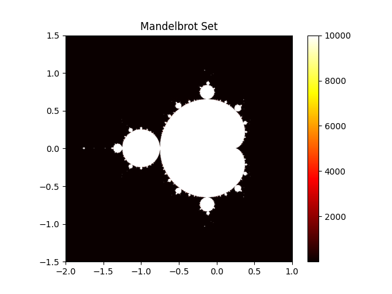

.. _basics.performant_code:

***************************************************
Writing Performant NumPy Code with Multi-Core CPUs
***************************************************

Introduction
================

NumPy is designed for high performance numerical computing in Python by leveraging vectorized operations.
However, vectorization does not always fully utilize the capabilities of multi-core processors.
To exploit parallelism, additional strategies are necessary.

In this section, we cover the following topics:

* :ref:`General concepts for using multi-core processors in Python <basics.performant_code.general_concepts_for_multi_core_processors>`
* :ref:`Using multi-core processors with Python standard libraries <basics.performant_code.multi_core_with_standard_libraries>`
* :ref:`Third party libraries for multi-core processing <basics.performant_code.third_party_libraries>`

.. _basics.performant_code.general_concepts_for_multi_core_processors:

General concepts for multi-core processors in Python
=====================================================

Multiprocessing
----------------

Multiprocessing is a technique that allows the execution of multiple processes simultaneously,
each with its own Python interpreter and memory space.
As a high-level API, Python provides the `concurrent.futures.ProcessPoolExecutor` class
to facilitate multiprocessing.

Firstly, we introduce brief Pros and Cons of multiprocessing:

Pros
++++
* Bypasses the Global Interpreter Lock (GIL), allowing true parallelism
* Avoids accidental data sharing due to separate memory spaces

Cons
++++
* Higher memory usage due to separate memory spaces for each process
* Difficulty in sharing data between processes, requiring serialization (pickling) of objects

General tips
++++++++++++

The following are general tips for utilizing multiprocessing.
Some of these tips are used in the `Multiprocessing Example <#multiprocessing-example>`__.

Reduce creation overhead
~~~~~~~~~~~~~~~~~~~~~~~~~

Process creation has a higher overhead compared to thread creation due to the need to initialize a new Python interpreter and memory space.
To mitigate this overhead, consider the following strategies:

* Use process pools to reuse existing processes instead of creating new ones for each task.
  `concurrent.futures.ProcessPoolExecutor` provides this feature.
* Select appropriate startup methods. Avoid explicitly selecting ``fork``
  unless you know that it is safe in your application.
  Forking a multithreaded process is problematic and
  can lead to deadlocks or crashes.
  Python 3.14 changed the default start method on POSIX platforms
  from ``fork`` to ``forkserver`` to avoid common multithreaded process
  incompatibilities.
  See the `multiprocessing documentation <https://docs.python.org/3/library/multiprocessing.html#contexts-and-start-methods>`__ for more details.

Reduce communication overhead
~~~~~~~~~~~~~~~~~~~~~~~~~~~~~~

Inter-process communication (IPC) can introduce significant overhead due to data serialization and transfer between processes. In Python, only picklable objects are allowed to be passed between processes.
Due to this limitation, multiprocessing is not suitable for programs which need to serialize data between processes frequently.

To reduce communication overhead, consider the following strategies:

* Minimize the amount of data transferred between processes.
* Use shared memory constructs such as `multiprocessing.shared_memory`, `multiprocessing.Array`
  or `multiprocessing.Value` for large data that needs to be accessed by multiple processes.
* `Balance processing load <#balance-processing-load>`__ to ensure
  that all processes are utilized efficiently and avoid idle time.

Pickling considerations
~~~~~~~~~~~~~~~~~~~~~~~~

The worker function and its arguments must be picklable when using multiprocessing.
This requirement can become a limitation when working with complex data structures or dynamically
defined functions.

If you encounter pickling-related issues, consider the following strategies:

* Refactor your code to use simpler data structures or functions.
  For example, define worker functions at the top level of a module and avoid lambda or nested functions.
* Consider third-party libraries such as `joblib <https://github.com/joblib/joblib>`__.
  ``joblib``'s default backend ``loky`` relies on `cloudpickle <https://github.com/cloudpipe/cloudpickle>`__
  for serialization and can handle a wider range of Python objects than the standard ``pickle`` module.
  See the ``joblib`` documentation on `Serialization of un-picklable objects <https://joblib.readthedocs.io/en/latest/auto_examples/serialization_and_wrappers.html>`__ for more details.

Multithreading
-----------------

Multithreading allows multiple threads to run within the same process,
sharing the same memory space.

Free-threaded Python was introduced experimentally in Python 3.13
and became a supported (non-experimental) feature in Python 3.14.
When combined with libraries that are explicitly designed to be thread-safe,
this can enable true parallel execution with threads.
For details on free-threaded Python builds, see the
`Python Free-Threading Guide <https://py-free-threading.github.io/>`__.

As a high-level API, Python provides the `concurrent.futures.ThreadPoolExecutor` class 
for thread-based parallelism.
Python also provides the
`concurrent.futures.InterpreterPoolExecutor <https://docs.python.org/3/library/concurrent.futures.html#concurrent.futures.InterpreterPoolExecutor>`__,
which uses multiple interpreters running in separate threads
and avoids sharing Python objects between them.
However, it is not yet available in NumPy.
(See `gh-24755 <https://github.com/numpy/numpy/issues/24755>`__ for details.)

The main pros and cons of multithreading are as follows:

Pros
++++
* Lower memory usage since threads share the same memory space
* Easier communication between threads

Cons
++++
* Possibility of race conditions when mutating shared data simultaneously with reads in other threads
* Limited performance improvement if using Python libraries are not thread-safe or have limited support for free-threaded Python builds

General tips
++++++++++++

The following are general tips for utilizing multithreading.
For more details on thread safety guarantees for built-in types
in Python's free-threaded build, see the Python documentation
on `Thread Safety Guarantees <https://docs.python.org/3.15/library/threadsafety.html#thread-safety-guarantees>`__.
Some of these tips are used in the `Multithreading Example <#multithreading-example>`__.

Avoid race conditions
~~~~~~~~~~~~~~~~~~~~~

Race conditions occur when multiple threads update shared data simultaneously,
leading to unpredictable results.
To avoid race conditions, consider the following strategies:

* Minimize the amount of shared data between threads by designing your program
  to use thread-local storage or by passing data explicitly to threads. 
* Prefer immutable NumPy arrays or read-only access patterns when possible,
  since they reduce the need for explicit synchronization.
* Use thread-safe data structures or synchronization primitives like locks, semaphores,
  or condition variables to manage access to shared data.
  Note that improper use of these synchronization mechanisms can cause deadlocks,
  so they should be used with care.

Avoid CPU oversubscription
~~~~~~~~~~~~~~~~~~~~~~~~~~~~

Some NumPy operations, such as matrix multiplication and linear algebra functions
(See :ref:`Linear Algebra <routines.linalg>`),
may use multiple threads provided
by the underlying BLAS library (e.g. OpenBLAS, MKL).

If these operations are executed from another thread pool that already uses
all available CPU cores, CPU oversubscription can occur. In this situation,
both the outer thread pool and the BLAS threads compete for the same CPU
resources, which can reduce performance.

To avoid CPU oversubscription, consider the following strategies:

* Limit the number of threads in BLAS to 1, for example using
  `threadpoolctl <https://github.com/joblib/threadpoolctl>`__

Common tips for both multiprocessing and multithreading
-------------------------------------------------------

Balance processing load
+++++++++++++++++++++++

If the processing load is not evenly distributed among workers,
some workers may finish their tasks earlier and remain idle while others are still working.
It leads to inefficient use of resources and longer overall execution time.

To achieve better load balancing, consider the following strategies:

* Use dynamic task allocation where tasks are assigned to workers as they become available,
  rather than pre-allocating tasks.
* Check ``chunksize`` parameter to ensure that tasks are neither too small (causing excessive overhead)
  nor too large (leading to load imbalance).

Determine the correct number of cpus
+++++++++++++++++++++++++++++++++++++

Pythons provides `os.cpu_count` and `os.process_cpu_count <https://docs.python.org/3/library/os.html#os.process_cpu_count>`__
functions to get the number of CPUs in the system and the current process, respectively.
However, in some environments (e.g., Docker containers or HPC clusters),
this may not reflect the actual number of CPUs available to the process.

To get a more accurate count of available CPUs, consider the following strategies:

* Use `joblib.cpu_count() <https://joblib.readthedocs.io/en/latest/generated/joblib.cpu_count.html>`__,
  which takes into account constraints such as CPU affinity settings and Linux CFS scheduler quotas.
  (See `joblib <#joblib>`__ section for more details about joblib.)

.. _basics.performant_code.multi_core_with_standard_libraries:

Using multi-core processors with Python standard libraries
=============================================================

In this section, we demonstrate how to use Python's standard libraries to leverage multi-core processors with NumPy.

As an example, we use `Mandelbrot set <https://en.wikipedia.org/wiki/Mandelbrot_set>`__ generation. 
Mandelbrot set is defined as the set of complex numbers ``c``
for which the sequence defined by the iterative function does not diverge to infinity:

.. math::

    z_{n+1} = z_n^2 + c, \quad z_0 = 0

If the absolute value of :math:`z_n` remains bounded
(i.e., does not exceed a certain threshold, typically ``2`` ) after a fixed number of iterations,
then ``c`` is considered to be in the Mandelbrot set.

Following to this definition, we can calculate each point in the complex plane independently,
making it suited for parallel computation.

The hot colors in the image below represent the number of iterations
it took for the sequence to diverge for each point in the complex plane.

Multiprocessing Example
------------------------

The following code demonstrates how to use `concurrent.futures.ProcessPoolExecutor`
to parallelize the Mandelbrot set generation across multiple processes.

This example prioritizes clarity over efficiency.
In practice, transferring large NumPy arrays between processes can be expensive.
Defining shared-memory arrays or creating arrays within each process may be more efficient implementation.

.. code-block:: python

    from concurrent.futures import ProcessPoolExecutor

    import numpy as np
    from numpy.typing import NDArray

    def mandelbrot_block(
        c_block: NDArray[np.complex128], max_iter: int
    ) -> NDArray[np.int64]:
        z = np.zeros(c_block.shape, dtype=np.complex128)
        steps = np.zeros(c_block.shape, dtype=np.int64)

        for _ in range(max_iter):
            mask = np.abs(z) <= 2
            z[mask] = z[mask] * z[mask] + c_block[mask]
            steps[mask] += 1
        return steps

    def mandelbrot_set(
        arr: NDArray[np.complex128],
        max_iter: int,
        n_workers: int,
    ) -> NDArray[np.int64]:
        n_workers = min(n_workers, arr.size)
        arrs = np.array_split(arr, n_workers)

        with ProcessPoolExecutor(max_workers=n_workers) as pool:
            futures = [
                pool.submit(mandelbrot_block, _arr, max_iter) for _arr in arrs
            ]
            results = [future.result() for future in futures]

        return np.concatenate(results)

    if __name__ == '__main__':

        xmin, xmax, ymin, ymax = -2.0, 1.0, -1.5, 1.5
        nx, ny = 800, 800
        max_iter = 10000
        n_workers = 10

        real = np.linspace(xmin, xmax, nx, dtype=np.float64)
        imag = np.linspace(ymin, ymax, ny, dtype=np.float64)

        arr = (real[:, np.newaxis] + 1j * imag[np.newaxis, :]).ravel()
        mandelbrot_image = mandelbrot_set(arr, max_iter, n_workers)
        mandelbrot_image = mandelbrot_image.reshape((nx, ny))

Multithreading Example
----------------------

As in the multiprocessing example, we demonstrate how to use `concurrent.futures.ThreadPoolExecutor`
to parallelize the Mandelbrot set generation across multiple threads.
For more detailed explanations and additional examples,
see `Examples Demonstrating Free-Threaded Python <https://py-free-threading.github.io/examples/>`__.

Setup
+++++

Install a free-threaded build Python
~~~~~~~~~~~~~~~~~~~~~~~~~~~~~~~~~~~~~

Before running the multithreading example, ensure you have
a free-threaded build of Python 3.13 or later.
About how to install a free-threaded build of Python,
please refer to the `Installing Free-Threaded Python  <https://py-free-threading.github.io/installing-cpython/>`__.

According to the `Python documentation <https://docs.python.org/3/howto/free-threading-python.html>`__,
there are several ways to verify if your Python build is free-threaded. 

* Run ``python -VV`` in your terminal and check ``free-threading build`` is shown
* Check the value of `sys._is_gil_enabled()` in a Python shell, which should return `False`.

Code Example
++++++++++++

The following code demonstrates how to use `concurrent.futures.ThreadPoolExecutor`
to parallelize the Mandelbrot set generation across multiple threads.

This implementation shares several arrays between threads.
For example, ``SHARED_readonly_arr`` is a read-only array that holds the complex numbers to be evaluated,
and ``SHARED_updating_steps`` is an array that holds the number of iterations for each point.

.. code-block:: python

    import sys
    from concurrent.futures import ThreadPoolExecutor

    import numpy as np

    def mandelbrot_block(start: int, stop: int, max_iter: int) -> None:
        z_target = np.zeros(stop - start, dtype=np.complex128)

        indexes = slice(start, stop)
        arr_target = SHARED_readonly_arr[indexes]
        steps_target = SHARED_updating_steps[indexes]

        threshold = 2.0
        for _ in range(max_iter):
            mask = np.abs(z_target) <= threshold
            z_target[mask] = z_target[mask] * z_target[mask] + arr_target[mask]
            steps_target[mask] += 1
        SHARED_updating_steps[indexes] = steps_target
        return None

    def mandelbrot_set(
        total_size: int,
        max_iter: int,
        n_workers: int,
    ) -> None:

        chunksize = total_size // n_workers
        with ThreadPoolExecutor(max_workers=n_workers) as pool:
            futures = [
                pool.submit(
                    mandelbrot_block, start, min(start + chunksize, total_size), max_iter
                )
                for start in range(0, total_size, chunksize)
            ]
            _ = [future.result() for future in futures]

    if __name__ == '__main__':

        print("Python version is free-threaded:", not sys._is_gil_enabled())
        assert not sys._is_gil_enabled()

        xmin, xmax, ymin, ymax = -2.0, 1.0, -1.5, 1.5
        nx, ny = 800, 800
        max_iter = 10000
        n_workers = 10

        real = np.linspace(xmin, xmax, nx, dtype=np.float64)
        imag = np.linspace(ymin, ymax, ny, dtype=np.float64)

        SHARED_readonly_arr = (real[:, np.newaxis] + 1j * imag[np.newaxis, :]).ravel()
        SHARED_readonly_arr.flags.writeable = False

        SHARED_updating_steps = np.zeros(SHARED_readonly_arr.shape, dtype=np.int64)

        mandelbrot_set(SHARED_readonly_arr.size, max_iter, n_workers)
        mandelbrot_image = SHARED_updating_steps.reshape((nx, ny))

.. _basics.performant_code.third_party_libraries:

Third Party Libraries for Multi-Core Processing
===============================================

In many practical scenarios, third-party libraries can provide more convenient and efficient solutions
than using Python's standard libraries.

Dask
----

Dask is an open-source library that provides parallel compuing features
not only for a single machine but also for a cluster of machines.
It also provides ``DaskArray`` which has a similar API to NumPy's ``ndarray``. 
If you are familiar with NumPy, you can easily get started with ``DaskArray``.

* Dask Documentation: https://docs.dask.org/en/stable/
* Dask GitHub Repository: https://github.com/dask/dask

joblib
------

``joblib`` is a library that provides helper functions
which make it easy to parallelize tasks.

For example,

* ``joblib``'s default backend ``loky`` relies on `cloudpickle <https://github.com/cloudpipe/cloudpickle>`__
  for serialization and can handle a wider range of Python objects than the standard ``pickle`` module.
  (e.g., lambda functions)

* `joblib.cpu_count() <https://joblib.readthedocs.io/en/latest/generated/joblib.cpu_count.html>`__
  returns the number of CPUs available to the current process, taking into
  account constraints such as CPU affinity settings and Linux CFS scheduler
  quotas. This may provide a more accurate value than
  `os.cpu_count` and `os.process_cpu_count <https://docs.python.org/3/library/os.html#os.process_cpu_count>`__
  functions in Docker containers and other resource-constrained environments.

For more details on ``joblib``, see the following resources:

* joblib Documentation: https://joblib.readthedocs.io/en/latest/
* joblib GitHub Repository: https://github.com/joblib/joblib

threadpoolctl
--------------

``threadpoolctl`` is a library that provides utilities to control the behavior
of thread pools in Python, including other thread pools used by libraries
such as BLAS and OpenMP.
It allows you to avoid CPU oversubscription
when using multiple libraries that utilize threads.

For more details on ``threadpoolctl``, see the following resources:

* threadpoolctl GitHub Repository: https://github.com/joblib/threadpoolctl
