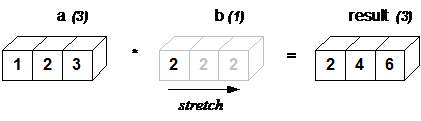
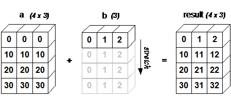
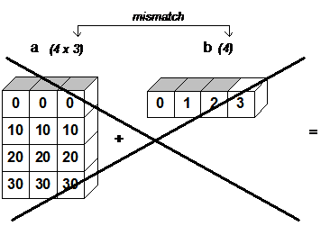

:orphan:

===========================
Array Broadcasting in Numpy
===========================

.. 
   Originally part of the scipy.org wiki, available `here
   <https://scipy.github.io/old-wiki/pages/EricsBroadcastingDoc>`_ or from the
   `github repo
   <https://github.com/scipy/old-wiki/blob/gh-pages/pages/EricsBroadcastingDoc.html>`_

numpy operations are usually done element-by-element which requires two arrays
to have exactly the same shape:

.. code-block:: python
    :caption: Example 1
    :name: example-1

    >>> from numpy import array
    >>> a = array([1.0, 2.0, 3.0])
    >>> b = array([2.0, 2.0, 2.0])
    >>> a * b
    array([ 2.,  4.,  6.])

numpy's broadcasting rule relaxes this constraint when the arrays' shapes meet
certain constraints. The simplest broadcasting example occurs when an array and
a scalar value are combined in an operation:

.. code-block:: python
    :caption: Example 2
    :name: example-2

    >>> from numpy import array
    >>> a = array([1.0,2.0,3.0])
    >>> b = 2.0
    >>> a * b
    array([ 2.,  4.,  6.])

The result is equivalent to the previous example where ``b`` was an array. We
can think of the scalar ``b`` being stretched during the arithmetic operation
into an array with the same shape as ``a``. The new elements in ``b``, as shown
in :ref:`figure-1`, are simply copies of the original scalar. The stretching
analogy is only conceptual. numpy is smart enough to use the original scalar
value without actually making copies so that broadcasting operations are as
memory and computationally efficient as possible. Because :ref:`example-2`
moves less memory, (``b`` is a scalar, not an array) around during the
multiplication, it is about 10% faster than :ref:`example-1` using the standard
numpy on Windows 2000 with one million element arrays.

    *Figure 1*

    *In the simplest example of broadcasting, the scalar ``b`` is
    stretched to become an array of same shape as ``a`` so the shapes
    are compatible for element-by-element multiplication.*

The rule governing whether two arrays have compatible shapes for broadcasting
can be expressed in a single sentence.

.. admonition:: The Broadcasting Rule

    **In order to broadcast, the size of the trailing axes for both arrays in
    an operation must either be the same size or one of them must be one.**

If this condition is not met, a ``ValueError('frames are not aligned')``
exception is thrown indicating that the arrays have incompatible shapes. The
size of the result array created by broadcast operations is the maximum size
along each dimension from the input arrays. Note that the rule does not say
anything about the two arrays needing to have the same number of dimensions.
So, for example, if you have a 256 x 256 x 3 array of RGB values, and you want
to scale each color in the image by a different value, you can multiply the
image by a one-dimensional array with 3 values. Lining up the sizes of the
trailing axes of these arrays according to the broadcast rule shows that they
are compatible

+-------+------------+-------+-------+---+
|Image  | (3d array) | 256 x | 256 x | 3 |
+-------+------------+-------+-------+---+
|Scale  | (1d array) |       |       | 3 |
+-------+------------+-------+-------+---+
|Result | (3d array) | 256 x | 256 x | 3 |
+-------+------------+-------+-------+---+

In the following example, both the ``A`` and ``B`` arrays have axes with length
one that are expanded to a larger size in a broadcast operation.

+-------+------------+-----+-----+-----+---+
|A      | (4d array) | 8 x | 1 x | 6 x | 1 |
+-------+------------+-----+-----+-----+---+
|B      | (3d array) |     | 7 x | 1 x | 5 |
+-------+------------+-----+-----+-----+---+
|Result | (4d array) | 8 x | 7 x | 6 x | 5 |
+-------+------------+-----+-----+-----+---+

Below, are several code examples and graphical representations that help make
the broadcast rule visually obvious. :ref:`example-3` adds a one-dimensional array
to a two-dimensional array:

.. code-block:: python
    :caption: Example 3
    :name: example-3

    >>> from numpy import array
    >>> a = array([[ 0.0,  0.0,  0.0],
    ...            [10.0, 10.0, 10.0],
    ...            [20.0, 20.0, 20.0],
    ...            [30.0, 30.0, 30.0]])
    >>> b = array([1.0, 2.0, 3.0])
    >>> a + b
    array([[  1.,   2.,   3.],
           [ 11.,  12.,  13.],
           [ 21.,  22.,  23.],
           [ 31.,  32.,  33.]])

As shown in :ref:`figure-2`, ``b`` is added to each row of ``a``. When ``b`` is
longer than the rows of ``a``, as in :ref:`figure-3`, an exception is raised
because of the incompatible shapes.

    *Figure 2*

    *A two dimensional array multiplied by a one dimensional array results in
    broadcasting if number of 1-d array elements matches the number of 2-d
    array columns.*

    *Figure 3*

    *When the trailing dimensions of the arrays are unequal, broadcasting fails
    because it is impossible to align the values in the rows of the 1st array
    with the elements of the 2nd arrays for element-by-element addition.*

Broadcasting provides a convenient way of taking the outer product (or any
other outer operation) of two arrays. The following example shows an outer
addition operation of two 1-d arrays that produces the same result as
:ref:`example-3`

.. code-block:: python
    :caption: Example 4
    :name: example-4

    >>> from numpy import array, newaxis
    >>> a = array([0.0, 10.0, 20.0, 30.0])
    >>> b = array([1.0, 2.0, 3.0])
    >>> a[:,newaxis] + b
    array([[  1.,   2.,   3.],
           [ 11.,  12.,  13.],
           [ 21.,  22.,  23.],
           [ 31.,  32.,  33.]])

Here the newaxis index operator inserts a new axis into ``a``, making it a
two-dimensional 4x1 array. :ref:`figure-4` illustrates the stretching of both
arrays to produce the desired 4x3 output array.

.. figure:: theory.broadcast_4.gif
    :alt: vector-vector with newaxis
    :name: figure-4

    *Figure 4*

    In some cases, broadcasting stretches both arrays to form an output array
    larger than either of the initial arrays.*

.. note::

    The code to produce the figures is part of the `AstroML book
    <http://www.astroml.org/book_figures/appendix/fig_broadcast_visual.html>`_

